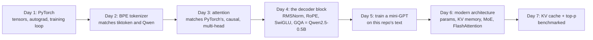

# Week 9: Under the Hood: Transformers from Scratch

**Phase 5: Models** · ~4-6 hours/day · Prerequisites: Week 1 (tokens, sampling, the KV cache as a concept), basic Python; a GPU is **not** needed (everything runs on a laptop CPU; the 10-minute training run in Day 5 is the longest thing)

Weeks 1 to 8 used language models as services. This week you build the thing inside one, **from tensors up**, and, more importantly, you **check every piece against a real implementation**: a tokenizer against tiktoken and Qwen's, an attention layer against PyTorch's, a decoder against Hugging Face's Qwen2 (random weights, then the **real pretrained weights**), a mixture-of-experts layer against Mixtral's, a KV cache against Hugging Face's `generate`. Then you train a small model of your own.

> **The rule of this week:** a from-scratch implementation is only worth anything if it can be shown to be *right*. Every component here is verified against a reference, with a test that proves the comparison can fail.



## Learning goals
By Sunday you can:
- Write a **PyTorch training loop** and diagnose it from its loss curve; verify a hand-written backward pass two ways.
- Implement **byte-level BPE** (trainer, encoder, decoder) and prove it with parity against two real tokenizers.
- Implement **scaled dot-product, causal and multi-head attention**, and test properties (causality, order-blindness, padding independence).
- Assemble the **Llama/Qwen decoder** (RMSNorm, RoPE, SwiGLU, grouped-query attention) and load **real pretrained weights** into it.
- **Train a language model** with a proper recipe, read its curves, and compare it with count-based baselines.
- Compute **parameters and KV-cache memory** from a config; implement a **mixture-of-experts** layer and **FlashAttention's algorithm**.
- Add a **KV cache** and **top-p sampling**, and measure what they do.

## Schedule
| Day | Lesson | Challenge | Needs |
|---|---|---|---|
| 1 | [PyTorch essentials](day1_pytorch-essentials.md) | Train an MLP from scratch and explain the loss curve | CPU |
| 2 | [A BPE tokenizer from scratch](day2_bpe-tokenizer-from-scratch.md) | A tokenizer whose output matches tiktoken's | tiktoken's GPT-2 vocabulary and Qwen's tokenizer (tests skip without them) |
| 3 | [Attention from scratch](day3_attention-from-scratch.md) | An implementation that passes shape and equivalence tests | CPU |
| 4 | [The transformer block](day4_transformer-block.md) | Assemble the full block and run a forward-pass test (against real Qwen) | cached Qwen2.5-0.5B (test skips without it) |
| 5 | [Train a mini-GPT](day5_train-a-mini-gpt.md) | A model that generates plausible text from your own corpus | CPU, ~10 min |
| 6 | [Modern architecture](day6_modern-architecture.md) | Params and KV-cache memory for three real configs | `transformers` (meta device) |
| 7 | [Weekly challenge](day7_weekly-challenge.md) | A KV cache and top-p sampling, benchmarked | CPU (real Qwen row optional) |

New shared code lives in `weeks/week09_transformers-from-scratch/solutions/`: `bpe.py` (tokenizer), `attention.py`, `blocks.py` (the decoder), `arch.py` (parameter and memory arithmetic, MoE, tiled attention) and `weekly/fastgen/` (KV cache, sampling, benchmarks). Day 5 saves a checkpoint to the gitignored `outputs/`; Day 7's sampling table uses it if present.

```bash
uv sync --extra local        # torch, transformers, tiktoken
```

## The week's headline numbers (all measured on an Apple M2, CPU, float32)
| | |
|---|---|
| Day 1 | the hand-written backward pass agrees with autograd to **1e-17** and with finite differences to 3e-8; a learning rate of 0.01 *looks* stuck for 200 epochs but is only slow (lr 1.0: 100% accuracy) |
| Day 2 | **331 of 331** texts tokenise identically to **tiktoken (GPT-2)** and to **Hugging Face (Qwen2.5)** with two different regexes; without the pre-tokenising regex compression is *better* (2.46 vs 2.42 chars/token) but only **12.6%** of words are tokenised the same in context |
| Day 3 | matches `F.scaled_dot_product_attention` and `nn.MultiheadAttention` to 1.5e-7; without the 1/√d, 95% of the weight lands on one position at d = 1024 *before training*; a one-layer model learns "copy from 3 back" and the attention matrix shows the offset |
| Day 4 | the from-scratch decoder gives **Qwen2.5-0.5B's logits (max difference 5.8e-5), the same argmax at every position and the same 16 greedy tokens**; post-norm gets 1e-8 of the last layer's gradient at the first layer, pre-norm gets 1.06× |
| Day 5 | 857k-parameter GPT: validation loss **2.82** (perplexity 16.7, 1.76 bits/char) against 4.10 for bigram counts; it **overfits after ~step 1,900** (train 1.69, validation 2.70) because 12.3M training tokens are 17 passes over 0.72M |
| Day 6 | closed-form parameter counts equal the library's for Llama-3-8B (8,030,261,248), Mixtral-8x7B (46,702,792,704; 12.9B active) and Qwen2.5-0.5B (494,032,768); GQA cuts Llama-3-8B's 128k-token KV cache from 69 GB to 17 GB; the MoE layer matches Mixtral's block to 5e-7; tiled attention is exact for every block size |
| Day 7 | the KV cache matches the uncached logits to 8e-7 and Hugging Face's `generate`; **4.1×, 6.2×, 8.7× faster** at 32, 128, 256 new tokens (a per-step cost of 1.2 to 1.6 ms against 6 to 21 ms); the real Qwen2.5-0.5B runs **3.5× faster** with identical tokens; greedy decoding loops in 25% of samples, top-p 0.9 rescues T = 1.5 sampling |

## What has been verified
| Item | How |
|---|---|
| Day 1: hand-written MLP | 25 tests: gradients vs autograd (1e-12) and finite differences, a test that **breaks the backward pass on purpose** and checks both checkers notice, log-sum-exp stability, NumPy/PyTorch loss curves identical, every regime of the curve reader |
| Day 2: `bpe.py` | 27 tests: textbook merge order, determinism, the encoder reproduces the trainer's segmentation of every training word, round trips, special-token injection refused, **parity with tiktoken's GPT-2 and with Hugging Face's Qwen on 331 texts**, a test that a wrong rank table is caught |
| Day 3: `attention.py` | 30 tests: against PyTorch (causal and not, four multi-head shapes with copied weights), float64 `gradcheck`, causality **bit for bit**, padding independence, order-blindness with and without a mask, sinusoidal positions as rotations, the learned copy task |
| Day 4: `blocks.py` | 40 tests: every part against Hugging Face's, five random whole-model comparisons (multi-head, grouped-query, multi-query, Llama untied), the **real Qwen2.5-0.5B** (logits, argmax, greedy tokens, 494,032,768 parameters), a perturbation test that the equivalence check can fail, RoPE relative position, parameter-count formula on 12 random configs |
| Day 5: training | 25 tests: split by document, tokenizer trained on training text only, schedule values, optimiser groups, gradient clipping spied on every step, evaluation, baselines on streams with known entropy, sampling distributions, an empty prompt |
| Day 6: `arch.py` | 44 tests: parameter counts against **seven instantiated models and the three real configs on the meta device**, the KV formula against a **real cache object**, MoE against `MixtralSparseMoeBlock` (4 shapes), balance loss limits, tiled attention for 12 block/causal combinations, gradients, enormous scores |
| Weekly: `fastgen/` | 29 tests: cache against the uncached forward (5 shapes, chunked), grouped path equality **and that it avoids copies**, all generation modes identical, agreement with **Hugging Face's `generate`**, top-p/top-k hand cases, sampling frequencies, metrics by hand |

**Mutation checks** (`scripts/mutate.py`) ran on `bpe.py` (they found dead code: the trainer's duplicate-token guard cannot be reached, which I removed), `attention.py`, `blocks.py`, `day5_solution.py`, `arch.py`, `day1_solution.py` and `kvcache.py`/`sampling.py`. Survivors either became tests or are equivalent mutants (a pure optimisation branch; a `<` against `<=` at an exact top-p boundary, which floating point makes ambiguous). They found, among others: a float16 normalisation test that could not fail (the assertion tested `isfinite`, where the broken code returned a finite zero), a missing test for a checkpoint with no output matrix, an RoPE mutation hidden behind a multi-line expression, and a balance-loss test that never used `top_k > 1`.

**Bugs found by the work itself** (each has a test): `generate` crashed on an empty prompt; the first greedy comparison against Hugging Face said "not equal" because the checkpoint's `generation_config` applies a repetition penalty even with `do_sample=False`; `rope_tables` built its frequencies on the CPU for a GPU tensor; a top-p test that asserted on an exact float boundary.

**Not run by the author:** any GPU (every number is from a laptop CPU and **will not transfer in absolute terms**), FlashAttention's real kernel and its speed-up, batched or long-context decoding, a human or judge evaluation of generated text, and models beyond Qwen2.5-0.5B (the Llama-3-8B and Mixtral configs are used only for arithmetic and on the meta device). Two config files are typed from memory of the published ones; their parameter totals match the published totals.

**What to remember:** compare against a reference and make sure the comparison can fail; a model can overfit for a trivial reason (here: 17 passes over a corpus smaller than its parameter count); the decoder's design choices each have a measurable reason (pre-norm: gradient balance; GQA: the cache; RoPE: relative position; the regex in BPE: consistency); and **the KV cache turns generation from quadratic to linear**, which you can see in a table of per-step milliseconds.
