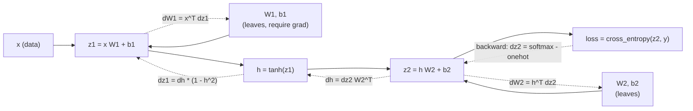

# Week 9, Day 1: PyTorch Essentials: Tensors, Autograd, Modules and a Training Loop

**Time:** ~4h · **Needs:** nothing (CPU, no downloads, no keys) · **Run it:** `uv run python weeks/week09_transformers-from-scratch/solutions/day1_solution.py`

Weeks 1 to 8 used models as services. This week you build the thing inside: a transformer, from tensors up, and check it against real models. Today is the minimum PyTorch you need to read and write that code, taught by building the smallest thing that trains: a two-layer network, **twice** (once with the backward pass written by hand, once in `nn.Module`), and then learning to **read what its loss curve is telling you**.

## Learning objectives
- Use tensors fluently: shapes, dtypes, broadcasting, views against copies, `no_grad`, `detach`.
- Explain **autograd** as "the chain rule, recorded as you compute", and verify a gradient two independent ways.
- Write the anatomy of a **training loop** from memory and say what each line prevents.
- Run the **sanity checks** that catch most bugs before any tuning: the starting loss, a memorised batch, a learning-rate sweep.
- **Read a loss curve**: falling, stalled, diverging, overfitting; and know what a curve cannot tell you.

---

## 1. The five facts about tensors that cause most bugs

```python
x = torch.randn(32, 2)        # (batch, features): the first dimension is almost always the batch
x.shape, x.dtype, x.device    # torch.Size([32, 2]), torch.float32, cpu
a, b = torch.ones(3, 1), torch.ones(1, 4)
(a + b).shape                  # (3, 4): BROADCASTING: size-1 dimensions stretch, and a mismatch is an error only if neither is 1
```

1. **Shape is the contract.** Write the shape in a comment on every line while you learn. Most errors are a dimension in the wrong place (`(batch, time, dim)` against `(time, batch, dim)`).
2. **Broadcasting is silent.** `(32,)` plus `(32, 1)` gives `(32, 32)`, not an error. A loss that is suspiciously low often has a broadcast in it.
3. **Views share memory, copies do not.** `x.view`, `x.transpose`, slicing: views. `x.clone()`: a copy. Writing through a view changes the original; `view` on a non-contiguous tensor fails, `reshape` copies if it has to.
4. **dtype decides precision and memory.** float32 is the default for training; float64 is for checking gradients; bfloat16 and float16 are for big models. Integer tensors (token ids, class labels) cannot require gradients.
5. **`device` is a place.** CPU everywhere here so every run is reproducible. Tensors on different devices cannot meet; moving them is explicit (`.to(device)`).

## 2. Autograd: the chain rule, recorded

When you compute `loss = f(g(h(x)))` with tensors that `require_grad`, PyTorch records each operation as a node of a graph. `loss.backward()` walks the graph from the loss to the leaves, multiplying local derivatives, and **adds** the result into each leaf's `.grad`.



Three consequences you will meet every day:
- **Gradients accumulate.** Two `backward()` calls without `zero_grad()` add up (`test_gradients_accumulate_unless_zeroed`). Forgetting `zero_grad()` is the classic silent bug: the model still "trains", badly.
- **`no_grad()` (or `torch.inference_mode()`)** turns the recording off: use it for evaluation and sampling, or you build a graph you never use.
- **`detach()`** cuts a tensor out of the graph: the value stays, the history goes.

## 3. The backward pass, written by hand

`NumpyMLP` in the solution is the smallest network that needs a hidden layer, with **nothing hidden**:

```
z1 = x W1 + b1        h = tanh(z1)        z2 = h W2 + b2        loss = mean_i( -log softmax(z2)_i[y_i] )

dz2 = (softmax(z2) - onehot(y)) / N       dW2 = h^T dz2       db2 = sum dz2
dh  = dz2 W2^T                            dz1 = dh * (1 - h^2)       dW1 = x^T dz1       db1 = sum dz1
```

Two things worth seeing once. **The gradient of softmax-then-cross-entropy is just `probabilities - one-hot`** (divided by the batch size): the same expression you will see inside every language model's training step, over a vocabulary instead of three classes. And **softmax needs the log-sum-exp trick**: subtract the row maximum before `exp`, or `exp(1000)` overflows to infinity (`test_softmax_cross_entropy_does_not_overflow_on_huge_logits` shows both).

How do you know the hand-written gradient is right? Two independent checks, both run:

| check | result |
|---|---|
| against PyTorch autograd, same weights, float64 | max absolute difference **1e-17** on every tensor |
| against **finite differences** (`(loss(w+ε) − loss(w−ε)) / 2ε` on random weights) | worst relative error **3e-8** |

A check that cannot fail proves nothing, so a test **breaks the backward pass on purpose** (drops the `(1 − h²)` factor) and asserts that *both* checkers notice (`test_the_gradient_checkers_can_fail`). Finite differences are slow and only for debugging, but they depend on nothing but the forward pass, which makes them the check to reach for when you write a new layer (you will on Days 3 and 4).

The same network in PyTorch, with exactly the same weights (`torch_twin`; `nn.Linear` stores `W` transposed), trained by full-batch gradient descent for 100 steps: loss **1.1067 → 0.5912** in both, largest difference **3e-16**. There is no magic in `nn.Module`; it is bookkeeping around the same arithmetic.

## 4. The training loop

```python
for epoch in range(epochs):
    for idx in batches(shuffled(train)):          # 1. a different order each epoch (a seeded generator keeps it reproducible)
        loss = cross_entropy(model(x[idx]), y[idx])   # 2. forward, then the loss
        opt.zero_grad()                                # 3. clear what the last step left behind
        loss.backward()                                # 4. gradients of the loss with respect to every parameter
        opt.step()                                     # 5. move each parameter a little downhill
    evaluate(model, val)                           # 6. under no_grad, in eval mode: how are we doing on data we did not train on?
```

`model.train()` and `model.eval()` flip layers whose behaviour differs (dropout, batch norm); this MLP has none, but the habit costs nothing. SGD moves by `lr × gradient`; **Adam** also rescales each parameter by a running estimate of its recent gradient size, which is why it is the default for transformers (Day 5).

## 5. Sanity checks before you tune anything

| check | what it catches | result here |
|---|---|---|
| **The starting loss** should be `ln(classes)`: an untrained network predicts uniformly | a wrong loss, a wrong label shape, a bad initial scale | 1.097 against ln 3 = 1.099 |
| **Memorise one small batch** (12 points, 400 steps) to ~0 | a bug in the model or the loop, a learning rate that is far too small | loss **0.0009** |
| **Gradients against a reference** (above) | a wrong backward pass | 1e-17 / 3e-8 |
| **Same seed, same curve** | hidden nondeterminism | `test_training_is_reproducible_for_a_seed` |

The language-model version of the first check is the one you will use on Day 5: a vocabulary of V tokens must start at **ln V**. A starting loss of 10 on a 1,000-token vocabulary (ln 1000 = 6.9) means the output layer is initialised too large.

## 6. Reading a loss curve (the deliverable)

Data: three interleaved spirals (225 training and 75 validation points; not linearly separable: a test trains a *linear* classifier to convergence and gets under 70%). Network: 2 → 16 → 3 with tanh, plain SGD, 200 epochs, batch 32, the same seed; only the learning rate changes. Sparklines are scaled min-to-max per row, so compare the labels and the final numbers, not the heights.

| lr | final train | final val | val acc | what the curve does |
|---|---|---|---|---|
| 0.001 | 0.975 | 1.015 | 52% | stalled |
| 0.01 | 0.667 | 0.757 | 57% | stalled |
| 0.1 | 0.463 | 0.561 | 68% | slowly improving |
| 1.0 | 0.008 | 0.013 | **100%** | converged |
| 10.0 | 50.9 | 26.2 | 43% | **diverging** (it ends far above ln 3 = 1.10: worse than knowing nothing) |

`describe_curve` names the regime from the last two windows of ten epochs:

| label | rule |
|---|---|
| diverging | non-finite, or ended above 5× where it started, or above twice the chance-level loss |
| converged | the loss is essentially zero |
| overfitting | training loss still falls while validation loss rises |
| improving | falling more than 5% per window |
| **stalled** | flat. **Either stuck or crawling because the learning rate is tiny; the curve alone cannot tell you which.** Raise the rate tenfold and look again |
| slowly improving | falling, under 5% per window |

The first two rows are the lesson. A learning rate of 0.001 and 0.01 both read "stalled" for 200 epochs; **they are not stuck, they are slow**: lr 1.0 on the same network reaches 100%. The fix for a stalled curve is the cheapest experiment you have, not a new architecture.

**Explaining one full curve** (the daily challenge): Adam, two hidden layers of 32, lr 0.01, 300 epochs.

| epoch | train | val | val acc |
|---|---|---|---|
| 0 | 0.954 | 0.821 | 55% |
| 5 | 0.709 | 0.709 | 55% |
| 20 | 0.545 | 0.669 | 61% |
| **50** | **0.068** | **0.121** | **97%** |
| 100 | 0.010 | 0.016 | 100% |
| 299 | 0.001 | 0.002 | 100% |

- **Epoch 0**: loss 0.95, below ln 3 = 1.10, because an epoch already contains eight updates (225 points in batches of 32).
- **Epochs 0 to 20, the plateau**: loss 0.95 to 0.55 and accuracy only 55 to 61%. The network is carving the plane into rough regions; spirals need the arms to be *separated*, which takes several hidden units to coordinate.
- **Epochs 20 to 50, the drop**: 0.545 to 0.068 and 61% to 97%. Once enough units line up, everything improves at once. This shape (plateau, cliff, tail) is typical of problems with structure; you will see it again in the language model's first few hundred steps.
- **After epoch 100, the tail**: the loss keeps shrinking (0.010 to 0.001) and accuracy is already 100%. Past this point the model is only becoming *more confident*. Validation loss follows training loss throughout (0.002 against 0.001), so there is **no overfitting here**: 75 validation points from the same distribution on a task a network of about 1,250 parameters can fit with room to spare.

What this curve cannot tell you: whether 75 validation points are enough (they are not for a fine comparison), whether the model would handle spirals with different noise, or whether one seed is representative. A curve is a symptom, not a diagnosis.

## 7. Pitfalls
- **Forgetting `zero_grad()`**, or calling it after `backward()`.
- **Evaluating without `no_grad()`**: memory grows and nothing breaks.
- **Comparing runs with different data orders** and calling the difference "the learning rate". Seed the shuffling.
- **Using the loss on the training set as your result.** Report validation numbers, and say how big the validation set is.
- **Believing a plateau.** It is a question, not an answer.
- **Splitting data that arrives ordered by class without shuffling** (the split helper shuffles, and a test checks that every class is in the validation set).
- **Debugging a model and a data bug at once.** Overfit one batch first: it removes the data from the problem.

---

## Daily challenge: train an MLP from scratch and explain the loss curve

**Build** (reference: [`solutions/day1_solution.py`](solutions/day1_solution.py)):
1. A deterministic dataset a linear model cannot solve, with a shuffled train/validation split.
2. An MLP with a **hand-written backward pass**, checked against autograd **and** finite differences, with a test that proves the checkers can fail.
3. The same network in `nn.Module`; show that from the same weights the two give the same loss curve.
4. The sanity checks (starting loss, one memorised batch) and a learning-rate sweep.
5. A written explanation of **one complete loss curve** in the style of section 6: what each phase is and what it cannot tell you.

**Acceptance criteria**
- Validation accuracy of at least 95% with a stated seed, and the starting loss within 0.1 of `ln(classes)`.
- Your gradient agrees with autograd to 1e-10 or better (float64) and with finite differences to 1e-5.
- Breaking the backward pass on purpose makes your checks fail.
- The learning-rate sweep contains a **diverging** run and a **stalled-but-not-stuck** run, and says which is which.
- Your explanation names at least three phases of the curve and one thing the curve does not show.

**Stretch**
- Add **momentum** and **Adam** by hand (a few lines each) and reproduce `torch.optim`'s trajectory on the same weights.
- Replace `tanh` with ReLU and **explain** the change in the early curve (initialisation scale matters: try He initialisation).
- Plot training and validation loss with matplotlib and annotate the phases.
- Use `torch.autograd.gradcheck` on a custom `autograd.Function` for a layer you write.

## Further reading
- PyTorch documentation: *Autograd mechanics* and *Broadcasting semantics*.
- Karpathy, *A Recipe for Training Neural Networks* (the sanity checks above are from it).
- Karpathy, *micrograd* (a scalar autograd engine in about 100 lines).
