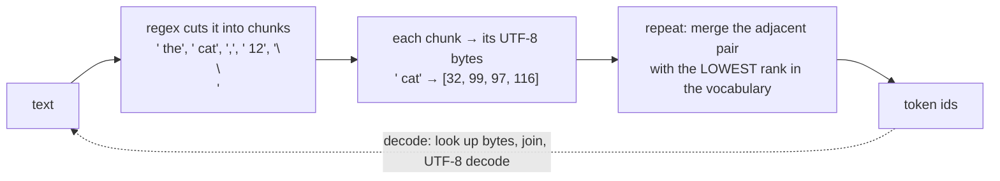

# Week 9, Day 2: A BPE Tokenizer from Scratch

**Time:** ~5h · **Needs:** nothing for the trainer; tiktoken's cached GPT-2 vocabulary and the local Qwen tokenizer for the parity checks (the tests skip themselves without them) · **Run it:** `uv run python weeks/week09_transformers-from-scratch/solutions/day2_solution.py`

Week 1 Day 2 showed what tokens cost and where they surprise you. Today you build the thing that makes them, and then **prove it is right** by feeding it two real vocabularies (GPT-2's and Qwen's) and getting the **same ids as the reference implementations** on 331 texts, including 300 random strings written to be nasty.

## Learning objectives
- Explain **byte-level BPE** in three steps (pre-tokenise, bytes, merges) and implement the **trainer, encoder and decoder**.
- Say why the base vocabulary is 256 bytes (nothing is ever "unknown") and why a **regular expression** cuts the text first.
- **Validate a re-implementation against a reference**: hand-built edge cases, random fuzzing, a second independent reference, and a test that proves the comparison can fail.
- Measure how **vocabulary size** trades sequence length against table size, and see what a tokenizer trained on English does to other languages.

---

## 1. The algorithm in one picture



Training builds the table the merge step looks things up in:

1. Count every chunk of the corpus (each distinct chunk once, with its frequency).
2. Write each chunk as a list of byte ids. The vocabulary is the 256 bytes, ids 0 to 255.
3. Count every **adjacent pair** across all chunks, weighted by chunk frequency. Take the most frequent; give the concatenation of its two tokens the **next id** (256, 257, ...); replace the pair everywhere. Repeat until the vocabulary is the size you asked for.

**A token's id is its rank, and its rank is the order in which it was merged.** That one fact is why encoding needs only the table `bytes → rank`: to encode a chunk, repeatedly find the adjacent pair whose concatenation is in the table with the **lowest** rank (the earliest-learned merge), and merge it, until no adjacent pair is in the table. It replays the training merges in the order they were learned, on text the trainer never saw.

The textbook check (a test): the string `aaabdaaabac`, two merges. Pair counts: `aa` 4, `ab` 2, ... so `aa` becomes id 256; then `(aa, a)` and `(a, b)` tie at 2, and the **tie-break (smaller pair first)** picks `ab` as 257. Determinism needs a tie-break; the order of ties is arbitrary but must be fixed.

## 2. Why bytes, and why a regex

**Bytes.** Characters are open-ended (about 150,000 Unicode code points and growing); bytes are 256. A tokenizer on bytes can encode any string ever written, including a lone control character, with **no unknown token**; the cost is that a rare character becomes several tokens. A model can also emit ids that stop in the middle of a character, so `decode` must not crash on an incomplete UTF-8 sequence (`errors="replace"` shows U+FFFD; a test checks it).

**The regex.** GPT-2's pattern cuts text into: contractions (`'s`, `'ll`), a **letters run with its leading space** (` the`), a digits run, a punctuation run, whitespace. Merges can never cross a chunk, so **a word gets the same tokens wherever it appears**. The ablation measures what that buys.

| Trained on the same text, 1,024 tokens | chars/token on unseen text | tokens that cross a word boundary | words tokenised the same in context |
|---|---|---|---|
| **GPT-2 regex** | 2.42 | 0 | **100%** |
| no regex (split on newlines only) | **2.46** | 277 (`'e '`, `', '`, `'the '`, ...) | **12.6%** |

Without the regex the tokenizer **compresses slightly better (2.46 against 2.42) and is far worse**: only 12.6% of words get the same tokens in context as they do alone. The model would see "the" followed by a comma, "the" followed by a space and "the" at a line end as different token sequences, and has to learn each separately. The regex is not an optimisation for compression; it **buys consistency** at a small cost. (Why the leading space attaches to the *following* word: `" the"` and `"the"` are different tokens in every GPT-style vocabulary, which is why a prompt that ends in a space can hurt: the model expects the space to start the next word.)

## 3. Proving it right: three layers of validation

A tokenizer bug does not crash anything: it silently makes every number in the pipeline slightly wrong. So the check is not "it runs".

1. **Reference parity.** Load GPT-2's vocabulary (50,257 ids, from tiktoken's table `bytes → rank`) into **your** encoder and compare with `tiktoken.encode`: **331 of 331 texts identical** (31 hand-built cases: contractions, upper-case contractions, `\r\n`, 200-character runs, emoji ZWJ sequences, flags, Cyrillic, Greek, Arabic, Hebrew, CJK, control characters, `SolidGoldMagikarp`; and 300 random strings over a hostile alphabet).
2. **A second, independent reference.** Qwen2.5's vocabulary has 151,643 ids, a **different regex** (digits split one by one, case-insensitive contractions) and a different file format (printable stand-ins for bytes: space is `Ġ`). Loaded into the same encoder: **331 of 331 identical** to Hugging Face's tokenizer. If your encoder only worked for GPT-2 you would not know whether it was right or lucky.
3. **A check that can fail.** Swapping the ranks of two common tokens (` the`, ` and`) makes the parity check report a mismatch (`test_parity_detects_a_wrong_encoder`).

Also tested: every string round-trips (`decode(encode(x)) == x`, including 300 random strings the tokenizer never saw), the **trainer and encoder agree** on the segmentation of every training chunk (two implementations of one idea), special tokens (below), and construction rejects a vocabulary missing a byte or reusing an id.

**Special tokens** are strings like `<|endoftext|>` that the vocabulary reserves as control tokens. If user text can contain them, a user can type a control token: so `encode` **raises** on a special string unless the caller explicitly allows it (the same default as tiktoken).

## 4. Training on your own text

Corpus: this course's own lessons. Weeks 1 to 7 (552,020 characters) for training, week 8 (94,248 characters, **never seen**) for evaluation. Training 768 merges takes 1.2 seconds.

| vocab size | tokens on week 8 | chars/token |
|---|---|---|
| 256 (bytes only) | 94,296 | 1.00 |
| 300 | 68,234 | 1.38 |
| 512 | 48,617 | 1.94 |
| 1,024 | 38,887 | 2.42 |
| 2,048 | 32,834 | 2.87 |
| 4,096 | 28,638 | 3.29 |

Returns diminish: the first 44 merges cut the sequence by 28%; going from 2,048 to 4,096 tokens cuts it by 13%. A larger vocabulary shortens every sequence (cheaper attention, more text per context window) and **grows the embedding and output tables** (vocab × width parameters; Qwen2.5-0.5B's 151,936 × 896 table is 136 million of its roughly 494 million parameters, about 28%). The sweet spot depends on the data and the model size.

The same week-8 text through production vocabularies: **GPT-2 (50k) 3.72 chars/token, o200k (200k) 3.95, Qwen2.5 (152k) 3.84, mine (1,024) 2.42**. A 1,024-token vocabulary trained on 0.5 million characters is not competitive; it is *enough to train a tiny model on* (Day 5), which is the point.

## 5. What a tokenizer does to your text (measured)

```
' hello'     GPT-2: 1 [' hello']     Qwen: 1 [' hello']     mine: 3 [' he', 'l', 'lo']   (the word is not in my corpus)
'1234567'    GPT-2: 3 ['123','45','67']   Qwen: 7 (one digit each)   mine: 7
'indentation\n        x = 1'   GPT-2: 14 tokens (eight spaces become 7 single-space tokens)   Qwen: 8   mine: 8
```

Tokens per character on a sample (lower is cheaper; the Python snippet is 122 characters):

| | GPT-2 (50k) | mine (1,024) | o200k (200k) | Qwen2.5 (152k) |
|---|---|---|---|---|
| English | 0.24 | 0.35 | 0.26 | 0.26 |
| Vietnamese | **1.03** | 1.14 | 0.35 | 0.34 |
| Japanese | **1.42** | **2.89** | 0.78 | 0.72 |
| Python | 0.57 | 0.37 | 0.23 | 0.23 |

- **Other languages cost more.** In GPT-2, Vietnamese takes about **4x** as many tokens per character as English (1.03 against 0.24) and Japanese **6x**; newer vocabularies trained on more languages cut that to about 1.4x and 3x. Mine, trained only on English and code, falls back to bytes: **2.89 tokens per Japanese character** (a Japanese character is 3 bytes). A "128k context window" holds far less non-English text.
- **Digits** are split differently: GPT-2 groups up to three, Qwen splits every digit. Neither is wrong; arithmetic ability depends on it, and a model trained with one cannot be fed the other.
- **Code whitespace**: GPT-2 spends a token per space of indentation; modern vocabularies have tokens for runs of spaces. This is one reason GPT-2 was poor at code, and a reminder that **the tokenizer is part of the model**.
- **A word not in the corpus fragments** (` hello` into three pieces in mine): rare words cost more tokens and are usually learned worse.

## 6. Pitfalls
- **Training the tokenizer on data unlike what you will use it on.** It cannot adapt later; changing it invalidates every embedding.
- **Evaluating compression on the training text.** It is flattering; use unseen text.
- **Comparing token counts across tokenizers** and calling it a cost comparison; compare **cost per character or per word**.
- **A trailing space in a prompt**, or splitting text mid-character when truncating bytes.
- **Allowing special-token strings in user input.**
- **Assuming `decode(encode(x)) == x` means the tokenizer is right.** It means the encoder and decoder agree; only a reference tells you the ids are the *right* ones.
- **Using a Claude or Gemini token count from tiktoken.** Tokenizers are vendor-specific (Week 1 Day 2).

---

## Daily challenge: a tokenizer whose output matches tiktoken on a test set

**Build** (reference: [`solutions/bpe.py`](solutions/bpe.py), [`solutions/day2_solution.py`](solutions/day2_solution.py)):
1. A byte-level BPE **trainer** (frequency-weighted pair counting, a deterministic tie-break), an **encoder** driven by the rank table, and a **decoder** that survives partial characters.
2. A loader that accepts tiktoken's `bytes → rank` table; **parity with `tiktoken.get_encoding("gpt2")`** on a hand-built test set of your own **and** random strings.
3. A **second reference** with a different regex and file format (Qwen's `tokenizer.json`).
4. A **vocabulary-size sweep** on held-out text and **one ablation** (no regex) with a metric that shows what it changes.

**Acceptance criteria**
- Identical ids to tiktoken (GPT-2) on at least 300 texts, 100 of which are random, and to Hugging Face for Qwen on the same set.
- `decode(encode(x)) == x` for every test string, including a lone control character and an emoji sequence.
- A test proves the parity check can fail.
- The trainer is deterministic, and the encoder reproduces the trainer's segmentation of every training word.
- Special-token text in the input raises unless allowed.
- You report compression on **unseen** text, and say what the ablation does to consistency, not only to compression.

**Stretch**
- Make training **O(n log n)**: keep pair counts in a heap and measure on 100 MB of text (the reference is fast enough for 0.5 MB).
- Add **byte-fallback inspection**: given a text, list which characters were encoded as multiple byte tokens and report the cost per language.
- Implement **BPE dropout** (randomly skip merges at training time) and show it produces different segmentations of one word.
- Train on a Vietnamese corpus of your own and recompute the table above for Vietnamese.
- Compare with **unigram / SentencePiece** (`sentencepiece` is a pip install away): segment the same text and read the differences.

## Further reading
- Sennrich et al., *Neural Machine Translation of Rare Words with Subword Units* (the BPE paper); Radford et al., *Language Models are Unsupervised Multitask Learners* (byte-level BPE in GPT-2).
- Karpathy, *minbpe* and *Let's build the GPT Tokenizer*.
- The `tiktoken` source (about 200 lines of Python plus a Rust core).
