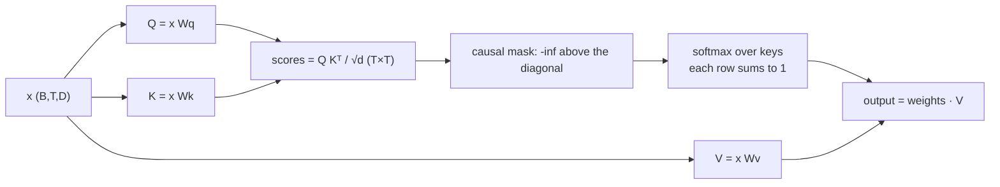

# Week 9, Day 3: Attention from Scratch

**Time:** ~5h · **Needs:** nothing (CPU, no downloads) · **Run it:** `uv run python weeks/week09_transformers-from-scratch/solutions/day3_solution.py`

Attention is the part of the transformer that makes it different from everything before it: each position decides **which other positions to read from**. It is also small: a matrix multiplication, a softmax, a mask, and another matrix multiplication. Today you write it, check it against PyTorch's own implementations to six decimal places, test the properties it must have, and then watch a one-layer model learn something with it and read the answer straight out of the attention matrix.

## Learning objectives
- Write **scaled dot-product attention**, the **causal mask** and **multi-head attention**, with shapes annotated on every line.
- Explain what **queries, keys and values** are, and why the dot product is divided by **√d** (measured, not asserted).
- Verify an implementation by **equivalence** (against `F.scaled_dot_product_attention` and `nn.MultiheadAttention` with the same weights) and by **properties** (causality, permutation behaviour, padding independence, gradient check).
- See that attention is **blind to order** and what fixes that; read an **attention matrix**.
- State the **quadratic cost** and what it does to memory.

---

## 1. Queries, keys and values

Every position produces three vectors from its input vector `x`:

| vector | role | analogy |
|---|---|---|
| **query** `q = x W_q` | what I am looking for | a search query |
| **key** `k = x W_k` | what I offer to be found by | a document's index terms |
| **value** `v = x W_v` | what I hand over if you pick me | the document |

Position `i` compares its query with every key (a dot product: large when they point the same way), turns the scores into a distribution with softmax, and returns the **weighted average of the values**:

```
scores = Q K^T / √d          (T × T: how well query i matches key j)
weights = softmax(scores)    (each row sums to 1)
output = weights V           (each output is a mix of the values)
```



Two things make this a layer rather than a lookup: the three projections are **learned** (the model learns what to ask for, what to advertise and what to pass on), and the weights are **computed from the content**, not fixed. Compare a convolution, which mixes neighbours with fixed learned weights: attention mixes *whatever matches*, however far away.

## 2. The causal mask

A language model predicts the next token, so position `i` must not see positions `j > i`. The mask sets those scores to `−∞` **before** the softmax, which makes their weight exactly 0:

```
       key 0  key 1  key 2  key 3
q 0     ✓      ✗      ✗      ✗          allowed = lower triangle (position i may attend to j ≤ i)
q 1     ✓      ✓      ✗      ✗
q 2     ✓      ✓      ✓      ✗
q 3     ✓      ✓      ✓      ✓
```

Masking *after* the softmax would be wrong (the rows would no longer sum to 1, and information still flows through the normaliser). The implementation takes the **last Tq rows** of the mask when there are fewer queries than keys: a block of new queries at the *end* of a longer sequence. That is exactly the situation of generating with a KV cache (Day 7), and a test pins it: the last three rows of full causal attention equal attention computed from only the last three queries and all the keys and values.

Two numerical details that are bugs in many first implementations: **softmax subtracts the row maximum** (otherwise `exp(1000)` is infinity), and **a row that is entirely masked must give zeros, not NaN** (`−∞ − (−∞)` is NaN). Both are tests.

## 3. Why divide by √d? (measured)

If queries and keys have independent unit-variance entries, `q·k` has variance **d**: it grows with the head size. Large scores push softmax into saturation: one weight near 1, the rest near 0, and the gradient through the saturated softmax vanishes. Dividing by √d brings the variance back to 1. Attention rows over 32 positions (maximum entropy ln 32 = 3.47 nats), random unit-variance queries and keys, averaged over 20 trials:

| d | entropy, scaled | max weight, scaled | entropy, **unscaled** | max weight, **unscaled** |
|---|---|---|---|---|
| 4 | 3.04 | 0.16 | 2.30 | 0.34 |
| 16 | 3.03 | 0.16 | 1.18 | 0.61 |
| 64 | 3.01 | 0.17 | 0.49 | 0.82 |
| 256 | 3.01 | 0.17 | 0.22 | 0.91 |
| 1024 | 3.01 | 0.17 | **0.12** | **0.95** |

Scaled attention is the same shape at every d (entropy about 3.0, no single position dominating). Unscaled attention at d = 1024 puts 95% of the weight on one position **before any learning has happened**: the model starts out nearly "hard" and cannot easily learn to spread its attention. The scale is not a detail.

## 4. Multi-head attention

One attention head produces one weighted average per position. Real models run **H heads in parallel**, each in a subspace of `d_head = D / H` dimensions, then concatenate and mix with an output projection:

```
x (B,T,D) → one fused Linear (D → 3D) → split into q, k, v  (B,T,D each)
          → reshape to heads  (B, T, H, d) → (B, H, T, d)
          → attention per head  (B, H, T, T) weights
          → back to (B, T, H, d) → (B, T, D) → output Linear
```

Why more than one? Different heads can specialise: one looks back one token, one looks for the previous occurrence of the same word, one tracks the subject. The shapes are the part to get right: the `view`/`transpose` that gives `(B, H, T, d)` and the `transpose`/`reshape` that undoes it. A mutation check confirmed that dropping the second transpose is caught.

**Verification.** `MultiHeadAttention` with copied weights against `torch.nn.MultiheadAttention`: the same output to 1.5e-7, on four shape combinations. The scaled dot-product function against `F.scaled_dot_product_attention` (causal and not): 2.4e-7. A float64 `gradcheck` confirms the gradients. These are equivalence tests: if all three pass, my layer *is* PyTorch's.

## 5. Properties worth testing (they catch bugs equivalence cannot)

| property | test |
|---|---|
| **Causality**: changing token 6 onward changes nothing at positions 0 to 5 | outputs at positions < 6 are **bit-for-bit equal** |
| **Rows are distributions**: each row sums to 1; the causal weights have no mass above the diagonal | `w.sum(-1) == 1`, `triu(w, 1) == 0` |
| **Padding independence**: what sits in padding positions must not change the real outputs | overwrite padded keys and values with ±99: real outputs identical |
| **Without a mask, no sense of order**: shuffle the tokens, and the outputs shuffle identically | max difference **6e-8** |
| **With a causal mask, order matters** | max difference **0.74** |
| **Scale** | hand-computed case: queries (2, 0) against keys (1, 0), (0, 1) |

The permutation result is the most important idea of the day. **Attention does not know where a token is.** Shuffle a sentence and, without positional information, a transformer layer produces the same outputs, shuffled the same way. Position must be *put in*: a learned vector per position (added to the token embedding here), the fixed sinusoids of the original paper (a test checks their shift-as-rotation property), or the rotary embeddings of Day 4. The causal mask itself leaks a little order: position 0 sees one token, position 5 sees six.

## 6. Watching it learn: copy the token from three positions back

A one-layer, one-head model: token plus position embedding, one causal attention layer, a linear output. Sequences of 16 random tokens over a vocabulary of 12; the target at position `i` is the **input token at position `i − 3`**. Chance loss is ln 12 = 2.48.

| | final loss | accuracy |
|---|---|---|
| **with** positional embeddings | **0.000** | **100%** |
| **without** positional embeddings | 1.894 | 28.2% |

And the answer, read directly from the average attention matrix of the trained model (queries 3 to 15 each look back exactly 3 positions: `[3, 3, 3, 3, 3, 3, 3, 3, 3, 3, 3, 3, 3]`):

```
      key: 0123456789012345
query  3:  █
query  4:   █
query  5:    █
query  6:     █
   ...                           a clean diagonal, three to the left of the main one
query 15:              █
```

The model discovered an *offset pointer* from a loss signal alone: `W_q` and `W_k` arrange for query `i`'s dot product with key `i − 3` to dominate, and the value at that position carries the token to the output. This is the whole mechanism by which transformers look things up.

The no-positions row needs an honest reading. It does **better than chance** (28% against 8%), not at chance, because the causal mask leaks position at the start of the sequence: at position 3 the model can see only four tokens, so "the token 3 back" is the *first* of them, which uniform attention can single out. Later positions have nothing to go on. So "attention without positions can't do positional tasks" is true; "it scores exactly chance" would be wrong, and the number is there to say so.

## 7. The cost: a T × T matrix

The score matrix has one entry per (query, key) pair, per head. Eight heads, 64 dimensions each, causal, on this machine's CPU:

| T | time (ms, noisy) | score matrix (MB) |
|---|---|---|
| 128 | 0.4 | 0.5 |
| 256 | 1.1 | 2.1 |
| 512 | 7.2 | 8.4 |
| 1,024 | 17.6 | 33.6 |
| 2,048 | 82.8 | **134.2** |

The memory column is exact arithmetic (`H × T² × 4` bytes) and quadruples with each doubling. The time column is a single CPU's measurement, noisy (ratios per doubling: 2.9x, 6.7x, 2.4x, 4.7x), and averages around 4x. At T = 32,768 the same computation would materialise a **34 GB** score matrix per layer. This is the reason for FlashAttention (Day 6: compute the same result in tiles without ever storing the matrix) and for the KV cache (Day 7: generation does not recompute old rows).

## 8. Pitfalls
- **Masking after the softmax**, or masking with a large negative number that overflows in half precision (use `−inf` and handle the all-masked row).
- **`view` on a transposed tensor** (it is not contiguous): use `reshape`.
- **Forgetting the scale**, or using `1/d` instead of `1/√d` (a test per mistake).
- **Shape comments that are wrong.** Write `(B, H, T, d)` next to every line and check it with `assert x.shape == ...` while developing.
- **Padding keys that are not masked**: the output then depends on whatever the padding contains.
- **Testing only that "it runs".** Equivalence and the causality test are what found the bugs while writing this.

---

## Daily challenge: an attention implementation that passes shape and equivalence tests

**Build** (reference: [`solutions/attention.py`](solutions/attention.py), [`solutions/day3_solution.py`](solutions/day3_solution.py)):
1. Row-stable `softmax`, `causal_mask`, `scaled_dot_product_attention` (with an optional extra mask), `MultiHeadAttention`, a key-padding mask.
2. Learned and sinusoidal **positional encodings**.
3. Equivalence tests against PyTorch (`F.scaled_dot_product_attention`, `nn.MultiheadAttention` with copied weights) on at least four shapes, plus a float64 `gradcheck`.
4. The property tests of section 5, **each** with a test that breaks the property on purpose.
5. The copy-from-3-back experiment with and without positions, and the attention matrix printed.

**Acceptance criteria**
- Output within 1e-5 of both PyTorch references, causal and non-causal.
- Changing a future token changes nothing at earlier positions (exact equality).
- A fully masked row gives zeros, not NaN; softmax does not overflow at scores of 1000.
- The last `k` rows of full causal attention equal attention from the last `k` queries alone.
- Permutation: gap near 0 without a mask, large with one.
- The trained copy model reaches at least 99% accuracy and its attention matrix shows the offset; you state what happens without positions and why it is not at chance.

**Stretch**
- Train a **two-layer** model on an **induction task** (`... A B ... A → B`): the second layer's attention should find "the token after the previous A". This is the circuit that underlies in-context learning.
- Add **ALiBi** (a linear bias on the scores by distance) instead of positional embeddings and compare on the copy task.
- Implement **sliding-window attention** and measure the memory against full attention.
- Write attention with `torch.einsum` and check it matches; then benchmark both.

## Further reading
- Vaswani et al., *Attention Is All You Need* (the scaled dot product and sinusoidal positions).
- Olsson et al., *In-context Learning and Induction Heads*.
- Karpathy, *Let's build GPT: from scratch, in code*.
