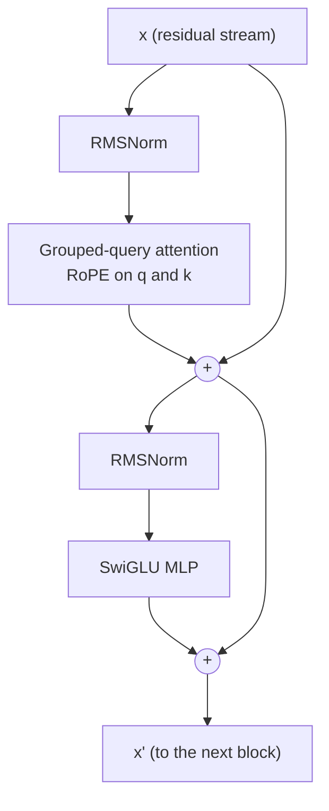

# Week 9, Day 4: The Transformer Block: Norms, Residuals, RoPE, SwiGLU, Grouped-Query Attention

**Time:** ~6h · **Needs:** `torch` and `transformers` (installed); the cached Qwen2.5-0.5B for the "real weights" check (its test skips itself without it) · **Run it:** `uv run python weeks/week09_transformers-from-scratch/solutions/day4_solution.py`

Yesterday's attention layer is one ingredient. A transformer is a stack of **blocks**, and the block used by Llama, Mistral and Qwen has five parts you will now write: **RMSNorm**, a **residual stream**, **rotary position embeddings**, a **SwiGLU** MLP and **grouped-query attention**. The test of whether you have written it correctly is not a unit test of your own invention. It is that **Hugging Face's Qwen2 and your code give the same logits**, first for random weights and then for the **real Qwen2.5-0.5B weights**, where your 100-line decoder generates the same 16 tokens as the library.

## Learning objectives
- Draw the **pre-norm residual block** from memory and say what each of its five components does and why it replaced its predecessor.
- Implement RMSNorm, RoPE (and prove it encodes **relative** position), SwiGLU, and GQA, each verified against a reference.
- Load **real pretrained weights** into your own implementation and verify logits and generation.
- Explain, with numbers, **why residual connections and pre-norm** make deep stacks trainable.

---

## 1. The block



```python
x = x + attention(norm1(x))     # read from the stream, write back an update
x = x + mlp(norm2(x))
```

Stack N of these between a token **embedding table** and a final norm plus **output projection** (the same matrix as the embedding table in small models: "tied embeddings") and you have the model. The `Decoder` in `solutions/blocks.py` is exactly that: under 300 lines including its comments.

**The residual stream** is the central idea. `x` runs straight through the whole network; every attention layer and every MLP *adds* an update to it. Nothing ever overwrites it. Two consequences: gradients have a direct path from the loss to every layer (section 7), and the model can be read as a shared "bus" that each component reads from and writes to. A test sets the output projections of attention and MLP to zero and asserts the block returns its input **bit for bit**: with silent sub-layers, the block is the identity.

## 2. Normalisation: RMSNorm

LayerNorm (the GPT-2 choice) subtracts the mean, divides by the standard deviation, then scales and shifts. **RMSNorm** drops the mean and the shift:

```
RMSNorm(x) = x / sqrt(mean(x²) + eps) * weight
```

Fewer operations, no bias, and in practice as good. Two details tested explicitly: the **statistics are computed in float32** even when the model runs in half precision (squaring a float16 value of 30,000 overflows to infinity: a test feeds exactly that and the mutation check confirmed it is the only thing that catches the cast), and the output keeps the **input's dtype**. RMSNorm matches `Qwen2RMSNorm` with a difference of exactly 0; my LayerNorm matches `nn.LayerNorm` to 4.8e-7.

**Pre-norm** (normalise the *input* of each sub-layer, as above) replaced the original **post-norm** (`norm(x + sublayer(x))`) because of what section 7 measures.

## 3. Rotary position embeddings (RoPE)

Yesterday: attention is blind to order, and positions must be put in. Learned absolute embeddings add a vector to each token. **RoPE** instead **rotates** each query and key by an angle proportional to its position, and does nothing to the values.

Split a query's `d` dimensions into `d/2` pairs; rotate pair `i` by `position × θ^(−2i/d)` radians (`θ = 10,000` in the original, `1,000,000` in Qwen2.5). The dot product between a query at position `m` and a key at position `n` then depends **only on `m − n`**, because rotating both by their positions leaves only the difference:

```
⟨R(m) q, R(n) k⟩ = ⟨q, R(n − m) k⟩
```

Verified two ways: the spread of that dot product over pairs with the same offset (positions up to about 1,000) is **1.2e-4** (float32 rounding), and a rotation **preserves length** (largest change **9.5e-7**). And a decoder-level test: shift every position by 500 and the logits do not change (`atol 1e-3`). That is why RoPE models can be fed positions starting at any offset, and the property KV caching leans on (Day 7). The frequencies span from one radian per position (pair 0) to almost none (the last pair): fast pairs resolve nearby offsets, slow pairs distinguish far ones, like the hands of a clock. My implementation matches Hugging Face's `apply_rotary_pos_emb` with difference 0 and uses the same "rotate half" layout (`(x1, x2) → (−x2, x1)` over the two halves of the head).

## 4. SwiGLU

The MLP after attention used to be `W₂ gelu(W₁ x)`. The gated version is

```
down( silu(gate(x)) * up(x) )          three matrices: gate, up, down; no biases
```

`silu(gate(x))` is a soft switch per hidden unit that decides how much of `up(x)` passes. With three matrices instead of two, the hidden width is set to about **8/3 × d** instead of 4 × d to keep the parameter count equal. Verified against `Qwen2MLP`: difference 0.

## 5. Grouped-query attention (GQA)

Multi-head attention keeps H separate key and value heads. During generation every one of them is **cached** for every past token (Day 7), and that cache is what fills the GPU at long contexts. **GQA** keeps H query heads but only **G < H** key/value heads: each K/V head is shared by a *group* of H/G query heads. `G = H` is ordinary multi-head attention; `G = 1` is multi-query attention.

Qwen2.5-0.5B: **14 query heads, 2 key/value heads**, head width 64: the K and V projections are `896 → 128` instead of `896 → 896`, and the KV cache is **7× smaller** than multi-head attention would need. Two tests pin it down: GQA with weights **repeated** to H heads gives the same output as ordinary multi-head attention (so it really is "sharing"), and a loop over every (query head, KV head) pair shows that query head `h` reads **only** KV head `h // (H/G)`.

## 6. Verification: three layers

| layer | what | result |
|---|---|---|
| **parts** | RMSNorm, SwiGLU, RoPE against Hugging Face's own classes; LayerNorm against `nn.LayerNorm` | differences **0, 0, 0** and 4.8e-7 |
| **whole model, random weights** | Qwen2 with 8 heads / 8 kv, 8 / 2, 8 / 1; Llama with 8 / 4 and an **untied** output matrix | logits differ by at most **2.4e-7** (all four) |
| **real weights** | Qwen2.5-0.5B (494,032,768 parameters, 24 layers, width 896) loaded into the from-scratch `Decoder` | logits differ by at most **5.8e-5**; argmax identical at **every** position; **16 greedy tokens identical** to Hugging Face |

```
prompt 'The capital of France is'  ->  ' Paris. It is the largest city in Europe and the third largest city in the'
```

(a 0.5B model's opinion of Europe's largest cities is its own; the point is that **the two implementations say the same thing, token for token**). The parameter count also agrees three ways: the model, Hugging Face's, and a closed-form formula in `count_parameters` (494,032,768 each), which Day 6 turns into a calculator.

Three things that went wrong while verifying, because they are the usual ones:
- **The first greedy comparison said "not equal".** My model was right. The checkpoint's `generation_config` applies a **repetition penalty of 1.1** (and sampling defaults) even when you pass `do_sample=False`. Switching those off made the 16 tokens identical. When a reference "disagrees", check *its* defaults first.
- **A reference that cannot fail is worthless.** A test perturbs one weight after loading and asserts that the logits then differ from Hugging Face by more than 1e-4.
- **A tied model's checkpoint has no output matrix.** Qwen2.5-0.5B's safetensors file contains no `lm_head.weight`: the output layer *is* the embedding table. The loader accepts that for a tied model and raises for an untied one (a mutation check found the test that was missing).

## 7. Why residuals and pre-norm: measured

Twenty-four blocks, random weights, the gradient of the mean squared output, and how large it is at the first block compared with the last:

| arrangement | gradient at block 1 | gradient at block 24 | first / last | activation RMS after blocks 1 / 12 / 24 |
|---|---|---|---|---|
| **pre-norm + residual** (modern) | 3.2e-2 | 3.0e-2 | **1.06** | 0.9987 / 0.9998 / 1.0005 |
| post-norm + residual (original) | **3.0e-9** | 2.5e-1 | **1.2e-8** | 1.0000 / 1.0000 / 1.0000 |
| no residual | 5.2e-1 | 2.7e-4 | **1.96e3** | 0.0027 / 0.0035 / 0.0032 |

- **Pre-norm + residual: every layer gets about the same gradient** (ratio 1.06). The identity path carries the loss's gradient straight down, and the residual stream stays at RMS ≈ 1, so every block starts as a *small correction* to the stream.
- **Post-norm: the first block receives 10⁻⁸ of the last block's gradient.** The norm sits *on* the residual path, so the gradient is rescaled at every layer and shrinks. This is why post-norm models need a careful learning-rate warm-up and why very deep ones were hard to train.
- **No residual: the gradient is 2,000 times *larger* at the first block than the last**, the opposite problem (the norms divide by a tiny activation scale on the way back and amplify). Both ratios far from 1 mean a single learning rate cannot suit all layers.

This is a measurement at **initialisation, not a training run**: it explains why one arrangement is *easier to start* training, not what the converged models would do. Day 5 trains the pre-norm model.

## 8. Pitfalls
- **`view` after a transpose** (use `reshape`), and `repeat` where you meant `repeat_interleave` for the grouped heads (a mutation check showed the group order matters: `[kv0, kv0, kv1, kv1]`, not `[kv0, kv1, kv0, kv1]`).
- **Applying RoPE to values.** Only queries and keys carry position; values carry content.
- **Computing normalisation statistics in half precision.**
- **Believing a close logit match is enough**: also check argmax at every position and a greedy continuation; a 1e-3 logit gap can hide a flipped near-tie only in rare cases, but a wrong layer typically gives a gap of order 1.
- **Forgetting that tied embeddings share storage** (count parameters once; `model.parameters()` does).
- **Comparing against a reference with different defaults** (repetition penalty, attention implementation, dtype).

---

## Daily challenge: assemble the full block and run a forward-pass test

**Build** (reference: [`solutions/blocks.py`](solutions/blocks.py), [`solutions/day4_solution.py`](solutions/day4_solution.py)):
1. RMSNorm, LayerNorm, RoPE, SwiGLU, GQA and the pre-norm `Block`, plus a `Decoder` (embedding, N blocks, final norm, tied output).
2. A parts-level comparison with the Hugging Face implementations, and a **whole-model** comparison with `Qwen2ForCausalLM` and `LlamaForCausalLM` at random weights.
3. A loader that copies a Hugging Face state dict into your model and **refuses** missing tensors and wrong shapes.
4. Load the **real Qwen2.5-0.5B** and compare logits and 16 greedy tokens.
5. The properties: causality, RoPE relative position, the silent-sublayer identity, the starting loss `ln(vocabulary)`, the closed-form parameter count against the model.

**Acceptance criteria**
- Logits within 1e-5 of Hugging Face for random weights at three attention configurations (multi-head, grouped-query, multi-query).
- With the real weights: identical argmax at every position and identical greedy tokens, logit gap under 1e-3.
- Changing a future token changes nothing earlier (bit-for-bit); shifting all positions changes nothing.
- A test proves the equivalence check can fail.
- The parameter-count formula equals the model's count for 12 random configurations and the real one (494,032,768).

**Stretch**
- Add **sliding-window attention** (Mistral) and verify it against `MistralForCausalLM`.
- Implement **QK-norm** (normalise queries and keys before the dot product, as in Qwen3 and Gemma) and measure its effect on attention-logit size.
- Replace the `repeat_interleave` with a grouped matrix multiplication that never materialises the repeated K and V, and measure memory.
- Load **Llama-style weights from a different checkpoint** (any small Llama in the Hugging Face cache) with `qkv_bias=False`.

## Further reading
- Su et al., *RoFormer: Enhanced Transformer with Rotary Position Embedding*.
- Shazeer, *GLU Variants Improve Transformer*; Zhang and Sennrich, *Root Mean Square Layer Normalization*; Ainslie et al., *GQA*.
- Xiong et al., *On Layer Normalization in the Transformer Architecture* (pre-norm against post-norm).
- The Hugging Face `modeling_qwen2.py` and `modeling_llama.py` source: you can now read all of it.
