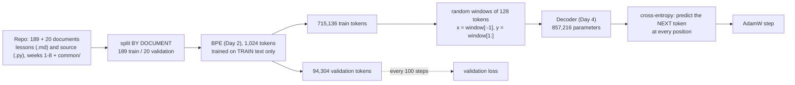

# Week 9, Day 5: Train a Mini-GPT on Your Own Corpus

**Time:** ~5h (about 10 minutes of that is the training run) · **Needs:** CPU only · **Run it:** `uv run python weeks/week09_transformers-from-scratch/solutions/day5_solution.py --steps 3000 --save outputs/minigpt.pt`, then `... day5_solution.py analyse outputs/minigpt.pt`

You have a tokenizer (Day 2) and a decoder verified against Qwen (Day 4). Today you put them together and **train a language model from random weights** on text you can read: this repository's own lessons and Python source. The result is a 0.86-million-parameter model that writes plausible-looking fragments of this course. The lesson is in the numbers: what the loss curve says, what the baselines say, where the model overfits, and why the samples look the way they do.

## Learning objectives
- Build a **leak-free data pipeline** (split by document, tokenizer trained on training text only) and say why each choice matters.
- Write the **training recipe**: AdamW with warm-up and cosine decay, gradient clipping, weight decay on matrices only, a fixed validation set.
- Use **baselines** (uniform, unigram, bigram) so a loss number means something.
- Read a loss curve for **overfitting**, and explain why a model this small on this little data overfits.
- Sample from the model and **judge the samples honestly**.

---

## 1. The pipeline



**Split by document, not by token.** Cut the token stream at an arbitrary point and a paragraph that appears in both halves (these lessons quote their own code) lets the model recite the validation set. Here every file is entirely in training or entirely in validation (a test checks that each validation file's unique content is absent from training). **Train the tokenizer on training text only**: a tokenizer that has seen the validation data has spent merges on it (a test asserts the vocabulary is exactly what training documents alone produce, and that it is *not* what training on everything would give).

**The objective.** At every position the model predicts the *next* token; the target window is the input window shifted by one. A 128-token window therefore gives 127 training signals, one per position, which is why transformers are so sample-efficient to train compared with one label per example.

## 2. The recipe (every part has a reason)

| ingredient | value | why |
|---|---|---|
| optimiser | AdamW, β = (0.9, 0.95) | the default for transformers; β₂ = 0.95 reacts faster than 0.999 to the loss spikes these models have |
| learning rate | 3e-3 peak; **warm-up** over 100 steps, then **cosine decay** to 10% | the first updates with Adam's noisy statistics are unreliable, so ramp up; decay lets the final steps settle |
| gradient clipping | global norm ≤ 1.0 | one bad batch cannot throw the weights far; tested by spying on the call every step |
| weight decay 0.1 | **on 2-D weight matrices only** | not on norm scales (they should sit near 1) and not on the embedding table (which is also the output matrix) |
| batch | 32 windows × 128 tokens = 4,096 tokens/step | small enough for a CPU: 0.17 s per step |
| validation | the same non-overlapping windows every time | so two points on the curve are comparable |
| **sanity checks** | starting loss ≈ ln V; memorise one batch | the Day 1 checks, again: tests for both |

Starting loss on the validation set: **6.948** against ln 1024 = **6.931**. An untrained model predicts uniformly and the numbers agree to 0.02: the loss function and the data alignment are right.

## 3. Baselines: what does "2.7" mean?

A loss is only meaningful against alternatives. Cross-entropy in nats per validation token:

| model | nats/token | perplexity |
|---|---|---|
| uniform over 1,024 tokens (ln V) | 6.931 | 1,024 |
| **unigram** (token frequencies only) | 6.010 | 407 |
| **bigram** (previous token only, add-0.1 smoothing) | 4.104 | 61 |
| **the transformer** (best checkpoint, full validation set) | **2.815** | **16.7** |

Perplexity is `exp(loss)`: the model is, on average, as uncertain as if choosing among about 17 equally likely tokens. A model that cannot beat the bigram counts has not learned anything about context; this one beats it by 1.3 nats. In a unit that does not depend on the tokenizer: **1.76 bits per character**. For scale, general-purpose compressors on the same validation text (218 KB, compressed on its own) need **2.68 (gzip), 2.38 (bz2) and 2.40 (xz) bits per character**. The comparison is not fair to the compressors: the model has absorbed 1.7 MB of similar text, which they have not, so read it as "the model has learned real regularities of this kind of text", not as "it beats xz".

## 4. The loss curve (the run)

```
step   100  train 5.960  val 4.909      step  1500  train 2.192  val 2.717      step  2500  train 1.793  val 2.672  <- best
step   200  train 4.158  val 3.744      step  1900  train 2.020  val 2.676      step  2800  train 1.734  val 2.688
step   500  train 2.939  val 3.056      step  2100  train 1.948  val 2.674      step  3000  train 1.686  val 2.699
step  1000  train 2.472  val 2.837
```

Read it in three phases, the way you read the Day 1 curve:

1. **Steps 0 to 500: everything improves** (val 6.9 to 3.06). The model learns token frequencies, then local patterns (what follows `def `, closing brackets, markdown bullets). Train loss and validation loss move together; train is *above* validation early on only because it is averaged over the steps since the last evaluation, while the model is still improving fast.
2. **Steps 500 to about 1,900: the gap opens** (train 2.94 to 2.02; val 3.06 to 2.68). Training loss keeps falling at about the same rate; validation falls more slowly.
3. **Steps 1,900 to 3,000: overfitting.** Training loss falls from 2.02 to **1.69**; validation loss **stops improving and starts to creep up** (2.676 at step 1,900; 2.699 at the end). The model is now learning the training set's specifics.

**Why it overfits.** The run is 3,000 steps × 4,096 tokens = **12.3 million tokens, but the corpus is 0.72 million**: **17 passes over the same data.** A rule of thumb (Chinchilla) says to train a model on about 20 *unique* tokens per parameter; this model has 0.86M parameters and 0.72M unique tokens, **less than one token per parameter**. It is data-limited by more than a factor of 20, and more steps cannot fix it. The remedies, in the order I'd try them: **more data** (the only real one), a smaller model, dropout, early stopping (done: the best checkpoint is from step 2,500), data augmentation.

**An honest caveat on "best validation 2.672".** The best checkpoint was chosen *on the validation set it is reported on*. With a curve this flat the selection effect is small (2.672 to 2.699 across the last 1,100 steps), but there is no separate test split, so every validation number here is slightly optimistic. The periodic evaluation uses the first 40,000 validation tokens for speed (2.672); the full validation set scores **2.815** with the same checkpoint, because the first 40,000 tokens are easier (the validation set is 16 code files and 4 lessons, and the code is more predictable). Report the full-set number, and say which one you are quoting.

## 5. Where it is good and where it is bad

From the saved checkpoint (`day5_solution.py analyse`):

| slice of validation | loss (nats/token) | perplexity | tokens |
|---|---|---|---|
| source code (`.py`) | 2.785 | 16.2 | 76,655 |
| lessons (`.md`) | 2.966 | 19.4 | 17,648 |
| position 0 in the window | 4.77 | | |
| positions 1 to 7 | 3.30 | | |
| positions 8 to 31 | 2.85 | | |
| positions 32 to 127 | 2.75 | | |

- **Code is slightly easier than prose** (16 against 19 perplexity). Code has rigid structure (indentation, brackets, repeated names); but the prose number comes from only 17,648 tokens (4 files), so treat the 0.18-nat gap as suggestive, not established.
- **The first token has almost no context** (4.77 nats), and the loss falls steadily as more context accumulates, flattening near position 32. Context is doing work: the same model scores about 2 nats better with 32 tokens of context than with none (4.77 against 2.75).

## 6. The samples (temperature 0.8, top-k 40; real output, not selected)

```
## Learning objectives
- Securate docs: *Corpuside* (numbering the real real local Qwenen once, so every directory grows the answer).

def entry_abstained(self) -> list[float]:
        return [self.vecs @(?) if entry({self.category}) for m in self.cases)]
```

What to notice:
- It has learned **form**: Markdown bullets, bold markers, the shape of a Python method definition, indentation, type annotations, this course's vocabulary ("Qwen", "gate", "candidates", "sources"). Strings from the lessons it never saw verbatim come out as plausible neighbours ("Corpuside", "Qwenen").
- It has **not** learned meaning, or even reliable syntax (`@(?) if ... for m in self.cases)]` does not parse). That is what a model with 0.86M parameters and one pass over under a million tokens should do. The fluency of a 0.5B model on 18 *trillion* tokens is a different regime, not a smoother version of this.
- Temperature changes the character of the text, not its quality. Prompt `The retry limit is`, seed fixed:

| temperature | what comes out |
|---|---|
| 0.0 (greedy) | `a false-alarm interval.\n\n### The rewriter is a citation\nWith a citation of the same gate (the cit` |
| 0.5 | `end (anything before trusting the sources); "\n        "defs that makes the corpus: re-run the sources` |
| 1.0 | `end (anythed classification)."""\n    body = "BASON makes each customers' or reference.json` |
| 1.5 | `entailans on explicitation \|."""\n    out = critical_lS_conLM(text: str) -> str:\n        for sheags` |

Lower temperature gives the model's most likely continuation (coherent-looking, repetitive); higher temperature increasingly breaks words apart (`entailans`, `explicitation`, `critical_lS_conLM`). This is the Week 1 Day 3 result, now on a model you trained. Day 7 adds top-p sampling and measures it.

## 7. Pitfalls
- **A validation set that shares paragraphs with training.** Split by document.
- **Reporting a loss without a baseline.** "2.7" means nothing; "1.3 nats better than the bigram" does.
- **Comparing losses across tokenizers.** Use bits per character.
- **Choosing the checkpoint and reporting the score on the same data** without saying so.
- **Training on a fixed budget of steps instead of unique tokens**: 17 epochs on a tiny corpus gives you a beautiful training curve and a flat validation one.
- **A learning rate with no warm-up** on a transformer: the first few steps can diverge.
- **Weight decay on everything**, including norm scales and the embedding/output matrix.
- **Forgetting `model.eval()`/`no_grad` in evaluation**, or forgetting to switch back to `train()` (a test checks that `evaluate` restores the mode).
- **Generating from an empty prompt**: the sampler crashed on it until a test found it; it now starts from the end-of-text token (or raises if the tokenizer has none).

---

## Daily challenge: a model that generates plausible text from your own corpus

**Build** (reference: [`solutions/day5_solution.py`](solutions/day5_solution.py)):
1. A document-level train/validation split and a tokenizer trained on the training documents only; tests for both.
2. The training loop with warm-up plus cosine decay, clipping, and selective weight decay; a fixed validation set evaluated periodically.
3. The three baselines, and bits per character.
4. A sampler with temperature and top-k, reproducible by seed.
5. A short write-up: the loss curve in three phases, the baselines, **one thing the model clearly learned, one it clearly did not**, and whether it overfits and why.

**Acceptance criteria**
- Starting validation loss within 0.1 of `ln(vocabulary)`; a test that one batch can be memorised.
- Validation loss at least 1 nat below the bigram baseline.
- No validation document's unique content appears in training; the tokenizer was trained on training text only.
- You report the checkpoint you chose and how you chose it, and the full-validation number.
- Samples at three temperatures from fixed seeds, with an honest assessment.

**Stretch**
- Train three **widths** (64, 128, 192) for the same number of steps and plot validation loss against parameters: where does the data limit bite?
- Add **dropout** (0.1) to the decoder and see whether it moves the point where validation loss turns up.
- Train on a **bigger** corpus (the whole Python standard library, or your own notes) and compare the gap between train and validation loss.
- Add a **separate test split** and report the chosen checkpoint's score on it.
- Run the same recipe on a GPU (Colab): the step time drops from 0.17 s to a few milliseconds, which makes a 10x bigger model feasible.

## Further reading
- Karpathy, *nanoGPT* and *Let's build GPT*; the Chinchilla paper (Hoffmann et al.) for tokens-per-parameter.
- Loshchilov and Hutter, *Decoupled Weight Decay Regularization* (AdamW).
- Eldan and Li, *TinyStories*: what small models can do when the data fits them.
