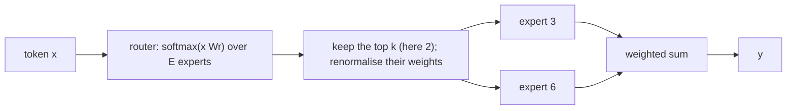
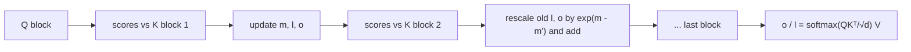

# Week 9, Day 6: Modern Architecture: GQA, Mixture of Experts, FlashAttention, and Reading a Config

**Time:** ~5h · **Needs:** `transformers` (for the library's own parameter counts, built on the *meta* device so nothing is allocated) · **Run it:** `uv run python weeks/week09_transformers-from-scratch/solutions/day6_solution.py`

You have written the architecture of Llama, Mistral and Qwen. Production models differ from it in three ways that matter: they **share key/value heads** (you built that), some replace the feed-forward layer with a **mixture of experts**, and their attention kernels never build the T × T matrix. Today you read three real `config.json` files, compute **parameters and memory in closed form** (and check the formula against the library for models of 8, 47 and 0.5 billion parameters), implement a sparse **MoE layer** that matches Mixtral's, and implement **FlashAttention's algorithm** in plain PyTorch.

## Learning objectives
- **Read a config** and derive the parameter count, the active parameters per token, the weight memory and the **KV-cache memory** of a model before downloading it.
- Explain what **GQA** saves (the cache), what **MoE** trades (memory for compute) and what **FlashAttention** changes (memory traffic, not the answer).
- Implement a **top-k MoE layer** with a load-balancing loss and verify it against Hugging Face's Mixtral block.
- Implement **online-softmax tiled attention** and verify it is exact, including for enormous scores.

---

## 1. Reading three configs

The fields that decide size: `hidden_size` (D), `num_hidden_layers`, `num_attention_heads` (H), `num_key_value_heads` (G), `head_dim`, `intermediate_size` (the feed-forward width), `vocab_size`, `tie_word_embeddings`, and for MoE `num_local_experts` and `num_experts_per_tok`.

| | layers | width | heads / kv | ffn | experts | vocab | parameters (formula = library) | active per token |
|---|---|---|---|---|---|---|---|---|
| Llama-3-8B | 32 | 4096 | 32 / 8 | 14,336 | no | 128,256 | **8,030,261,248** | 8.03B |
| Mixtral-8x7B | 32 | 4096 | 32 / 8 | 14,336 | 8, top 2 | 32,000 | **46,702,792,704** | **12.88B** |
| Qwen2.5-0.5B | 24 | 896 | 14 / 2 | 4,864 | no | 151,936 | **494,032,768** | 0.49B |

The "formula" column is `count_params` in `solutions/arch.py`; the "library" count comes from instantiating the model **on the meta device** (`with torch.device("meta"): AutoModelForCausalLM.from_config(cfg)`, which builds the structure without allocating memory, so a 47-billion-parameter model costs nothing). **They agree exactly for all three**, and for seven small real models of different shapes in the tests (grouped-query, multi-query, tied and untied output, an explicit `head_dim`, 4- and 5-expert MoE). Two of the configs are typed from memory of the published files, and the totals they give (8.03B, 46.7B) are the published ones, which is the check that the *numbers* are right and not only the formula.

The formula, per layer:

```
attention = D·H·d  +  2·D·G·d  +  H·d·D        (q, k, v, output; d = head width; Qwen also has biases on q, k, v)
mlp       = 3·D·F  (×E experts for an MoE, + D·E for the router)       (gate, up, down)
norms     = 2·D
total     = V·D (embedding) + layers·(attention + mlp + norms) + D (final norm) + V·D (output head, unless tied)
```

**Where the parameters are:**

| | embedding | attention | MLP | output head |
|---|---|---|---|---|
| Llama-3-8B | 7% | 17% | 70% | 7% |
| Mixtral-8x7B | 0% | 3% | **97%** | 0% |
| Qwen2.5-0.5B | **28%** | 9% | 64% | 0% (tied) |

Two readings. The **feed-forward layers hold most of the weights** (70% in a dense model, 97% in Mixtral): that is where "knowledge" capacity is added. And **for a small model the vocabulary matters**: 28% of Qwen2.5-0.5B is one table, which is why such models tie the input and output matrices and why the multilingual vocabulary of Day 2 is not free.

## 2. Memory: weights and the KV cache

**Weights** = parameters × bytes per parameter: 2 for bf16, 1 for int8, 0.5 for 4-bit.
**KV cache** (one sequence) = `2 × layers × kv_heads × head_dim × tokens × bytes`: two tensors (K and V) per layer, per kv head, per position. A test builds a real Llama model, runs it, and checks the formula against the **actual size of the cache object** it returns.

| | weights bf16 | int4 | KV cache at 4k / 32k / 128k tokens (GQA, as built) | the same with full multi-head attention |
|---|---|---|---|---|
| Llama-3-8B | 16.1 GB | 4.0 GB | 0.54 / 4.29 / **17.18 GB** | 2.15 / 17.18 / **68.72 GB** |
| Mixtral-8x7B | **93.4 GB** | 23.4 GB | 0.54 / 4.29 / 17.18 GB | 2.15 / 17.18 / 68.72 GB |
| Qwen2.5-0.5B | 1.0 GB | 0.2 GB | 0.05 / 0.40 / 1.61 GB | 0.35 / 2.82 / 11.27 GB |

- **GQA cuts the cache by H/G**: 4× for Llama-3-8B and Mixtral, **7× for Qwen2.5-0.5B** (14 query heads over 2 kv heads). The GQA paper reports quality close to multi-head attention at a fraction of the memory. At 128k tokens Llama-3-8B's cache is 17 GB per sequence; with multi-head attention it would be **69 GB for a single user**.
- **Concurrent users multiply it.** Llama-3-8B for 16 users at 32k tokens each: 16.1 GB of weights **plus 68.7 GB of cache = 84.8 GB**. The cache, not the weights, decides how many users one GPU serves (Week 11).
- **Mixtral needs all 93 GB resident even though it uses 12.9B per token**: every expert may be called by some token. MoE saves compute, not memory.

**Decoding one token is memory-bound.** Generating a token reads every (active) weight and the whole cache once, and does very little arithmetic with them. So a **ceiling** on single-sequence speed is `bandwidth / bytes read per token` (active weights in bf16 plus the 4k cache), with the bandwidth an assumption I have not measured:

| hardware (assumed bandwidth) | Llama-3-8B | Mixtral-8x7B | Qwen2.5-0.5B |
|---|---|---|---|
| Apple M2 (100 GB/s) | 6 tokens/s | 4 | 96 |
| one H100 (3.35 TB/s) | 202 | 127 | 3,226 |

These are upper bounds, not benchmarks (real systems lose some to overheads); the *ratios* are the useful part: Mixtral's 12.9B active parameters make it only about 1.6× slower than the 8B dense model, not 6×. Week 11 measures a real server.

## 3. Mixture of experts

A dense feed-forward layer runs every token through the same MLP. A **mixture of experts** keeps `E` separate MLPs ("experts") and a small **router**; each token is sent to its **top-k** experts, whose outputs are mixed with the router's weights:



Parameters grow with `E` (Mixtral: 8 experts, 4× the MLP parameters); compute per token grows only with `k` (2 experts run). That is the trade: **more capacity for the same per-token compute, at the cost of memory and routing complexity.**

`MoEMLP` in `solutions/arch.py`: a router `Linear(D, E)`, `E` SwiGLU experts, `top_k` routing with renormalised weights, and a **load-balancing loss**. Verification:

| check | result |
|---|---|
| against Hugging Face's `MixtralSparseMoeBlock` with copied weights (4 shapes: 2 to 8 experts, top 1 to 3) | largest difference **< 5e-7** |
| against a token-by-token computation (route, run the chosen experts, mix) | equal |
| one expert = a dense MLP; all experts = a softmax mixture | equal |
| routing weights sum to 1 per token; expert loads sum to 1 | yes |

**Why the balance loss.** Left alone, a router can send most tokens to a few experts (they get more training, so the router prefers them even more), and the others never learn: you pay for the memory and get a smaller model. The standard fix adds `E · Σ f_e P_e` to the loss, where `f_e` is the fraction of tokens routed to expert `e` and `P_e` its mean router probability. It equals **1.0 for perfectly even routing** (for any `k`: tested) and **E when everything goes to one expert** (tested with a collapsed router). A toy experiment (4 clusters of tokens, each with its own linear map as the target; 8 experts, top 2; 400 steps):

| balance coefficient | task MSE | balance loss | busiest expert (× uniform share) | idle experts |
|---|---|---|---|---|
| 0 | 0.0220 | 1.28 | **3.00** | **2** |
| 0.01 | 0.0217 | 1.01 | 1.95 | 0 |
| 0.1 | 0.0126 | 1.00 | 1.09 | 0 |

Without the loss, one expert takes three times its fair share and two never get used. With a small coefficient the loads even out and the **task loss does not get worse (here it improves)**. That is one toy task with one seed: the direction (balance helps use capacity) is well established; the size of the effect at scale is not something this experiment shows. (Real MoE models also drop tokens over a capacity limit and add noise or "shared experts"; none of that is here.)

## 4. FlashAttention's algorithm

Standard attention materialises the `T × T` score matrix (Day 3: 134 MB per layer at 2,048 tokens for 8 heads, **34 GB** at 32k). FlashAttention computes the **same result** without ever storing it, by processing keys and values **one block at a time** with an **online softmax**:

For each query row keep a running maximum `m`, a running denominator `l = Σ exp(s − m)` and a running output `o = Σ exp(s − m) v`. When a new block brings a larger maximum `m'`, multiply the old `l` and `o` by `exp(m − m')`: the softmax is **rescaled, never recomputed**. After the last block, `o / l` is exactly `softmax(s) V`.



`tiled_attention` is that algorithm in 25 lines of PyTorch:

| check | result |
|---|---|
| vs standard attention, **blocks of 1, 5, 16, 33, 64 and 500**, causal and not | within 1e-5 every time |
| a block of new queries at the **end** of a longer sequence (the KV-cache case) | exact |
| scores of the order 10⁴ (a naive `exp(score)` overflows) | **finite and within 4.8e-7**: the running maximum makes it stable |
| gradients through the tiled computation, float64 | equal to standard attention's |
| largest score tensor per head, T = 2,048, block 64 | **131,072 elements against 4,194,304: 32× smaller** (it is `T × block` instead of `T × T`) |

**What this does not show.** The *speed-up* of the real FlashAttention comes from **keeping each tile in the GPU's on-chip memory (SRAM)**, which is far faster than main memory (HBM): attention on a GPU is limited by memory traffic, not by arithmetic, and the fused kernel reads and writes the inputs and outputs once. My version is plain PyTorch on a CPU and is **slower than the standard one** (183 ms against 137 ms for T = 2,048): the point here is the algorithm and its exactness, and the memory bound, not a speed-up I cannot measure on this machine.

## 5. Other changes worth knowing (concepts, not implemented)
- **Sliding-window attention** (Mistral): each position sees only the last W tokens, so the cache and the cost are bounded.
- **Multi-head latent attention** (DeepSeek): cache a low-rank projection of K and V instead of the heads themselves.
- **Long-context RoPE scaling** (YaRN, NTK scaling): change the frequencies so a model trained on 4k tokens works at 128k.
- **Mixture-of-depths, state-space models, hybrid models**: alternatives to full attention at every layer.
- **QK-norm, logit soft-capping, and other stability tricks** in the newest models.

## 6. Pitfalls
- **Counting a tied output matrix twice**, or forgetting that the config's `head_dim` can differ from `hidden_size / heads`.
- **Reading "47B" as the cost per token.** For an MoE, total parameters are memory, *active* parameters are compute.
- **Estimating serving capacity from the weights alone.** The KV cache per user is often the limit.
- **Using the formula on a config you have not verified.** The check against the library on the meta device takes seconds and catches a mistyped field.
- **Believing a tokens-per-second ceiling.** It is bandwidth arithmetic with assumed hardware numbers.
- **Assuming FlashAttention changes the answer.** It is exact; it changes memory use and, on a GPU, speed.
- **Dense-model intuition for MoE training**: the router needs a balance loss, and uneven routing is a silent waste of parameters.

---

## Daily challenge: compute parameters and KV-cache memory for three real model configs

**Build** (reference: [`solutions/arch.py`](solutions/arch.py), [`solutions/day6_solution.py`](solutions/day6_solution.py)):
1. `ModelSpec`, a reader for a Hugging Face config, and `count_params` (total and active), `kv_cache_bytes`, `weight_bytes`.
2. Verify the count against the library on the **meta device** for three configs of different families (dense, GQA, MoE, tied embeddings) **and** against real small models of at least six shapes.
3. A table of weights and KV cache at 4k, 32k and 128k tokens in bf16, with and without GQA.
4. A top-k MoE layer, checked against Mixtral's block, with the balance loss and its two limiting values.
5. Tiled attention, exact for every block size, finite for enormous scores.

**Acceptance criteria**
- The formula equals the library's count exactly for every config tried, and the active-parameter figure for Mixtral-8x7B matches the published 12.9B.
- The KV-cache formula equals the size of a real cache object (batch 2, 13 tokens).
- The MoE layer matches Hugging Face's within 1e-5 on at least three (experts, k) combinations; the balance loss is 1 for uniform routing at k = 1, 2, 3 and E for a collapsed router.
- Tiled attention matches within 1e-5 for blocks of 1, 7, 64 and larger than the sequence, and a test makes a naive softmax overflow where yours does not.
- You state what is **assumed** (hardware bandwidths) and what is **not measured** (GPU speed-up).

**Stretch**
- Add **sliding-window attention** to the spec (cache capped at W) and tabulate the saving at 128k.
- Add **DeepSeek-style shared experts** to `MoEMLP` and verify against its Hugging Face block.
- Plot **cache size against context** for MHA, GQA (8 kv heads) and MQA (1) at 70B scale.
- Make a **Triton** or `torch.compile`d version of the tiled kernel on a Colab GPU and measure the real speed-up against the standard implementation.
- Estimate the **cost per million tokens** of serving each of the three models on a GPU you name, using the bandwidth arithmetic above, and say which assumption moves the answer most.

## Further reading
- Ainslie et al., *GQA*; Shazeer et al., *Outrageously Large Neural Networks* (MoE); Jiang et al., *Mixtral of Experts*; Fedus et al., *Switch Transformers* (the balance loss).
- Dao et al., *FlashAttention* and *FlashAttention-2*; Milakov and Gimelshein, *Online normalizer calculation for softmax*.
- Kwon et al., *Efficient Memory Management for LLM Serving with PagedAttention* (the KV cache as the serving bottleneck).
