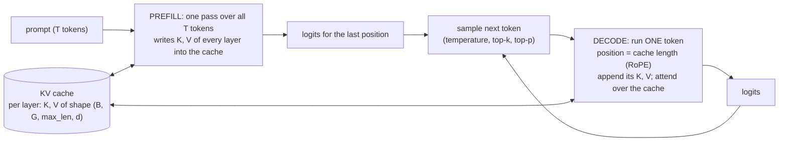

# Week 9, Day 7: Weekly Challenge: A KV Cache and Top-p Sampling for the Mini-GPT, Benchmarked

**Time:** ~6h · **Builds on:** Day 3 (attention, the end-aligned causal mask), Day 4 (the decoder, RoPE positions), Day 5 (the trained mini-GPT, sampling), Day 6 (cache-size arithmetic) · **Needs:** CPU only (the real-Qwen row needs the cached Qwen2.5-0.5B) · **Run it:** `uv run python weeks/week09_transformers-from-scratch/solutions/weekly/fastgen/run_weekly.py`

## The brief

Your decoder generates text, but slowly: every new token re-runs the *entire* prefix through every layer, so a sequence of N tokens costs O(N²). Real inference engines remember the keys and values of the tokens already processed and run **one token** per step. Today you add that **KV cache** to the model you built, make it **exactly** equivalent to the uncached path (and to Hugging Face's `generate`), implement **top-p (nucleus) sampling**, and **measure** what it buys on real hardware: speed against sequence length, cost per step as the context grows, memory against the formula from Day 6, and what the sampling settings do to quality and diversity.

## Requirements

**R1. A cache that is exactly equivalent.** `forward_cached(model, ids, cache)` runs the next `T` positions of the sequence the cache holds, using the model's own weights. Prefill of any length, then single tokens, then more multi-token chunks, must reproduce the uncached logits.

**R2. Positions come from the cache.** New tokens are rotated by their *absolute* positions (`cache length + i`), not by 0..T−1 (RoPE, Day 4); the new queries sit at the **end** of the cached keys (Day 3's end-aligned causal mask).

**R3. Grouped-query decoding without copies.** For a single-token step the `H/G` query heads of a group are processed as a block against **one** key/value head instead of repeating the K/V heads `H/G` times. Equivalent to the repeated path, and a test proves the copies really are avoided.

**R4. A preallocated cache and a naive one**, so the benefit of preallocation is measured and not assumed.

**R5. Top-p sampling.** A function that returns the **filtered distribution** (so every rule is testable exactly), with temperature, top-k and top-p composed in the standard order; `sample` draws from it.

**R6. Generation three ways** (no cache, concatenating cache, preallocated cache) producing **identical tokens** greedily and with a fixed seed when sampling; stop tokens; a hard length limit.

**R7. External verification.** Greedy generation equals Hugging Face's `generate` on a random Qwen2 model (a *different* implementation of the cache), and the real Qwen2.5-0.5B generates the same 48 tokens with and without the cache.

**R8. Measurements, reported with what they cannot tell you:** speed against N, per-step cost against context length, memory against the formula, grouped against repeated GQA decoding, sampling quality against diversity.

## What the benchmark found (this machine: an Apple M2 CPU, 4 threads, float32)

**Correctness first.** The largest logit difference between the cached and uncached forward passes over 48 positions (20 prefilled, then 28 decoded one token at a time): **8.3e-7**.

**1. Speed.** A 4.4M-parameter model (6 layers, width 256, 8 query / 2 kv heads), 64-token prompt, greedy decoding, best of two runs:

| new tokens N | no cache | preallocated cache | speed-up | tokens/s (decode): no cache → cache |
|---|---|---|---|---|
| 32 | 0.18 s | 0.04 s | **4.1×** | 174 → 790 |
| 128 | 1.01 s | 0.16 s | **6.2×** | 127 → 803 |
| 256 | 3.10 s | 0.36 s | **8.7×** | 82 → 730 |

All three modes produce **identical tokens** in every run. The speed-up **grows with N** because the two paths scale differently, which the next table shows directly.

**2. Cost of one decode step as the context grows** (ms, median of 5 steps):

| context | no cache | cache |
|---|---|---|
| 65 | 6.2 | 1.2 |
| 113 | 7.6 | 1.4 |
| 161 | 10.3 | 1.2 |
| 209 | 12.1 | 1.3 |
| 257 | 17.2 | 1.6 |
| 305 | **21.4** | **1.6** |

Without the cache each step costs more than the last (it re-runs a longer prefix: the cost per step is *linear* in the context, the total *quadratic*). With the cache the step is nearly flat: the only part that still grows is attention over the cached keys, which is small next to the fixed cost of the weight matrices at this size. At long contexts the attention term (and the cache's memory traffic) takes over, which is why the cache is also the thing that limits serving (Day 6).

**3. Preallocation made no measurable difference here.** `concat` (growing the tensors with `torch.cat` every step) and `cache` (preallocated, written in place) are within noise at 256 tokens (0.36 s for both). The naive version copies the whole cache at each step, which is O(length) extra work, but it is tiny against the matrix products at this size. It matters when the cache is large (long contexts, big batches) and, on a GPU, because of allocator fragmentation; I did not measure that regime.

**4. Grouped GQA decoding** (single-token step, 256 cached tokens): **1.57 ms** grouped against **2.25 ms** when the K/V heads are repeated (1.4× faster on the small model). On the real Qwen2.5-0.5B (14 query heads over 2 kv heads) the step takes **46 ms against 53 ms** (about 13% faster). Avoiding the copies matters more as the cache grows.

**5. Cache memory** after 200 tokens: **614,400 bytes**, exactly the Day 6 formula (`2 × layers × kv_heads × head_dim × tokens × 4 bytes`); the preallocated buffers for the full length reserve 645,120.

**6. The real Qwen2.5-0.5B** in the decoder you wrote, 48 greedy tokens after a 5-token prompt: **no cache 6.2 tokens/s (8.0 s), cache 21.4 tokens/s (2.3 s): 3.5× faster**, **identical tokens**: ` Paris. It is the largest city in Europe and the third largest city in the world. It is located in the south of France, on the banks of the Seine River. It is situated on the Île de la Cité,`. (A 48-token run on a prompt of 5 gets a smaller speed-up than 256 tokens on 64 for the same reason as above: the quadratic term has not had time to dominate.)

**7. Sampling, quality against diversity** on the Day 5 mini-GPT (8 prompts × 3 seeds, 60 tokens each; two proxies, not human judgements):

| setting | self-perplexity | distinct bigrams | loops |
|---|---|---|---|
| greedy | 2.3 | **0.22** | **25%** |
| T = 1.0, no filter | 8.1 | 0.90 | 0% |
| T = 1.0, top-k 40 | 6.9 | 0.88 | 0% |
| **T = 1.0, top-p 0.9** | 5.2 | 0.85 | 4% |
| T = 1.0, top-p 0.5 | 3.3 | 0.75 | 12% |
| T = 0.7, no filter | 3.5 | 0.77 | 0% |
| T = 1.5, no filter | **41.5** | 0.95 | 0% |
| T = 1.5, top-p 0.9 | 19.2 | 0.94 | 0% |

*Self-perplexity* is how surprised the model is by the tokens it chose (at temperature 1, unfiltered); real validation text scores about 17. *Distinct bigrams* is the share of unique token pairs (low means repetitive); *loops* is the share of samples whose last 20 tokens repeat a 4-gram.

- **Greedy decoding degenerates**: very predictable text (2.3) but only 22% distinct bigrams, and a quarter of the samples end in a loop. Picking the single most likely token every time is not a good generation strategy for a language model, a well-known result visible here at 0.9M parameters.
- **Unfiltered sampling at T = 1** is diverse (0.90) and wanders: self-perplexity 8.1.
- **Top-p 0.9 trims the unlikely tail** (5.2) while staying diverse (0.85). **Top-p 0.5 trims too much**: it starts looping again (12%).
- **At T = 1.5, unfiltered sampling is garbage** (41.5: the model is more surprised by its own output than by real text), and **top-p 0.9 rescues it to 19.2** while keeping the diversity (0.94). This is the strongest argument for top-p: it adapts the cutoff to the shape of the distribution (a confident step keeps a few tokens, an uncertain one keeps many), where top-k keeps a fixed number whatever the shape.
- **These are proxies.** Low self-perplexity is not "good" (greedy has the lowest and is the worst text), and distinct bigrams do not measure meaning. The *combination* (neither too repetitive nor too surprising) is what you tune; for real quality you would read samples or use a judge (Week 7).

## Acceptance criteria (the reference solution meets all of them)

| # | Criterion | Evidence |
|---|---|---|
| 1 | Cached logits equal uncached logits for multi-head, grouped-query, multi-query, with and without q/k/v bias | five shapes within 1e-5; chunk sizes 7, 1, 12, 1, 1, 8 also equal |
| 2 | The grouped single-token path equals the repeated path **and** avoids `repeat_interleave` | both tests |
| 3 | Greedy generation equals Hugging Face's `generate` | random Qwen2; and the real Qwen2.5-0.5B (48 tokens) |
| 4 | All three modes give identical tokens, greedy and sampled with one seed | tests |
| 5 | Positions are absolute: a cache holding a different prefix gives different logits | test |
| 6 | Top-p keeps the smallest set reaching `p` (and at least one token); top-k keeps ties; the order of composition is fixed | hand-computed cases away from float boundaries |
| 7 | Sampled frequencies follow the filtered distribution | 5,000 draws within 0.03 |
| 8 | The cache size equals the Day 6 formula; a full cache raises | tests |
| 9 | Mutation check | cache, grouped path, positions, masks, sampling: every behavioural mutant killed except `<` against `<=` at an exact top-p boundary (ambiguous in floating point by design, and documented) |

Verified here: **29 tests** for the weekly code.

## Pitfalls
- **Using positions `0..T-1` for the new tokens** (the cached output then differs from the uncached one at every step but looks plausible).
- **A causal mask aligned to the top-left** when the queries are a block at the end of the keys.
- **Returning the whole preallocated buffer** instead of a view of the valid part (the model would attend over zeros).
- **Comparing speeds with different outputs.** A faster path that produces different tokens is not faster, it is wrong; every row of the benchmark reports `same tokens`.
- **Believing the tokens/s of a 0.5B model on a CPU** transfers to a GPU: the ratios do; the numbers do not.
- **Top-p at a boundary**, **top-p before temperature**, and **renormalising before filtering**: three different distributions with the same name.
- **A cache that outlives its conversation** (privacy, Week 8): cached keys and values are a copy of the user's text.

## What this does not show
- **GPU behaviour.** Memory bandwidth, kernel fusion, paged caches and continuous batching (Week 11) change the picture.
- **Batched decoding.** Everything here is batch 1; throughput under many concurrent sequences is a different measurement.
- **Long contexts.** The longest context measured is about 300 tokens; the cache's memory and bandwidth costs dominate beyond that.
- **Sample quality by a human or a judge.** The two sampling metrics are proxies.

## Stretch
- **Rolling (sliding-window) cache**: keep only the last W positions and verify against a model that uses a sliding-window mask.
- **Batched generation** with left-padded prompts and per-sequence lengths; measure tokens/s against batch size.
- **Speculative decoding**: a small draft model proposes k tokens, the large one verifies them in one pass; measure the accepted length.
- **Prefix caching**: reuse the cache of a shared system prompt across requests; report the saving for a 500-token prefix.
- **Repetition penalty and min-p** sampling, compared with top-p on the same two metrics.
- Run the benchmark on a **Colab GPU** and compare the shape of the per-step curve.

## Further reading
- Pope et al., *Efficiently Scaling Transformer Inference* (cache and memory-bandwidth analysis).
- Holtzman et al., *The Curious Case of Neural Text Degeneration* (top-p).
- Leviathan et al., *Fast Inference from Transformers via Speculative Decoding*.
- Kwon et al., *PagedAttention* (Week 11).

## Looking back at the week
You wrote a PyTorch training loop, a tokenizer that matches tiktoken, attention that matches PyTorch's, a decoder that produces the same tokens as the real Qwen2.5-0.5B, a mixture-of-experts layer that matches Mixtral's, FlashAttention's algorithm, and a KV cache that matches Hugging Face's `generate`, and you trained a small model of your own on your own data. Every one of those was checked against a reference rather than trusted. Week 10 changes the weights of a model like this one (fine-tuning); Week 11 serves it.
