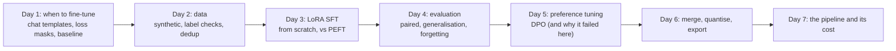

# Week 10: Fine-Tuning

**Phase 5: Models** · ~4-6 hours/day · Prerequisites: Week 9 (the from-scratch decoder: this week's model runs in it), Week 2 Day 3 (the extraction schema), Week 7 (confidence intervals, paired comparisons); **CPU only**: a GPU is not needed (the longest runs are about 25 minutes)

Week 9 built a transformer; this week **changes its weights on purpose**. The running example is the Week 2 extraction task (a messy customer email in, a typed `Order` out), the model is **SmolLM2-135M-Instruct** (small enough to fine-tune on a laptop CPU), and the evaluation is 38 emails **written by hand and never used for training**. Everything is written from scratch and verified against a reference where one exists: LoRA against PEFT, the chat template against the tokenizer's, the exported model against the library.

> **The rule of this week:** a fine-tune is a mirror of its data and its evaluation. Decide *whether* to tune from a measured baseline, measure the data's label errors, evaluate on phrasing the training set never produced, and check what the tuning broke. **A falling training loss is the least informative number in the pipeline.**



## Learning goals
By Sunday you can:
- Decide between prompting, retrieval and fine-tuning with **evidence**, and write the decision memo.
- Build **chat-format training examples** with a loss mask and avoid the boundary bugs that corrupt them.
- **Generate and curate** synthetic data: label checks against the source text, MinHash deduplication, decontamination, balance, with **measured** catch and false-rejection rates.
- Implement **LoRA**, verify it against PEFT, train with a hand-written SFT loop, and explain **QLoRA/NF4**.
- **Evaluate** a fine-tune: intervals, paired comparisons, the generalisation gap, forgetting.
- Implement **DPO, ORPO and GRPO's objectives**, run a preference pass, and recognise when it made the model worse.
- **Merge, export, quantise and audit** a model, and price the result.

## Schedule
| Day | Lesson | Challenge | Needs |
|---|---|---|---|
| 1 | [When to fine-tune](day1_when-to-fine-tune.md) | A decision memo and a formatted dataset | CPU, SmolLM2 download |
| 2 | [Data curation](day2_data-curation.md) | A 1,000-example synthetic dataset with quality filters | CPU |
| 3 | [SFT with LoRA](day3_sft-with-lora.md) | Fine-tune a small model on the Day 2 data | CPU (~25 min), `peft` for the parity check |
| 4 | [Evaluating fine-tunes](day4_evaluating-fine-tunes.md) | An eval report: base vs tuned (vs a frontier model: not run) | CPU (~25 min) |
| 5 | [Preference tuning](day5_preference-tuning.md) | A DPO pass with a measured change | CPU (~35 min per run) |
| 6 | [Merge, export, publish](day6_merge-export-publish.md) | Your model, merged, exported and quantised | CPU (~15 min) |
| 7 | [Weekly challenge](day7_weekly-challenge.md) | Beat the prompted baseline at a fraction of the cost | CPU |

New code lives in `weeks/week10_fine-tuning/solutions/`: `orders.py` (the task, the answer keys, the scorer), `chatfmt.py`, `gen_data.py`, `lora.py`, `train_sft.py`, `probes.py`, `evalrun.py`, `dpo.py`, `quant.py`, `export.py`, `infer.py`, and `weekly/extract_ft/`. `blocks.py` (Week 9) gained `hidden_states()` and a general `config_from_hf` (Llama checkpoints load too).

```bash
uv sync --extra finetune      # torch, transformers, peft, accelerate
```

## The week's headline numbers (SmolLM2-135M-Instruct; Apple M2 CPU; greedy decoding; 38 hand-written emails)
| | |
|---|---|
| Day 1 | zero-shot prompt: 21% valid JSON, **0%** exact; a 3-shot prompt (593 tokens): 97% valid JSON, **3%** exact, 39% field accuracy |
| Day 2 | 1,500 generated emails with 99 deliberately wrong labels: checks without a completeness test caught **91%** and **0 of 8** omitted items; with it **100%**, with **0 false rejections of 1,401 clean samples**; MinHash+LSH found **19 of 19** near-duplicate pairs and was **5× faster** than exact comparison at 4,800 emails |
| Day 3 | LoRA r=16: **4.9M trainable parameters (3.5%)**, logits equal PEFT's to 8.7e-5, dev loss 1.507 → 0.0056 in 23 minutes of CPU |
| Day 4 | hand-written exact match **3% → 74% [58%, 85%]** (paired difference +0.71 [+0.55, +0.84]; better on 27 emails, worse on 0); synthetic 92%: a **generalisation gap of 18 points**; forgetting: factual probes 70% → 30%, prose loss +0.24 nats |
| Day 5 | **DPO made the model worse**: exact match 74% → 32% (worse on 18 emails, better on 2) while its own reward accuracy reached 100%; a 10× smaller learning rate changed nothing (+3 points, one email), and an added likelihood term on the chosen answer cut the damage but still lost to SFT (68%): **no DPO setting improved on SFT here** |
| Day 6 | merged = adapter model (1.2e-4); exported model loaded by `transformers` with identical output; **Q8_0 lossless at 31% of the size; 4-bit collapses on a 135M model** (NF4 50%, Q4_0 24%, uniform int4 0%) |
| Day 7 | report generated end to end: **fine-tuned 74% exact [58%, 85%] against 3% for the best prompt** (paired +0.71 [+0.55, +0.84], better on 27 emails, worse on 0), **2.8× cheaper per request under an assumed price card**, training repaid after about 300 requests; the forgetting probes fell 31% → 25% |

## What has been verified
| Item | How |
|---|---|
| Day 1: `chatfmt.py`, `orders.py` | 29 tests: our ChatML renderer equals `apply_chat_template` on 14 cases; the loss mask covers exactly the answer plus `<|im_end|>`; left-truncation never cuts an answer; **an answer starting with whitespace is rejected (a test found the straddling-token bug)**; every gold label is itself a valid order; the scorer separates not-JSON, invalid order and wrong fields |
| Day 2: `gen_data.py` | 22 tests: determinism; every defect kind caught; **the completeness check catches an omission the grounding checks cannot**; "nothing urgent" is not an urgency cue; clean samples never fail (0 of 6,000); MinHash agreement estimates Jaccard; LSH reports only verified pairs and finds at least 90% of the true ones; the splits are disjoint and free of evaluation text |
| Day 3: `lora.py`, `train_sft.py`, `quant.py` | 26 tests: B = 0 gives bitwise equality with the base; delta rank; the gradient reaches B but not A at the first step; **LoRA against PEFT (adapters and merged)**; the frozen weights never move; the answer loss equals the naive loss and padding does not change it; the per-step gradient norm is that of the per-token mean loss; NF4 rebuilt from its definition equals the published table (difference 0.0) |
| Day 4: `evalrun.py`, `probes.py` | 14 tests: every probe has a right answer that passes and wrong or order-shaped ones that fail (a test found that an order object passed the "true or false" probe); paired comparison counts; adapters round-trip into a merged model |
| Day 5: `dpo.py` | 16 tests: loss = ln 2 at the reference, by hand, gradient signs, ORPO and GRPO by hand, the clipped objective stops pushing, the first step starts at ln 2, the NLL term keeps the chosen likelihood up |
| Day 6: `export.py` | 10 tests: export then load reproduces the weights exactly (tied and untied); **a merged LoRA model exported to a directory is loaded by `transformers` with the same logits**; the Modelfile, the hosted-API file checks and the audit (including a planted credential) |
| Weekly: `extract_ft/` | 9 tests: cost arithmetic, report sections, the reply cache re-scores without generating, and a **one-minute end-to-end smoke run** of the whole pipeline |

**Mutation checks** (`scripts/mutate.py`) ran on `lora.py`, `train_sft.py`, `chatfmt.py`, `gen_data.py`, `dpo.py`, `quant.py` and `export.py`. Survivors either became tests or are equivalent mutants (a transposed product that equals `B A`; LSH with one row per band, which only adds candidates that the exact Jaccard then verifies). They found, among others: a loop that never checked it clipped or cleared gradients, a bucket sort nobody tested, a reference-column swap in DPO that only a "first step starts at ln 2" test catches, and a q8 divisor test that passed with the wrong constant.

**Bugs found by the work itself** (each has a test): leading whitespace in an answer creates a token that straddles the prompt/answer boundary; the first generator **omitted the customer's name** from some emails while labelling it (found because the label checks rejected 10% of *clean* data); the generator's non-order templates had copied five of the hand-written evaluation emails (found by the decontamination stage); the "nothing urgent" cue; an order object passing a "true or false" probe.

**Not run by the author:** any hosted model (a frontier baseline, hosted fine-tuning, an LLM that writes the synthetic data), **QLoRA, TRL, Unsloth and any GPU run**, **GRPO training**, **Ollama** (the GGUF conversion and llama.cpp serving of this model are done in Week 11), the Hugging Face Hub upload, and anything with a model larger than 135M parameters. Prices are **assumptions** supplied as inputs. One training run and one seed for everything.

**What to remember:** a baseline you measured is worth more than a fine-tune you hoped for; the evaluation that matters is on phrasing the training data never produced; DPO can satisfy its own objective while wrecking the task; 4-bit quantisation that is harmless at 7B can be fatal at 135M; and every claim in a report needs its interval.
