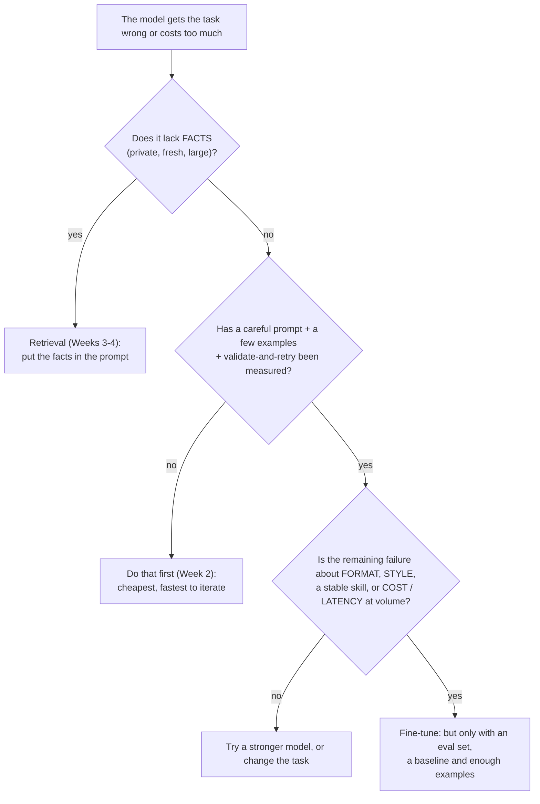

# Week 10, Day 1: When to Fine-Tune, Chat Templates and Dataset Formats

**Time:** ~4h · **Needs:** CPU only (the baseline run takes about 3 minutes); the SmolLM2-135M-Instruct checkpoint downloads once (about 270 MB) · **Run it:** `uv run python weeks/week10_fine-tuning/solutions/day1_solution.py`

This week you fine-tune a model, and the first skill is knowing **whether to**. Fine-tuning is the most expensive of the three ways to change a model's behaviour (prompting, retrieval, training), the slowest to iterate on, and the easiest to do for the wrong reason. Today you learn the decision, then the plumbing every fine-tune depends on: **chat templates**, **loss masks** and **dataset formats**. Then you measure a real baseline, so that the decision memo you write at the end has evidence in it instead of opinions.

**The task for the whole week** is the Week 2 extraction problem: turn a messy customer email into a typed `Order` (8 fields: is it an order, customer name, order id, items with quantities, urgency, delivery date, total, currency). The model is **SmolLM2-135M-Instruct** (135M parameters, a Llama-architecture model that runs on a laptop CPU), loaded into the decoder you wrote in Week 9. A frontier model would be the natural tool for this; a 135M model is a deliberately hard test of what fine-tuning can do. The **evaluation set** is 38 hand-written emails (the 8 of Week 2 plus 30 new ones, with answer keys, written *before* any model saw them) and is **never used for training**.

## Learning objectives
- Decide between **prompting, retrieval and fine-tuning** from what each one actually changes, and write a **decision memo** with evidence.
- Explain a **chat template**, reproduce SmolLM2's, and see what happens when a fine-tune uses the wrong one.
- Build training examples with a **loss mask** (loss on the answer and the end-of-turn token only) and know the edge cases that break it.
- Convert between the common **dataset formats** (messages, Alpaca, ShareGPT, prompt/completion, preference pairs).
- **Measure a baseline** before training anything: validity, field accuracy, and cost per request.

---

## 1. Prompting, retrieval or fine-tuning?



What each tool changes:

| | what it changes | good for | bad for | iteration time |
|---|---|---|---|---|
| **Prompting** | the input | most tasks; fast experiments | needs a long prompt on every call; unreliable on small models | seconds |
| **Retrieval** | the facts the model sees | private, changing or large knowledge; citations | teaching a *skill* or a *format* | minutes |
| **Fine-tuning** | the weights | a stable format or style, a narrow skill, shorter prompts, a smaller/cheaper model, behaviour that is hard to describe | adding facts that change (it forgets, it hallucinates them); one-off tasks | hours, plus a pipeline |

The most common mistake is fine-tuning to add **knowledge**. A model fine-tuned on your documents will imitate their style and still make up their contents; retrieval gives it the documents. Fine-tuning is for **how** the model answers, not **what** it knows.

**Good reasons**, each testable: the output must follow a **strict format** that prompting cannot make reliable; the **same task runs at high volume** so a short prompt on a small model beats a long prompt on a big one; **latency or privacy** rules out a hosted model; you have **hundreds to thousands of labelled examples** and an eval set; the behaviour is easy to demonstrate and hard to describe.

**Bad reasons**: "the model is wrong sometimes" (is it wrong in a way a prompt fixes?), no eval set (you will not know if it worked), fewer than a hundred examples, a task that changes weekly, wanting the model to "know" something.

## 2. A chat model is a language model with a layout

SmolLM2 was trained on text that looks like this (ChatML):

```
<|im_start|>system
You are a helpful AI assistant named SmolLM, trained by Hugging Face<|im_end|>
<|im_start|>user
Hi<|im_end|>
<|im_start|>assistant
```

`<|im_start|>` and `<|im_end|>` are **special tokens** (ids 1 and 2; `<|im_end|>` is also the end-of-sequence token). The model's whole "chat" behaviour is: after `<|im_start|>assistant\n`, write an answer and then `<|im_end|>`. The template is stored with the tokenizer as a Jinja snippet; `solutions/chatfmt.py` re-implements it in a few lines and a test checks it **equals `tokenizer.apply_chat_template` on 14 cases** (with and without the generation prompt: no system message, a system message, multi-turn, unicode, empty-ish and multi-line content).

Two behaviours to know: if you give **no system message the template inserts the model's default one**, so a prompt you thought was empty is not; and the **generation prompt** (`<|im_start|>assistant\n`) is what you append at inference time so the model knows it is its turn.

**Why the template matters for fine-tuning.** The model has learned the layout. If you fine-tune on a different one (say `### Instruction:` / `### Response:`), you teach a *new* layout on top of the old and the model must now handle two; if inference uses a third, you get garbage. **Train with exactly the template you will serve with**, and let the tokenizer be the source of truth.

## 3. Training examples and the loss mask

A training example is one conversation, tokenised, with a **label** per token. The loss should be computed only where the model has to produce something:

```
<|im_start|>system\nExtract the order from the email as JSON.<|im_end|>\n     <- prompt: label -100 (ignored)
<|im_start|>user\nHi, it's Dana. Order A-1042 please: 3x blue widgets ...<|im_end|>\n   <- prompt: ignored
<|im_start|>assistant\n                                                       <- header: ignored
{"is_order":true,"customer_name":"Dana Whitfield",...,"currency":"USD"}<|im_end|>   <- ANSWER: labels = the token ids
\n                                                                              <- trailing newline: ignored
```

On the first hand-written email that is **173 tokens, 88 of them answer tokens (51%)**. Computing the loss on the prompt too would teach the model to *write emails* instead of extracting from them, and would dilute the gradient. Including `<|im_end|>` in the labels is what teaches the model to **stop**; leave it out and the fine-tuned model rambles on after the JSON.

`encode_example` tokenises the **whole rendered conversation once** (so the ids are exactly what the model sees at inference) and uses the tokenizer's **character offsets** to decide which tokens are answer tokens. Tests check: the labelled tokens decode to exactly `<answer><|im_end|>`; the ids equal the tokenisation of the rendered text; with several assistant turns you can train on the last or on all; a too-long prompt is cut **from the left** and **an answer is never cut** (an answer that does not fit raises, because training on half a JSON object teaches the model to stop mid-object).

**An edge case a test found.** If an answer **starts with whitespace** (say `"  indented"`), the newline that ends the header and the spaces fuse into a single BPE token that begins *inside the header*. The offset rule then treats that token as prompt, so the model is never trained to produce those spaces, while at inference (where the prompt ends after the newline) it would have to. The tokenisations disagree. `validate_messages` now rejects an assistant answer that starts with whitespace, and a test demonstrates the straddling token. The general lesson: **tokenise the concatenation, and check the boundary between prompt and answer.**

Other validation that prevents silent damage: unknown roles, empty content, a system message that is not first, two turns by the same role in a row, content that contains `<|im_start|>` or `<|im_end|>` (it would break the template: a user could inject a fake turn), and no final assistant answer.

## 4. Dataset formats

The same conversation in the layouts you will meet (all convertible; the "messages" form is the one this week uses):

| format | shape | where you meet it |
|---|---|---|
| **messages** (chat) | `{"messages": [{"role","content"}, ...]}` | OpenAI, Hugging Face TRL, Axolotl, Unsloth |
| **Alpaca** | `{"instruction", "input", "output"}` | single-turn tasks; Stanford Alpaca and descendants |
| **ShareGPT** | `{"conversations": [{"from": "human"/"gpt", "value"}]}` | multi-turn datasets from the Vicuna era |
| **prompt/completion** | `{"prompt", "completion"}` | completion-only SFT; the prompt is the rendered text up to `assistant\n` |
| **preference** | `{"prompt", "chosen", "rejected"}` | DPO and other preference tuning (Day 5) |

Round trips are tested (messages to Alpaca to messages; messages to ShareGPT and back), prompt plus completion plus `"\n"` equals the rendered conversation, and a preference pair with identical `chosen` and `rejected` is rejected (it teaches nothing).

## 5. The baseline: what does prompting get?

Before any training, measure what you already have. The untouched SmolLM2-135M-Instruct, greedy decoding, on the 38 hand-written emails. Two prompts: **zero-shot** (a system prompt that describes the JSON schema) and **3-shot** (the same system prompt plus three worked examples as chat turns, none of them in the evaluation set).

| prompt | valid JSON | valid Order | exact (all 8 fields) | field accuracy | prompt tokens | s / email |
|---|---|---|---|---|---|---|
| zero-shot + schema | 21% | 8% | **0%** | 4% | 238 | 2.4 |
| 3-shot + schema | **97%** | 76% | **3%** (1 of 38) | **39%** | **593** | 1.7 |

(*Valid Order* means it parses as JSON, matches the Week 2 schema **and** passes its semantic checks: an order must have a name, an id and an item; a total needs a currency; a delivery date must be after the email arrived.)

Per-field accuracy of the 3-shot prompt: is_order 18%, customer_name 39%, order_id 37%, items 37%, urgency 53%, delivery_date 47%, total_amount 42%, currency 42%.

What this says:
- **Zero-shot is hopeless** for a 135M model: 79% of replies are not even JSON (it rambles, repeats, or mixes prose into the object).
- **Three examples fix the format** (97% valid JSON) **but not the task**: only 1 email in 38 is fully right and the field accuracy is 39%. The model has copied the *shape* of the examples, not learned to read the email: it says `is_order: false` for most real orders (18% right on that field). Failures cover the three kinds worth separating: valid-but-wrong fields, an **invalid order** (a total without a currency) and **not JSON at all** (`Extra data` after a first object).
- **Prompting is also the expensive option here**: the 3-shot prompt is **593 tokens** per email, while an email plus a one-line instruction is about **85**. At volume you pay for those 500 extra tokens on *every* call. A fine-tuned model needs no examples in the prompt.

A fair baseline matters. The first schema prompt contained the example id `A-1042`, and the model copied it into most of the first replies I looked at; the evaluation prompt now tells the model to copy the id "exactly as written in the email" and a test asserts that no example id appears in it. **A baseline you have handicapped proves nothing.**

## 6. The decision memo (a template, filled in)

A decision memo is one page that a colleague can disagree with:

1. **Task and success criteria**, measurable: e.g. field accuracy ≥ 85% and valid Order ≥ 95% on the 38 hand-written emails; ≤ 1 s per email on a laptop CPU.
2. **What was tried** and what it scored (the table above).
3. **Why prompting is not enough**: the failure modes, with examples.
4. **What fine-tuning would change** and what it will *not* (it can teach the format and the reading skill; it will not make a 135M model understand anything outside the task).
5. **Cost and risk**: data to build (Day 2), compute (CPU minutes here; a GPU-hour for a bigger model), maintenance (a new schema means new data and a re-train), **forgetting** (Day 4), and what a frontier model would cost per request instead (not measured here: no hosted-model key was used).
6. **Decision and a kill criterion**: "fine-tune; if a 1,000-example LoRA does not reach X on the hand-written set, stop and use a hosted model."

For this task the evidence supports fine-tuning **conditionally**: prompting a 135M model cannot reach the criteria, the format problem is exactly what fine-tuning is good at, the volume argument (593 against 85 tokens) is real, and a kill criterion exists. What the evidence does *not* show is that fine-tuning will work, or that it beats a hosted frontier model with a good prompt: both are tested on Days 4 and 7 (the second only as a labelled cost estimate).

## 7. Pitfalls
- **Fine-tuning for facts.** Use retrieval.
- **No baseline, or a handicapped one.**
- **Evaluating on training data**, or on data written from the same templates as training (Day 2 builds the hand-written set precisely to avoid that).
- **A mismatched template** between training and serving.
- **Loss on the prompt**, or **no end-of-turn token** in the labels.
- **Tokenising the prompt and the answer separately** and concatenating (the boundary can differ from what the model sees).
- **Truncating the answer.**
- **Training on content that contains control tokens.**
- **Leading whitespace in answers.**
- **Treating the format fix as a skill fix**: 97% valid JSON with 3% exact is a model that learned the shape and not the task.

---

## Daily challenge: a decision memo and a formatted dataset for one task

**Build** (reference: [`solutions/chatfmt.py`](solutions/chatfmt.py), [`solutions/orders.py`](solutions/orders.py), [`solutions/infer.py`](solutions/infer.py), [`solutions/day1_solution.py`](solutions/day1_solution.py)):
1. A chat-template renderer that matches the tokenizer's own on at least ten conversations, with validation of the conversations it accepts.
2. `encode_example` with a loss mask, tested for the answer boundary, the end-of-turn token, multi-turn selection, left-truncation of the prompt, and an answer that does not fit.
3. Converters between messages and at least three other layouts, with round-trip tests.
4. A hand-written evaluation set (at least 30 items with answer keys that are themselves validated) and a scorer that separates *valid JSON*, *valid object* and *field-level correctness*.
5. A baseline measurement (zero-shot and few-shot) with per-field accuracy, failure modes and prompt-token cost.
6. A one-page **decision memo** in the template above.

**Acceptance criteria**
- The template matches the tokenizer on every test conversation, with and without the generation prompt.
- The labelled tokens of an example decode to exactly the answer plus the end-of-turn token.
- An answer that starts with whitespace, or a message that contains a control token, is rejected with a clear error.
- The baseline table reports validity and field accuracy **separately**, and the prompt cost in tokens.
- No few-shot example and no schema-prompt example appears in the evaluation set; a test checks it.
- The memo states success criteria and a kill criterion before any training.

**Stretch**
- Add **sequence packing** (several short examples in one training sequence, with attention masked per example) and measure the padding waste you remove on this dataset.
- Write a converter for your provider's fine-tuning API format (OpenAI's chat JSONL, for example) and a validator for its rules. (Submitting a job is not run here: it needs a key.)
- Measure how the **baseline changes with the number of shots** (0, 1, 3, 8) and where it stops improving.
- Re-run the baseline with the model's **default system prompt** left in and see what the 135M model does with it.

## Further reading
- Hugging Face, *Chat templates* (the `transformers` documentation) and the SmolLM2 model card.
- Zhou et al., *LIMA: Less Is More for Alignment* (data quality over quantity).
- OpenAI's fine-tuning guide on when to fine-tune, and the Anthropic and Google equivalents for hosted tuning.
