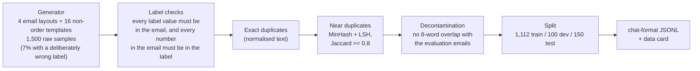

# Week 10, Day 2: Synthetic Data, Quality Filters and Curation

**Time:** ~5h · **Needs:** CPU only · **Run it:** `uv run python weeks/week10_fine-tuning/solutions/day2_solution.py` (about 20 seconds)

A fine-tune is a mirror of its data: it learns the format, the style, the mistakes and the blind spots of whatever you feed it. Most of the work of fine-tuning is therefore *making the dataset*, and most of the failures that get blamed on the model or the learning rate are in the data. Today you build a **1,100-example training set** for the order-extraction task, with the quality machinery a real pipeline needs: **label checks** against the source text, **near-duplicate removal**, **decontamination** against the evaluation set, **balance** statistics. And, because the generator is a program, you can do something a real pipeline cannot: **inject known label errors and measure whether the filters catch them.**

## Learning objectives
- Generate **synthetic training data** with controlled variety, and say what synthetic data can and cannot teach.
- Write **validity filters** that check a label against the text it describes, and measure their **catch rate and false-rejection rate** on known defects.
- Remove **exact and near duplicates** (MinHash + LSH) and verify the approximation against exact Jaccard similarity.
- **Decontaminate**: guarantee that nothing in training overlaps the evaluation set.
- Look at **balance and coverage** before training, not after.

---

## 1. The data pipeline



**Why synthetic data.** Real labelled emails are rare and private; a model can write plausible ones (the prompt is below), and a program can write *labelled* ones for free. **What it teaches:** the format, the schema, a consistent way of resolving cases (a "not urgent" email is `low`, an email that names a date gets that date in ISO form), robustness to layouts and phrasing it has seen. **What it cannot teach:** phrasing and mess it has never seen; that is why the evaluation set is **hand-written** and unrelated to the templates (Day 1), and why the distance between the synthetic test set and the hand-written one is the most important number of Day 4.

**The generator** (`solutions/gen_data.py`) produces four layouts (prose, bullet list, form-style, terse), each with randomised greetings, fillers, sign-offs and noise; numbers as digits or words; **seven date formats**, **six money formats** (symbols, codes, thousands separators, the continental decimal comma); urgency expressed in ten high-priority and eight low-priority ways or not at all; one to four items; 12% non-orders (cancellations, status questions, complaints, quote requests, out-of-office replies, unsubscribe requests). Every email is produced **from** its label, so the label is correct by construction, except for the defects injected deliberately.

**The prompt a language model would get instead** (a labelled sketch; **not run**: no hosted-model key was used this week):

```
Write one realistic, messy email from a customer to a small business. It must <place an order | cancel an order | ask a question>.
Include: customer name, an order id like "AB-123", 1-3 items with quantities, <a delivery date>, <a total in USD/EUR/GBP>.
Vary the style: <formal | casual | terse | form-like>. Do not use these phrasings: <list of recent outputs>.
Then output the JSON label. Return {"email": ..., "label": {...}}.
```

and the loop around it: validate the JSON, **run the same label checks below** (a language model's label for its own email is wrong more often than you would like), drop duplicates, track the diversity. The checks are the same whatever writes the data.

## 2. Label checks: does the label follow from the text?

Every filter asks one question of a sample: *can this label be wrong given this email?*

| check | what it verifies |
|---|---|
| order id | the id appears in the email (case and punctuation ignored) |
| customer name | the name appears in the email (a first-name-only email must have a first-name-only label) |
| items | every item's words appear (plurals normalised); every **quantity** appears as a digit or a number word |
| delivery date | the email states exactly that date, in any of the supported formats; and if the email states a date, the label has one; and it is **after the email was received** |
| total and currency | the number appears (thousands separators, decimal commas), with a symbol, code or word for the currency |
| urgency | a cue for the label's value appears; "nothing urgent" and "not urgent" count as **low** cues, not urgent ones |
| **completeness** | every number in the email is **explained by the label**: it is a quantity, the order id, a date, or the total |

The last check is the one that matters most and the one I added after measuring. **My first version had no completeness check**, and on 102 injected defects it caught **93 (91%)**: every kind except one. **All eight "dropped item" defects slipped through** (0 of 8): a label that *omits* an item is still a subset of what the email says, so every "is this value in the email?" check passes. The checks above prove **precision** (what the label claims is in the text) but not **recall** (everything in the text is in the label). The completeness check is a heuristic for recall: a quantity left in the email with no item to explain it is evidence of a missing item. After adding it, the same pipeline caught every injected defect.

**Read that 100% with suspicion.** I injected defects of eight kinds, and I wrote the checks to catch those eight kinds. The catch rate is a **ceiling**: a language model's mistakes are subtler (a *plausible but wrong* urgency, a date inferred from "end of next month"), and they would pass checks this literal. What the experiment does show: the checks work as designed, the false-rejection rate is **0 of 1,401 clean samples** (and 0 of 20,000 in a stress run), and the failure that *would* have gone unnoticed (omission) was found by looking at **which defect kinds slipped through**, not at the overall rate.

| defect injected into the label | injected | caught |
|---|---|---|
| wrong order id | 14 | 14 |
| wrong quantity | 18 | 18 |
| invented item | 17 | 17 |
| wrong urgency | 7 | 7 |
| wrong currency | 9 | 9 |
| delivery date in the past | 12 | 12 |
| **dropped item** | 8 | 8 (0 of 8 before the completeness check) |
| wrong customer name | 14 | 14 |

**The filters tested the generator too.** The first run rejected **138 of 1,415 clean samples (9.8%)**. Looking at them found real bugs: some prose emails **never mentioned the customer's name** (the label said "Sven Kowalski"; the text contained no name at all), which would have taught the model to invent names; form-style emails said `Priority: high`, which my cue list did not recognise; and a lower-casing noise step turned `AA-602` into `aa-602`, so the "gold" id no longer matched the text. Fixing the generator (the name is always present; a first-name-only email gets a first-name label; no lower-casing of values) brought the false rejections to **0**. Two more things surfaced later: `"nothing urgent"` contains the word *urgent* (a label of `high` was passing on that cue; two defects slipped through until the check handled negation), and single-digit totals such as `GBP 8` were not recognised as money.

## 3. Near-duplicates: MinHash and LSH

Exact duplicates are easy (normalise the text and hash it). **Near-duplicates** ("the same email with one word changed") inflate the apparent size of the dataset and, worse, cause leakage between splits. Comparing every pair of *n* emails is O(n²); **MinHash + locality-sensitive hashing** finds similar pairs in roughly linear time:

1. Represent each email as the set of its **5-word shingles**; the similarity of two emails is the **Jaccard index** of their sets, |A ∩ B| / |A ∪ B|.
2. A **MinHash signature** is the smallest hash of any shingle under each of 64 hash functions. The probability that two signatures agree at one position **equals the Jaccard similarity** (a test checks that the agreement rate estimates it to within 0.1).
3. **LSH**: split each signature into 16 bands of 4; two emails that agree on *any* band land in the same bucket and become **candidate pairs**, which are then verified with the exact Jaccard.

Measured on 600 emails at threshold 0.8: **19 true near-duplicate pairs, all 19 found, 0 false pairs** (every reported pair is verified, so there can be no false positives; the question is recall). The cost is the point:

| emails | exact all-pairs | MinHash + LSH |
|---|---|---|
| 600 | 0.26 s | 0.41 s |
| 1,200 | 1.01 s | 0.80 s |
| 2,400 | 4.02 s | 1.57 s |
| 4,800 | **16.0 s** | **3.3 s** |

At 600 emails LSH is *slower* (computing signatures is not free); the crossover is around 1,000, and by 4,800 it is 5× faster with the exact method growing quadratically (4× per doubling) and LSH roughly linearly. For a million documents the exact method does not finish.

Funnel on the 1,500 generated emails: 99 removed by the label checks, 14 exact duplicates, 24 near-duplicates (Jaccard ≥ 0.8), 1 removed by decontamination; **1,362 kept**.

## 4. Decontamination: nothing in training may overlap the evaluation set

The evaluation emails must be **unseen**. The check: drop any training sample that shares an **8-word sequence** with any evaluation email (the 38 hand-written ones plus the 3 few-shot examples of the baseline). It removed **1 sample** (after the generator's non-order templates were rewritten; the first version had copied five of my own hand-written evaluation emails almost verbatim, which the contamination stage caught: **the test of "no generated email equals a hand-written one" is in the suite**). Report the number you removed, and check it again on the final splits: the data card records **0** evaluation emails sharing an 8-word sequence with train, dev or test.

An 8-gram check catches copying and not paraphrase: a synthetic email that *means* the same as an evaluation email passes. For hosted-model-generated data, also check embeddings; for benchmark data, check the benchmark's published contamination reports.

## 5. Balance and coverage (training split, 1,112 examples)

| | distribution |
|---|---|
| is an order | 88% (12% non-orders) |
| urgency | high 21%, normal 50%, low 17% (of orders) |
| currency | none 40%, USD 16%, EUR 15%, GBP 17% |
| has a delivery date | 44% |
| items per order | 1: 34%, 2: 31%, 3: 17%, 4: 5% |
| layout | prose 34%, terse 21%, list 20%, form 12%, non-order 12% |

Look at these *before* training. A model trained on 88% orders and 12% non-orders will lean towards "is an order"; one trained with 3% date-less emails will hallucinate dates. Rare classes need examples, not hope. The training split is **158,745 tokens** (median 145 tokens, 95th percentile 188, max 216; **54% are answer tokens**; none truncated at 512). Those token counts are the training cost, and they determine the CPU time of Day 3.

Splits are seeded shuffles (train 1,112, dev 100, test 150), written as chat-format JSONL with a **data card** (generator seed, counts, residual defects, contamination count). A data card is what lets someone else (or you in a month) know what the model was trained on.

## 6. What this pipeline does not do
- **It does not make the dataset realistic.** Hand-written emails will use phrasing and mess the templates never produce; Day 4 measures that gap.
- **It does not remove all label noise** in general, only the noise it was built to detect.
- **Deduplication hides a trade-off.** Near-duplicates at Jaccard 0.8 are removed; at 0.5 you would remove legitimate variety.
- **It does not check for bias, toxicity or personal data.** The names here are synthetic; real emails need the Week 8 redaction first.

## 7. Pitfalls
- **Trusting a model's labels for its own synthetic data** without checking them against the text.
- **Reporting the catch rate on defects you designed the checks for.** It is a ceiling.
- **Looking only at the overall catch rate.** Look at which kinds slip through.
- **Measuring false rejections only on defective data.** A filter that rejects 10% of clean examples is deleting your coverage; look at what it rejects.
- **Deduplicating *after* splitting** (duplicates then straddle the split).
- **Generating the evaluation set with the same generator** as the training set.
- **Not recording what you did** (seed, filters, counts).

---

## Daily challenge: a 1,000-example synthetic dataset with quality filters

**Build** (reference: [`solutions/gen_data.py`](solutions/gen_data.py), [`solutions/day2_solution.py`](solutions/day2_solution.py)):
1. A generator with at least **three layouts**, number words and several date and money formats, non-order emails, and **defect injection** (at least six kinds of label error).
2. **Label checks** that compare each label with the email text (precision) **and** a check for omissions (recall); report catch rate per defect kind and the false-rejection rate on clean samples.
3. **Exact and near-duplicate removal**, with MinHash + LSH verified against exact Jaccard (report recall and timing at three sizes).
4. **Decontamination** against your evaluation set, with the count removed.
5. Distribution tables before training, the token statistics from Day 1's encoder, and a data card.

**Acceptance criteria**
- At least 1,000 training examples remain after filtering, and the evaluation set is not touched by the generator (a test checks that no generated email equals an evaluation email and that no 8-word sequence is shared).
- Clean samples are rejected at a rate below 1%, and you can name what the filters rejected.
- Every defect kind has a reported catch rate, and you state which kinds slipped through (if any) and why.
- LSH recall against exact Jaccard is at least 90% at the chosen threshold, and every pair it reports is verified.
- The data card records the seed, counts per stage and the residual defect count.

**Stretch**
- Add a **semantic** defect the literal checks cannot see (a plausible but wrong urgency in an ambiguous email), and show what catch rate the same filters get.
- Replace a template-based generator with one backed by a **hosted model** (not run here) and compare diversity: distinct 3-grams per thousand tokens, and the share of emails that pass the label checks.
- Add **embedding-based near-duplicate detection** (the Week 3 embedder) and compare it with MinHash on paraphrases.
- Train on 100, 300 and 1,100 examples (Day 3's script) and plot field accuracy against dataset size.

## Further reading
- Gunasekar et al., *Textbooks Are All You Need* and the *Phi* reports (synthetic data at scale); Wang et al., *Self-Instruct*.
- Broder, *On the resemblance and containment of documents* (MinHash); the Lee et al. paper *Deduplicating Training Data Makes Language Models Better*.
- Elazar et al., *What's In My Big Data?* (contamination).
