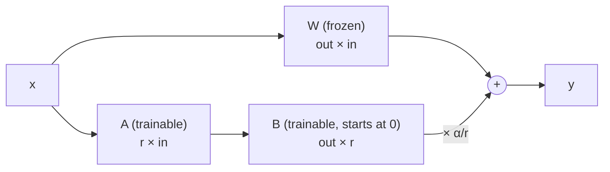

# Week 10, Day 3: Supervised Fine-Tuning with LoRA (and QLoRA)

**Time:** ~5h (about 25 minutes of that is the training run on a CPU) · **Needs:** CPU only; `peft` for the parity check (`uv sync --extra finetune`) · **Run it:** `uv run python weeks/week10_fine-tuning/solutions/day3_solution.py`

You have a base model (Day 1), a dataset (Day 2) and a loss mask. Now you train. The tool is **LoRA**: instead of updating every weight of the model, learn a small low-rank *correction* to some of them. It is why fine-tuning a multi-billion-parameter model fits on one GPU, and it is simple enough to write in forty lines. You will write it, check it against the reference implementation (PEFT), train SmolLM2-135M on the order-extraction data with your own loop, and watch what a fine-tune actually does to a loss curve.

## Learning objectives
- Derive **LoRA** (`y = Wx + (α/r)·B·A·x`), say what `r` and `α` do, and compute the parameters and memory it saves.
- Implement LoRA from scratch for the Week 9 decoder, **verify it against PEFT**, and **merge** it into the weights.
- Write an **SFT loop** (loss on answer tokens only, warm-up and cosine schedule, gradient clipping) and read its curves.
- Explain **QLoRA** (a 4-bit NF4 base model with LoRA on top) and reproduce its data type from its definition.

---

## 1. Why not just train everything?

Full fine-tuning updates every parameter, and **training memory is not just the weights**. With Adam in float32 each parameter needs its value (4 bytes), its gradient (4), and two optimizer moments (8): **16 bytes per parameter**, before activations.

| model | weights (fp16) | full fine-tuning (fp32 weights + Adam) | LoRA r=16 on a bf16 base | QLoRA (4-bit base) |
|---|---|---|---|---|
| SmolLM2-135M (this week) | 0.27 GB | 2.2 GB | about 0.6 GB (measured: 4.9M trainable) | n/a |
| a 7B model | 14 GB | **112 GB** | about 16 GB | about 6 GB |
| a 70B model | 140 GB | **1.1 TB** | about 150 GB | about 40 GB |

(Arithmetic, not measurements: 16 bytes × parameters for full fine-tuning; the base at its precision plus about 12 bytes per trainable LoRA parameter plus activations, which depend on batch and length, for the others. Real runs also need room for activations.) LoRA works because the **change** a fine-tune makes to a weight matrix is approximately **low-rank**: you do not need a full 576 × 576 matrix of corrections to teach a model a format.

## 2. LoRA

For a frozen weight `W` (out × in), add a trainable update `ΔW = (α/r) · B A` with `A` of shape `r × in` and `B` of shape `out × r`:

```
y = x Wᵀ  +  (α / r) · (x Aᵀ) Bᵀ
```



- **`B` starts at zero**, so the adapted model is *exactly* the base model before training (a test asserts bitwise equality). `A` is initialised like a normal layer (PEFT's choice: uniform in ±1/√in).
- Because `B = 0`, the **gradient to `A` is zero at the first step** and only `B` moves; after that both learn (tested: `dL/dA ∝ B`).
- **`r` (the rank)** is the capacity of the update: `ΔW` has rank at most `r` (a test checks the rank of the learned delta). **`α`** scales it; the scale is `α/r`, so changing `r` while keeping `α/r` fixed keeps the update's size comparable. A common default is `α = 2r`.
- **Which layers?** Attention only (`q, k, v, o`) or also the MLP (`gate, up, down`). More adapted layers means more capacity; this week uses **all seven** linear layers of every block.
- **Merging.** `W' = W + (α/r)·B·A` folds the update into the weights: the merged model has no extra layers and no extra latency. Tests check that the merged model's logits equal the adapted model's.
- **Adapters are small and swappable**: `lora_state_dict` returns only `A` and `B` (20 MB here). One base model can serve many tasks by loading different adapters.

**Trainable parameters** (SmolLM2-135M: 30 layers, width 576, 134.5M frozen):

| adapted layers | r=4 | r=8 | r=16 | r=32 | r=64 |
|---|---|---|---|---|---|
| attention only | 0.46M (0.34%) | 0.92M (0.68%) | 1.84M (1.35%) | 3.69M (2.67%) | 7.37M (5.20%) |
| all linear layers | 1.22M (0.90%) | 2.44M (1.78%) | **4.88M (3.50%)** | 9.77M (6.77%) | 19.5M (12.68%) |

**Verification against PEFT.** The same random adapters in `peft.get_peft_model(...)` and in `solutions/lora.py`, on SmolLM2-135M: **logits differ by 8.7e-5** (and 8.2e-5 after `merge_and_unload()` on one side and `merge_lora()` on the other). That is the float32 noise of this 30-layer network: the base model alone, with no LoRA at all, differs from the Hugging Face implementation by about 9e-5 (Week 9). A smaller test model (2 layers) agrees to under 1e-5. The adapter names map one-to-one (`layers.N.self_attn.q_proj.lora_A` is PEFT's `...lora_A.default.weight`), so adapters trained with one implementation load into the other.

## 3. The SFT loop (`solutions/train_sft.py`)

```python
for epoch in range(epochs):
    for batch in length_bucketed_batches(train, 8):       # similar lengths together: less padding
        loss_sum, n_answer_tokens, _ = answer_loss(model, collate(batch))
        (loss_sum / n_answer_tokens).backward()           # mean over ALL answer tokens in the batch
        clip_grad_norm_(adapter_params, 1.0); opt.step(); opt.zero_grad()
    dev_loss = evaluate_loss(model, dev)                  # the same dev examples every epoch
```

- **The loss** is a token-level mean over the answer tokens of the whole batch. `answer_loss` applies the 49,152-way output projection **only where there is a label** (about half the tokens), which saves roughly a tenth of the compute. A test checks it equals the naive cross-entropy over the full logits (to 1e-5), and that **padding does not change the loss** of the real tokens.
- **Schedule:** linear warm-up over 20 steps to a peak of **2e-4**, cosine decay to 10%. LoRA tolerates (and wants) a much higher learning rate than full fine-tuning (typically 1e-4 to 3e-4, against 1e-5 to 5e-5). **AdamW, no weight decay, clip at 1.0, dropout 0.05** on the adapter input.
- **Batches** of 8 examples, bucketed by length inside windows of 64 so a batch has little padding; the batch order is reshuffled every epoch from a seed.
- **A dev loss at the start** (before any update) gives the base model's loss on the task, so the curve has an origin.
- Tests: the frozen weights do not move; only `lora_*` tensors change; training lowers the loss of a toy problem; a callback fires every epoch; a model with nothing trainable is an error.

## 4. The run

**Setup:** SmolLM2-135M-Instruct, LoRA `r=16`, `α=32` on all seven linear layers of all 30 blocks (**210 adapted layers, 4,884,480 trainable parameters = 3.5% of the model**), 1,112 training and 100 development emails, batch 8, 3 epochs = 417 steps, peak learning rate 2e-4, on a laptop CPU (Apple M2, 4 threads, float32).

| | dev loss (nats / answer token) | dev token accuracy |
|---|---|---|
| **before training** (the base model, short prompt) | 1.507 | 64.0% |
| after epoch 1 (139 steps) | 0.0183 | 99.52% |
| after epoch 2 | 0.0073 | 99.84% |
| after epoch 3 | **0.0056** | **99.91%** |

Training loss (mean over the last 10 steps, answer tokens only): 1.53 at step 10, 0.85 at step 20, 0.34 at step 30, 0.13 at step 40, 0.05 at step 70, about 0.01 by step 160 and 0.003 at the end. **476,235 tokens in 1,404 seconds (339 tokens/s)**, about 23 minutes for three epochs (the run shared the CPU with other work; a clean run is about a fifth faster). The adapters occupy 20 MB per checkpoint.

Reading the curve:
- **The first 30 steps do almost all the work.** The loss falls from 1.5 to 0.3 in 30 steps (240 emails): the model already knows *how to write JSON*; it is learning *this* JSON (the key order, the null conventions, the field names).
- **The dev token accuracy is 99.5% after one epoch.** That is a statement about the **synthetic** distribution: the dev emails come from the same generator as the training emails. It says the model has learned the generator's templates. It does **not** say it can read an email somebody typed (Day 4 measures that).
- **Epochs 2 and 3 keep lowering the dev loss** (0.018, 0.0073, 0.0056) while the accuracy is already above 99.8%: more confident, not more accurate. A loss curve this flat is the moment to ask what the *other* test says.

**What a few generations look like** (greedy, three dev emails): the replies equal the gold JSON token for token. On the **first 12 hand-written emails** (a quick smoke check, not the evaluation): **100% valid JSON, 92% valid orders, 75% exact match, 90% field accuracy**, against **0% / 8% / 0% / 4%** for the zero-shot prompt and **97% / 76% / 3% / 39%** for the best prompt on the full 38 (Day 1). A one-line instruction and 1,100 emails of training did what 593 tokens of prompting could not. How much of that survives the full set, with intervals, and what the model forgot, is Day 4.

## 5. QLoRA: a 4-bit base under the adapters

QLoRA (Dettmers et al., 2023) keeps the frozen base model in **4 bits** and trains LoRA adapters in 16-bit on top: the memory column of the table in section 1 (about 6 GB for a 7B model). Its data type is **NF4**: 16 values placed at the **quantiles of a standard normal distribution**, because pretrained weights are roughly normal, so there is a fine grid near zero where most weights are and a coarse one in the tails. Weights are cut into blocks of 64, each block stored as 4-bit indices into the table plus one scale (its largest magnitude); dequantisation multiplies the table value by the scale.

`solutions/quant.py` **rebuilds the NF4 table from its definition** (8 positive and 7 negative normal quantiles plus an exact zero, scaled to ±1) and compares with the published values: **maximum difference 0.0**. Reconstruction error (RMS of the error over the RMS of the weights) on random normal weights, block sizes as in each format:

| format | bits per weight (with scales) | relative error |
|---|---|---|
| **int4** (16 evenly spaced values, blocks of 64) | 4.5 | 0.101 |
| **NF4** (blocks of 64) | 4.5 | 0.092 |
| **Q4_0** (GGUF; blocks of 32) | 4.5 | 0.086 |
| **Q8_0** (GGUF; blocks of 32) | 8.5 | 0.0054 |

NF4 beats a uniform 4-bit grid (9% lower error on normal weights) at the same size; the GGUF Q4_0 format, with smaller blocks, does slightly better still. Day 6 measures what these roundings do to the *fine-tuned model's accuracy*.

**QLoRA was not run here**: its reference implementation needs `bitsandbytes` and a CUDA GPU. The ingredients that are independent of the GPU are all here: the NF4 data type, blockwise quantisation, the LoRA layer on a frozen base, and the training loop. What QLoRA adds on top: **double quantisation** (the per-block scales are themselves quantised) and **paged optimisers** (optimizer state spills to CPU memory under pressure).

A sketch of the same run with the usual libraries (labelled **not run**: TRL and Unsloth are not installed and no GPU is available):

```python
# NOT RUN: shown for orientation
from peft import LoraConfig
from trl import SFTConfig, SFTTrainer
trainer = SFTTrainer(
    model="HuggingFaceTB/SmolLM2-135M-Instruct",
    train_dataset=load_dataset("json", data_files="train.jsonl")["train"],      # {"messages": [...]} records
    args=SFTConfig(output_dir="out", num_train_epochs=3, per_device_train_batch_size=8, learning_rate=2e-4,
                   lr_scheduler_type="cosine", warmup_steps=20, assistant_only_loss=True),
    peft_config=LoraConfig(r=16, lora_alpha=32, lora_dropout=0.05, target_modules="all-linear"),
)
trainer.train()
```

The hand-written loop above does what `SFTTrainer` does for this task: apply the chat template, mask the prompt, wrap the linear layers, train with AdamW and a schedule.

## 6. Pitfalls
- **A learning rate meant for full fine-tuning** (1e-5) on LoRA: the adapters barely move. Or a full-fine-tuning-sized rate that is too *large* for a big rank.
- **Rank as a magic number.** More rank means more capacity and more overfitting risk; on a narrow, templated task `r=8` to `16` is usually enough. Measure two ranks before believing either.
- **Forgetting the end-of-turn token** in the labels (the model never stops), or **training on the prompt**.
- **A different template at serving time** than in training.
- **Evaluating on the training data** (the dev loss in the table above is on *held-out synthetic* emails: it is the easy test; Day 4 gives the hard one).
- **Merging in low precision**: merging adapters trained against a 4-bit base into a 16-bit copy of the base is not the same model; merge into the weights you trained against, or re-evaluate.
- **Counting only trainable parameters when budgeting memory**: the frozen base, the activations and the optimizer state all count.

---

## Daily challenge: fine-tune a small model on the Day 2 data

**Build** (reference: [`solutions/lora.py`](solutions/lora.py), [`solutions/train_sft.py`](solutions/train_sft.py), [`solutions/day3_solution.py`](solutions/day3_solution.py), [`solutions/quant.py`](solutions/quant.py)):
1. A LoRA layer and `add_lora` / `merge_lora` / adapter save-and-load, tested by hand and **against PEFT**.
2. An SFT loop with assistant-only loss, a warm-up/cosine schedule, gradient clipping, per-epoch dev evaluation and checkpoints.
3. Train on the Day 2 training split; report the loss curve and the dev loss and token accuracy at every epoch.
4. NF4 and one other 4-bit format, with reconstruction error.

**Acceptance criteria**
- `B` is zero at initialisation and the adapted model's logits equal the base model's bit for bit; the merged model equals the adapted one to 1e-4.
- Logits agree with PEFT to within the noise of the base-model comparison.
- The frozen weights are bit-for-bit unchanged after training and only `lora_A` and `lora_B` moved.
- You report the trainable-parameter count, the training time and tokens per second, and the dev loss **before** training.
- The NF4 table rebuilt from its definition equals the published one.

**Stretch**
- Train with `r` = 4, 16 and 64 for one epoch each and compare dev loss and the Day 4 hand-written score; plot against the trainable parameter count.
- Adapt **attention only** and compare with all linear layers at equal rank.
- Implement **DoRA** (decompose the weight into magnitude and direction) or **rsLoRA** (`α/√r` scaling) and measure.
- Add **gradient accumulation** and verify that 4 micro-batches of 2 equal one batch of 8 (up to float noise).
- Run the same recipe on a **Colab GPU** with a 1 to 3 billion-parameter model (not run here).

## Further reading
- Hu et al., *LoRA: Low-Rank Adaptation of Large Language Models*; Dettmers et al., *QLoRA*; Liu et al., *DoRA*.
- The PEFT documentation (`LoraConfig`, `merge_and_unload`) and the TRL `SFTTrainer` guide.
- Biderman et al., *LoRA Learns Less and Forgets Less*.
