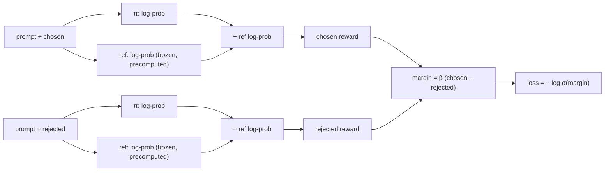

# Week 10, Day 5: Preference Tuning: DPO, ORPO, and the Ideas Behind RLHF and GRPO

**Time:** ~5h (about 35 minutes of that is sampling and training on a CPU) · **Needs:** CPU only; the Day 3 checkpoints · **Run it:** `uv run python weeks/week10_fine-tuning/solutions/day5_solution.py`

Supervised fine-tuning shows a model **one good answer** and asks it to imitate that answer. It never shows the model what a *bad* answer looks like, so it cannot directly push down a specific mistake the model keeps making. **Preference tuning** does: for the same prompt it gives a *chosen* answer and a *rejected* one, and trains the model to prefer the first. You will implement **DPO** (the simplest and most used method), build preference pairs for the extraction task from the model's *own* mistakes, run a DPO pass on top of your SFT model, and **measure whether it helped**, which turns out to be the hard part.

## Learning objectives
- Explain the **RLHF** pipeline (reward model, then policy optimisation with a KL leash) and how **DPO** removes the reward model and the sampling loop.
- Implement the **DPO loss**, verify it by hand and by its gradients, and say what `β` and the **reference model** do.
- Build **preference pairs**: on-policy (the model's own mistakes) and injected (realistic corruptions), and say what each is good for.
- Write the **ORPO** and **GRPO** objectives and see why a *verifiable* reward (our extraction scorer) makes group-based RL feasible.
- Measure a preference-tuning pass **honestly**: paired comparison, drift from the reference, and forgetting.

---

## 1. From RLHF to DPO

**RLHF** (reinforcement learning from human feedback) has three stages: SFT; train a **reward model** on human preference pairs (chosen beats rejected); then optimise the SFT model with **reinforcement learning (PPO)** to maximise the reward model's score **minus a KL penalty** to the SFT model (so it cannot drift into text that games the reward). It works and it is a lot of machinery: a reward model, a value network, sampling, many hyperparameters.

**DPO** (Rafailov et al., 2023) observes that the optimum of that KL-regularised objective has a closed form, so you can train the policy **directly on the preference pairs** with a classification-style loss. With `π` the model being trained, `ref` a frozen copy of the SFT model, and `log π(y)` the total log-probability of an answer's tokens:

```
loss = − log σ( β · [ (log π(chosen) − log ref(chosen))  −  (log π(rejected) − log ref(rejected)) ] )
```

`β · (log π − log ref)` is the answer's **implicit reward**. The loss raises the chosen answer's implicit reward above the rejected one's:



Properties verified by tests:
- **At `π = ref` the loss is exactly ln 2 = 0.693** and the margin is 0. Training should start there.
- The **gradient raises `log π(chosen)` and lowers `log π(rejected)`** by equal and opposite amounts (`β · σ(−margin)`), shrinking as the pair is learned.
- A pair the policy ranks the wrong way has loss above ln 2.
- A **larger `β` saturates sooner**: the same log-probability gap gives a bigger margin, so `β` is the leash (large β stays close to `ref`; small β lets the model move far).
- **The reference's log-probabilities are computed once, before training**, while the policy still equals the reference (a LoRA with `B = 0`). That halves the compute of every step.

**What DPO does *not* do:** it does not generate anything during training, so it can only be as good as the pairs. And it optimises *relative* log-probability, so both answers' probabilities can fall while the gap grows (a known failure: the model gets less likely to produce either).

## 2. Where the pairs come from

The pair `(chosen, rejected)` for a prompt determines what DPO changes. Two sources, used together here:

| source | rejected answer | good for | weakness |
|---|---|---|---|
| **on-policy** | one of *the model's own* sampled answers that is wrong | fixing mistakes the model **actually makes**; the pair is in the model's own distribution | needs generation (slow on a CPU); few wrong answers when SFT is already good |
| **injected** | the gold answer with one realistic error (a wrong id, a dropped item, a wrong quantity, ...) | cheap, plentiful, controllable difficulty | the model may never make this mistake; off-policy pairs can teach the wrong thing |

The chosen answer is always the **gold JSON** (the extraction task has an answer key; for open-ended tasks it is a better sample, or a human or judge's pick).

## 3. The experiment (`solutions/day5_solution.py`)

**The pairs.** I sampled **2 answers at temperature 1.0 (top-p 0.95) from the SFT model for each of 250 training emails** (500 samples, about 13 minutes on the CPU). Only **37 of the 500 samples (7.4%) were not exact matches**: the SFT model is already good on in-distribution emails, so the **on-policy source yielded just 29 pairs**. To get enough pairs, **435 injected pairs** were added (the gold JSON against the gold with one realistic error: wrong id 74, wrong name 71, wrong urgency 61, date in the past 61, invented item 51, wrong quantity 49, dropped item 36, wrong currency 32): **464 pairs, 94% of them off-policy.**

**The training.** A fresh LoRA (r = 16, 4.9M parameters) on the merged SFT model; the SFT model is the reference (log-probabilities precomputed once); batch 4 pairs, one epoch (116 steps, 267 s), learning rate 5e-5, β = 0.1.

```
step  10/116  loss 0.676  reward accuracy 78%  margin +0.04       (the loss starts at ln 2 = 0.693)
step  60/116  loss 0.385  reward accuracy 95%  margin +0.98
step 100/116  loss 0.291  reward accuracy 100% margin +1.51
```

By every number DPO reports, the training worked: the loss fell from 0.69 to 0.3 to 0.4, reward accuracy reached 90 to 100%, and the implicit-reward margin grew. **The mean change in log-probability on the training pairs was −3.64 for the chosen answers and −17.17 for the rejected ones** (a margin of +13.5 nats).

## 4. What it did to the model (hand-written and synthetic held-out emails, greedy)

| system | set | valid order | exact | field accuracy |
|---|---|---|---|---|
| SFT | hand-written | 92% | **74%** [58%, 85%] | 89% |
| SFT | synthetic | 99% | 92% [85%, 96%] | 98% |
| **SFT + DPO** | hand-written | **34%** | **32%** [19%, 47%] | **34%** |
| **SFT + DPO** | synthetic | **52%** | **43%** [34%, 53%] | **51%** |

Paired on the 38 hand-written emails, **DPO − SFT: exact match −0.42 (95% interval [−0.61, −0.24]), better on 2 emails, worse on 18, tied on 18; per-field accuracy −0.56, better on 2, worse on 23.** On the 100 synthetic emails exact match fell by 0.49, **worse on 49, better on none**. The error types on the hand-written set went from {0 not JSON, 3 invalid orders, 7 wrong fields, 28 exact} to **{12 not JSON, 13 invalid orders, 1 wrong-fields, 12 exact}**: the DPO model often **stops producing a valid JSON object at all**. Probe accuracy on unrelated prompts moved from 25% to 22%.

**That is a failed experiment, and the right thing to do with it is to understand it.** DPO optimised its own objective and wrecked the task. Why:

1. **DPO only constrains a difference.** The loss rewards `log π(chosen) − log π(rejected)` growing. It does not require `log π(chosen)` to stay high: the chosen answers' log-probability **fell** by 3.6 nats (the model became less likely to write the correct JSON) while the rejected ones fell by 17. This is **likelihood displacement**: the probability mass leaves *both* answers and goes somewhere else (here, to text that is not a valid order).
2. **The pairs overlap almost completely.** An injected rejected answer is the gold JSON with *one value changed*, so chosen and rejected share perhaps 95% of their tokens. Lowering the rejected answer's likelihood lowers the shared tokens (the opening braces, the key names, the commas) too, and those are the tokens every correct answer needs. The model learned "do not write this JSON-shaped string" in general.
3. **94% of the pairs were off-policy.** The model never made most of these mistakes; there was nothing real to correct, and a large step against a never-produced answer is mostly collateral damage.
4. **The step was large for a model this small** (lr 5e-5 on a 4.9M-parameter adapter for 116 steps at β = 0.1).

**Two standard remedies, both run** (same pairs, same reference, same evaluation; `--reuse-pairs`):

| run | learning rate | NLL on chosen | chosen log-prob change | rejected log-prob change | hand-written exact | synthetic exact | verdict (paired, hand-written) |
|---|---|---|---|---|---|---|---|
| SFT only (reference) | n/a | n/a | n/a | n/a | **74%** [58%, 85%] | 92% [85%, 96%] | n/a |
| DPO, as above | 5e-5 | 0 | **−3.64** | −17.17 | 32% [19%, 47%] | 43% [34%, 53%] | −0.42 [−0.61, −0.24]: **much worse** |
| **smaller step** | **5e-6** | 0 | **+0.00** | −1.08 | 76% [61%, 87%] | 93% [86%, 97%] | +0.03 [0.00, +0.08]: better on 1 email, tied on 37: **no effect** |
| **+ SFT term on the chosen answer** | 5e-5 | **1.0** | **−1.16** | −13.84 | 68% [53%, 81%] | 78% [69%, 85%] | −0.05 exact, −0.16 field accuracy [−0.29, −0.06]: **still worse** |

- **A tenfold smaller step** keeps the chosen answers' likelihood exactly where it was (+0.00) and moves the rejected ones down by about one nat: the model is almost unchanged, so the evaluation is almost unchanged (one email differs). *A safe DPO pass on this task is a no-op.*
- **Adding the SFT loss on the chosen answer** (the "DPO + NLL" or "RPO" remedy) **cut the damage**: the chosen log-probability fell by 1.2 nats instead of 3.6, and the hand-written exact match fell by 6 points (not significant at n = 38) instead of 42. But the model was **still worse than SFT** on field accuracy (−16 points, interval excludes zero) and on the synthetic set (−14 points), with 5 replies that were no longer JSON.
- **No setting I tried improved on SFT.** This is one pair set, one β and three learning-rate/regulariser settings on one seed: it does not show that DPO cannot help, only that **here, with pairs this easy to construct and an SFT model this good in distribution, it did not**. What would plausibly change the answer: on-policy pairs from the model's **real** mistakes on *hand-written-like* inputs (the 29 on-policy pairs I could mine are too few; the model errs where it was never shown data), a larger β, many more pairs, or a different method (ORPO, or SFT on more varied data).

**What to take away:** a preference-tuning pass needs the same evaluation as anything else (it is *not* free improvement), a falling DPO loss and a rising reward accuracy are **not** evidence that the model got better, and when SFT has already learned a narrow task there may be little for DPO to add. The honest conclusion for *this* task is that **SFT alone was the right tool**.

## 5. ORPO, GRPO, and the other methods

- **ORPO** (odds-ratio preference optimisation) removes the reference model: loss = the SFT loss on the chosen answer **plus** an odds-ratio term `−log σ(log odds(chosen) − log odds(rejected))` where `odds(p) = p / (1 − p)` and `p` is the geometric-mean per-token probability of the answer. One training stage, no `ref` forward pass; and the SFT term is exactly the guard that DPO lacked above. `solutions/dpo.py` has the loss (hand-verified); it was not trained here.
- **GRPO** (group relative policy optimisation, used to train reasoning models) samples **G answers to the same prompt**, scores each with a **reward**, and uses the within-group standardised reward as the advantage: `A_i = (r_i − mean(r)) / (std(r) + ε)`. No value network and no reward model: the group is its own baseline. The update is PPO's clipped objective `−min(ρ·A, clip(ρ, 1−ε, 1+ε)·A)` with `ρ = π_new/π_old` per answer. A group whose answers all got the same reward carries no signal (its advantages are 0).

  GRPO needs a **reward that can be computed automatically**. For this task it exists: `orders.score` is a **verifiable reward** (a valid order, the fraction of the 8 fields right, exact match). That is why verifiable tasks (maths with a checker, code with tests, structured extraction) are where reinforcement learning from outcomes works best. `group_advantages` and `grpo_loss` are implemented and tested (including that the clipped objective **stops pushing once the ratio leaves the trust region**), but **GRPO training was not run**: sampling G answers per prompt for hundreds of prompts is more generation than a laptop CPU does in reasonable time.
- **PPO-based RLHF**, **RLAIF** (an AI judge replaces the human labeller: validate the judge as in Week 7), **KTO** (needs only thumbs up/down labels, not pairs), and **IPO/SimPO** (loss variants that change how the margin saturates) are the other names you will meet.

## 6. Pitfalls
- **Preference pairs where the chosen answer is not clearly better.** Noisy preferences give a model that is confidently wrong in a new direction.
- **Length bias.** If chosen answers are systematically longer, DPO makes the model longer.
- **A reference that is not the starting policy.** The "log ref" terms must come from the model DPO started from.
- **Too large a learning rate or too many epochs.** DPO overfits a small pair set in a few passes (reward accuracy on the training pairs reaches 100% while the model degrades).
- **Reading reward accuracy on the training pairs as success.** It measures fit; the question is whether *held-out* behaviour improved.
- **Pairs whose chosen and rejected answers overlap almost completely** (a one-value error in a JSON object): lowering the rejected likelihood lowers the shared tokens too. Watch the chosen answer's log-probability, not just the margin.
- **Skipping the forgetting check** (Day 4's probes after the pass).
- **Comparing two models on a handful of items** and reading a difference of one email as an effect. Use paired comparison and intervals.

---

## Daily challenge: a DPO pass on top of the SFT model, with a measured change

**Build** (reference: [`solutions/dpo.py`](solutions/dpo.py), [`solutions/day5_solution.py`](solutions/day5_solution.py)):
1. The DPO loss, tested by hand and by gradient signs; sequence log-probabilities over the answer tokens only; precomputed reference log-probabilities.
2. A pair builder with an **on-policy** source and an **injected** source, and statistics on how many sampled answers were wrong.
3. A DPO training loop with a fresh LoRA on the merged SFT model, and the reward accuracy, margin and drift (the change in chosen and rejected log-probabilities).
4. A **paired** comparison of SFT against SFT+DPO on the hand-written set **and** on held-out synthetic emails, a forgetting check, and an honest conclusion.

**Acceptance criteria**
- The loss at initialisation equals ln 2 (to 1e-4) on your pairs; the reference log-probabilities equal the per-sequence values computed one at a time.
- The frozen weights do not move; the chosen-minus-rejected log-probability gap on the training pairs increases.
- You report the effect with an interval and a paired count (better on / worse on / tied on), and you say whether the interval excludes zero.
- You report drift from the reference (the change in the chosen **and** the rejected log-probability) and the forgetting probes, and you state plainly if the pass made the model worse.

**Stretch**
- Sweep `β` (0.05, 0.1, 0.5) and plot reward accuracy and held-out exact match against drift.
- Train **ORPO** on the base model directly and compare with SFT then DPO at equal compute.
- Add a **length-normalised** variant (SimPO-style) and test for length bias.
- Implement a **GRPO** step (G = 4 samples per prompt, the extraction scorer as the reward) and run it on a few dozen prompts.
- Replace the injected pairs with pairs mined from the model at a *higher temperature* and compare.

## Further reading
- Rafailov et al., *Direct Preference Optimization*; Hong et al., *ORPO*; Shao et al., *DeepSeekMath* (GRPO); Ethayarajh et al., *KTO*.
- Ouyang et al., *Training language models to follow instructions with human feedback* (InstructGPT: the RLHF pipeline).
- Lambert et al., the *RLHF Book*; the TRL documentation for `DPOTrainer` (not run here).
