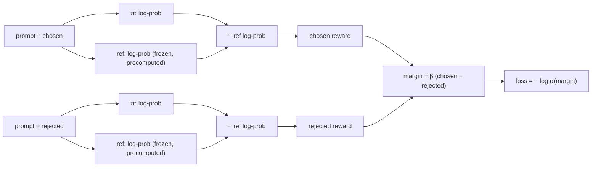

# Week 10, Day 5: Preference Tuning: DPO, ORPO, and the Ideas Behind RLHF and GRPO

**Time:** ~5h (about 35 minutes of that is sampling and training on a CPU) · **Needs:** CPU only; the Day 3 checkpoints · **Run it:** `uv run python weeks/week10_fine-tuning/solutions/day5_solution.py`

Supervised fine-tuning shows a model **one good answer** and asks it to imitate that answer. It never shows the model what a *bad* answer looks like, so it cannot directly push down a specific mistake the model keeps making. **Preference tuning** does: for the same prompt it gives a *chosen* answer and a *rejected* one, and trains the model to prefer the first. You will implement **DPO** (the simplest and most used method), build preference pairs for the extraction task from the model's *own* mistakes, run a DPO pass on top of your SFT model, and **measure whether it helped**, which turns out to be the hard part.

## Learning objectives
- Explain the **RLHF** pipeline (reward model, then policy optimisation with a KL leash) and how **DPO** removes the reward model and the sampling loop.
- Implement the **DPO loss**, verify it by hand and by its gradients, and say what `β` and the **reference model** do.
- Build **preference pairs**: on-policy (the model's own mistakes) and injected (realistic corruptions), and say what each is good for.
- Write the **ORPO** and **GRPO** objectives and see why a *verifiable* reward (our extraction scorer) makes group-based RL feasible.
- Measure a preference-tuning pass **honestly**: paired comparison, drift from the reference, and forgetting.

---

## 1. From RLHF to DPO

**RLHF** (reinforcement learning from human feedback) has three stages: SFT; train a **reward model** on human preference pairs (chosen beats rejected); then optimise the SFT model with **reinforcement learning (PPO)** to maximise the reward model's score **minus a KL penalty** to the SFT model (so it cannot drift into text that games the reward). It works and it is a lot of machinery: a reward model, a value network, sampling, many hyperparameters.

**DPO** (Rafailov et al., 2023) observes that the optimum of that KL-regularised objective has a closed form, so you can train the policy **directly on the preference pairs** with a classification-style loss. With `π` the model being trained, `ref` a frozen copy of the SFT model, and `log π(y)` the total log-probability of an answer's tokens:

```
loss = − log σ( β · [ (log π(chosen) − log ref(chosen))  −  (log π(rejected) − log ref(rejected)) ] )
```

`β · (log π − log ref)` is the answer's **implicit reward**. The loss raises the chosen answer's implicit reward above the rejected one's:



Properties verified by tests:
- **At `π = ref` the loss is exactly ln 2 = 0.693** and the margin is 0. Training should start there.
- The **gradient raises `log π(chosen)` and lowers `log π(rejected)`** by equal and opposite amounts (`β · σ(−margin)`), shrinking as the pair is learned.
- A pair the policy ranks the wrong way has loss above ln 2.
- A **larger `β` saturates sooner**: the same log-probability gap gives a bigger margin, so `β` is the leash (large β stays close to `ref`; small β lets the model move far).
- **The reference's log-probabilities are computed once, before training**, while the policy still equals the reference (a LoRA with `B = 0`). That halves the compute of every step.

**What DPO does *not* do:** it does not generate anything during training, so it can only be as good as the pairs. And it optimises *relative* log-probability, so both answers' probabilities can fall while the gap grows (a known failure: the model gets less likely to produce either).

## 2. Where the pairs come from

The pair `(chosen, rejected)` for a prompt determines what DPO changes. Two sources, used together here:

| source | rejected answer | good for | weakness |
|---|---|---|---|
| **on-policy** | one of *the model's own* sampled answers that is wrong | fixing mistakes the model **actually makes**; the pair is in the model's own distribution | needs generation (slow on a CPU); few wrong answers when SFT is already good |
| **injected** | the gold answer with one realistic error (a wrong id, a dropped item, a wrong quantity, ...) | cheap, plentiful, controllable difficulty | the model may never make this mistake; off-policy pairs can teach the wrong thing |

The chosen answer is always the **gold JSON** (the extraction task has an answer key; for open-ended tasks it is a better sample, or a human or judge's pick).

{{RUN}}

## 3. ORPO, RLHF's other descendants, and GRPO

- **ORPO** (odds-ratio preference optimisation) removes the reference model: loss = the SFT loss on the chosen answer **plus** an odds-ratio term `−log σ(log odds(chosen) − log odds(rejected))` where `odds(p) = p / (1 − p)` and `p` is the geometric-mean per-token probability of the answer. One training stage instead of two, no `ref` forward pass. `solutions/dpo.py` has the loss (hand-verified); it is not trained here.
- **GRPO** (group relative policy optimisation, used to train reasoning models) samples **G answers to the same prompt**, scores each with a **reward**, and uses the within-group standardised reward as the advantage: `A_i = (r_i − mean(r)) / (std(r) + ε)`. No value network and no reward model: the group is its own baseline. The update is PPO's clipped objective `−min(ρ·A, clip(ρ, 1−ε, 1+ε)·A)` with `ρ = π_new/π_old` per answer. A group whose answers all got the same reward carries no signal (its advantages are 0).

  GRPO needs a **reward that can be computed automatically**. For this task it exists: `orders.score` is a **verifiable reward** (a valid order, the fraction of the 8 fields right, exact match). That is why verifiable tasks (maths with a checker, code with tests, structured extraction) are where reinforcement learning from outcomes works best. `group_advantages` and `grpo_loss` are implemented and tested (including that the clipped objective **stops pushing once the ratio leaves the trust region**), but **GRPO training was not run**: sampling G answers per prompt for hundreds of prompts is more generation than a laptop CPU does in reasonable time.
- **PPO-based RLHF**, **RLAIF** (an AI judge replaces the human labeller: validate the judge as in Week 7), **KTO** (needs only thumbs up/down labels, not pairs), and **IPO/SimPO** (loss variants that change how the margin saturates) are the other names you will meet.

## 4. Pitfalls
- **Preference pairs where the chosen answer is not clearly better.** Noisy preferences give a model that is confidently wrong in a new direction.
- **Length bias.** If chosen answers are systematically longer, DPO makes the model longer.
- **A reference that is not the starting policy.** The "log ref" terms must come from the model DPO started from.
- **Too large a learning rate or too many epochs.** DPO overfits a small pair set in a few passes (reward accuracy on the training pairs reaches 100% while the model degrades).
- **Reading reward accuracy on the training pairs as success.** It measures fit; the question is whether *held-out* behaviour improved.
- **Skipping the forgetting check** (Day 4's probes after the pass).
- **Comparing two models on a handful of items** and reading a difference of one email as an effect. Use paired comparison and intervals.

---

## Daily challenge: a DPO pass on top of the SFT model, with a measured change

**Build** (reference: [`solutions/dpo.py`](solutions/dpo.py), [`solutions/day5_solution.py`](solutions/day5_solution.py)):
1. The DPO loss, tested by hand and by gradient signs; sequence log-probabilities over the answer tokens only; precomputed reference log-probabilities.
2. A pair builder with an **on-policy** source and an **injected** source, and statistics on how many sampled answers were wrong.
3. A DPO training loop with a fresh LoRA on the merged SFT model, and the reward accuracy, margin and drift (the change in chosen and rejected log-probabilities).
4. A **paired** comparison of SFT against SFT+DPO on the hand-written set **and** on held-out synthetic emails, a forgetting check, and an honest conclusion.

**Acceptance criteria**
- The loss at initialisation equals ln 2 (to 1e-4) on your pairs; the reference log-probabilities equal the per-sequence values computed one at a time.
- The frozen weights do not move; the chosen-minus-rejected log-probability gap on the training pairs increases.
- You report the effect with an interval and a paired count (better on / worse on / tied on), and you say whether the interval excludes zero.
- You report drift from the reference and the forgetting probes.

**Stretch**
- Sweep `β` (0.05, 0.1, 0.5) and plot reward accuracy and held-out exact match against drift.
- Train **ORPO** on the base model directly and compare with SFT then DPO at equal compute.
- Add a **length-normalised** variant (SimPO-style) and test for length bias.
- Implement a **GRPO** step (G = 4 samples per prompt, the extraction scorer as the reward) and run it on a few dozen prompts.
- Replace the injected pairs with pairs mined from the model at a *higher temperature* and compare.

## Further reading
- Rafailov et al., *Direct Preference Optimization*; Hong et al., *ORPO*; Shao et al., *DeepSeekMath* (GRPO); Ethayarajh et al., *KTO*.
- Ouyang et al., *Training language models to follow instructions with human feedback* (InstructGPT: the RLHF pipeline).
- Lambert et al., the *RLHF Book*; the TRL documentation for `DPOTrainer` (not run here).
