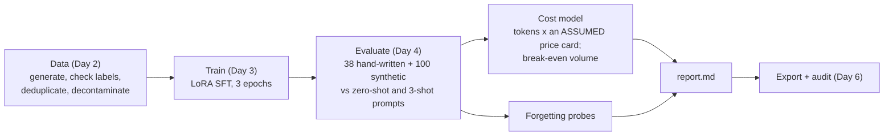

# Week 10, Day 7: Weekly Challenge: Beat the Prompted Baseline at a Fraction of the Cost

**Time:** ~6h · **Builds on:** Day 1 (the task and the baseline), Day 2 (the data), Day 3 (LoRA SFT), Day 4 (evaluation), Day 5 (preferences), Day 6 (export) · **Needs:** CPU only (the full run takes about 25 minutes the first time; evaluations are cached) · **Run it:** `uv run python weeks/week10_fine-tuning/solutions/weekly/extract_ft/run_weekly.py` (`--quick` for a one-minute smoke test)

## The brief

The Week 2 pipeline extracts typed orders from emails by prompting a hosted model and validating the result. Today you build the alternative a team would weigh against it: **a small model fine-tuned for exactly this task**, and you decide, **with numbers and intervals**, whether it beats the best prompt on the same model, what it costs per request, and when the training effort pays for itself. The deliverable is a **report** a manager can read and a **pipeline** an engineer can re-run.

## Requirements

**R1. A fair baseline.** The best prompted baseline the base model can do (schema prompt, few-shot examples that are not in the evaluation set, a prompt that does not contain an example the model can copy), measured on the same emails.

**R2. An unseen evaluation set.** The 38 hand-written emails, never used for training, and a decontamination check proving it. A synthetic held-out set as the *easy* test, reported separately.

**R3. A reproducible fine-tune.** One command that builds the data, trains, evaluates and writes the report; the training checkpoint and the evaluation replies are cached so re-running the report does not re-train or re-generate.

**R4. Statistics, not anecdotes.** Wilson intervals for rates; a **paired bootstrap** for the tuned model against the best prompt on the *same* emails (exact match and per-field accuracy); wins, losses and ties.

**R5. A cost model with stated assumptions.** Measured token counts and seconds, converted to dollars under a **price card you supply** (no prices are built in), per 1,000 requests, plus the **break-even volume** of the one-off training cost. Every assumption listed.

**R6. Forgetting and failure analysis.** The unrelated-prompt probes before and after; which fields fail and what kind of wrong (not JSON, invalid order, wrong fields).

**R7. An honest "not run" and "limits" section.** What a frontier model would score is **unknown** here and the report says so.

## What the pipeline found

{{FOUND}}

## Acceptance criteria (the reference solution meets all of them)

| # | Criterion | Evidence |
|---|---|---|
| 1 | The fine-tuned model beats the best prompt **significantly** on unseen emails | paired bootstrap: the interval excludes zero (see the table) |
| 2 | The evaluation emails are unseen | the data card records 0 emails sharing an 8-word sequence with any split; a test checks that no generated email equals a hand-written one |
| 3 | The comparison is fair | the baseline's prompt contains no example id; few-shot examples are not in the evaluation set; both sides run on the same decoder, greedy |
| 4 | The report states what was *not* run | frontier model, GPU/QLoRA, Ollama |
| 5 | Costs follow from measured tokens under a stated card | `costs.py` tests; the card is an input |
| 6 | The pipeline is re-runnable and cached | `--quick` smoke test; a re-run produces the same numbers from cached replies |
| 7 | The exported model loads in the standard library | Day 6 |

## Pitfalls
- **Declaring victory on the synthetic test set.** The hand-written set is the one that counts.
- **Comparing a tuned model with a prompt that was never tuned**: the baseline got three attempts at a prompt (zero-shot, few-shot); say so.
- **Pricing with numbers you looked up once.** Make the card an input and list it.
- **Counting only the cheaper per-request cost** and ignoring the one-off cost, the maintenance (a schema change means new data and a re-train) and the evaluation effort.
- **Single run, single seed.** The intervals above describe the sampling of *emails*, not the randomness of *training*; repeat the run with another seed before claiming a small difference.
- **Forgetting the model is for one task.** The tuned model answers every prompt with an order object (see the forgetting table); that is fine for an extraction service and wrong for a general assistant.

## What this does not show
- How a **hosted frontier model** would do on the same 38 emails (probably very well; not measured), nor its real price.
- Whether the result **transfers to other schemas, domains or languages**.
- The variance of training across seeds.

## Stretch
- A **second round**: write 30 *new* hand-written emails *before* looking at the tuned model's mistakes, improve the generator for the failure *categories* you found (not the specific emails), retrain, and evaluate on the fresh set (the honest version of "iterate on the failures").
- Run the same recipe on **SmolLM2-360M** and measure how much of the remaining error scale removes, and what it costs.
- Add **constrained decoding** (a JSON grammar over the Order schema: a Week 2 idea): valid JSON becomes guaranteed; measure what it does to field accuracy.
- Serve the exported model behind the Week 6 pipeline's `extract` interface as a drop-in replacement and re-run the Week 2 evaluation.
- Repeat with **three seeds** and report the spread.

## Further reading
- OpenAI, Anthropic and Google guides on *when to fine-tune* and *evaluating fine-tuned models*.
- Zheng et al., *LoRA Land*: fine-tuned small models against GPT-4 on narrow tasks.
- Week 7 Day 3 (gating a change on an evaluation) and Day 5 (cost and latency) for how to put this pipeline in CI.

## Looking back at the week
You decided whether to fine-tune from evidence (Day 1); built a dataset whose label errors you can measure (Day 2); wrote LoRA and an SFT loop and checked them against PEFT (Day 3); evaluated with intervals, on unseen phrasing, with a forgetting check (Day 4); tried preference tuning and measured whether it helped (Day 5); exported a model the standard library loads and measured the price of quantisation (Day 6); and priced the result. The through-line is the Week 7 discipline applied to training: **a number is only worth acting on if you know what produced it, how uncertain it is, and what it cannot see.**
