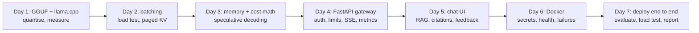

# Week 11: Inference, Serving & Deployment

**Phase 5: Models** · ~5-7 hours/day · Prerequisites: Week 9 (the decoder, the KV cache), Week 10 (the fine-tuned extractor is this week's model), Week 4 (retrieval evaluation), Week 8 (logging hygiene, secrets) · **Needs:** `brew install llama.cpp` (or any llama.cpp build), **Docker** (Days 6 and 7), about 4 GB for the Docker VM; **no GPU, no cloud account, no API key**

Weeks 9 and 10 made a model. This week **serves** it: the file format and the runtime (Day 1), the scheduling and memory ideas that make accelerators economical (Day 2), the arithmetic of fit and cost (Day 3), a gateway with identity, limits and backpressure (Day 4), a front end that shows its sources (Day 5), a container that survives failures (Day 6), and finally the whole thing deployed with Docker, evaluated and load-tested (Day 7). The model is the Week 10 fine-tune (SmolLM2-135M, order extraction) plus Qwen2.5-0.5B-Instruct for question answering; the hardware is an Apple laptop, so **everything that needs an NVIDIA GPU (vLLM, TensorRT, CUDA images) or a cloud account (Fly.io, Render, Modal) is labelled "not run"**.

> **The rule of this week:** a deployed system is judged by what happens when something is wrong: a model that is down, a prompt that is too long, a question with no answer, a load that is too high. Measure those cases, and report the numbers that embarrass you.



## Learning goals
By Sunday you can:
- **Convert, quantise and inspect** a model in GGUF, run it with llama.cpp, and say what a quantisation name really contains.
- Explain **continuous batching and PagedAttention**, drive a server with a **closed- and open-loop load generator**, and read TTFT and p50/p95 honestly.
- Do the **GPU memory and cost arithmetic**, and say when speculative decoding and self-hosting pay off (and when they do not).
- Build a **FastAPI gateway**: hashed API keys, a token bucket, a daily quota, a concurrency cap, a bounded queue, SSE streaming, health vs readiness, Prometheus metrics, tested without sleeping.
- Build a **streaming UI** with sources, verified citations, feedback and a cost readout, and test it headlessly.
- **Containerise** the gateway safely, rehearse its failures, and **deploy, evaluate and load-test** the whole stack.

## Schedule
| Day | Lesson | Challenge | Needs |
|---|---|---|---|
| 1 | [Local inference and quantisation](day1_local-inference-and-quantization.md) | The same model at several quantisations: quality against speed | llama.cpp (~4 min) |
| 2 | [Continuous batching and PagedAttention](day2_continuous-batching-and-paged-attention.md) | A throughput benchmark at increasing concurrency | llama.cpp (~5 min) |
| 3 | [GPU math, speculative decoding, economics](day3_gpu-math-speculative-decoding-economics.md) | An API-versus-self-hosted break-even calculator | CPU (~20 min) |
| 4 | [A FastAPI LLM backend](day4_fastapi-llm-backend.md) | A streaming API with per-user rate limits and tests | llama.cpp (~2 min) |
| 5 | [A streaming chat UI](day5_streaming-chat-ui.md) | A UI with citations, feedback and a cost display | llama.cpp (~2 min) |
| 6 | [Docker and deployment](day6_docker-and-deployment.md) | A containerised app with a health check | Docker (~2 min) |
| 7 | [Weekly challenge](day7_weekly-challenge.md) | Deploy the RAG API and the fine-tuned model end to end, load-test it | Docker (~12 min) |

New code lives in `weeks/week11_inference-serving-deployment/solutions/`: `llamacpp.py` (wrappers: convert, quantise, bench, perplexity, a managed `llama-server`, GGUF inspection), `loadgen.py`, `scheduler.py`, `paged_kv.py`, `economics.py`, `speculative.py`, the gateway package `llmapi/` (`auth`, `ratelimit`, `backends`, `metrics`, `rag`, `app`, `__main__`), `ui/` (Streamlit page and its client), `stack.py`, `dockerlab.py`, `deploy/` (Dockerfile, compose, `.env.example`, and unrun Fly.io, Render and Modal sketches) and `weekly/serve_rag/`.

```bash
uv sync --extra serve        # fastapi, uvicorn, streamlit, httpx, rank-bm25, gguf, sentencepiece, torch, transformers
brew install llama.cpp       # the engine (a prebuilt bottle; the GGUF converter script comes from the source tree)
```

## The week's headline numbers (Apple M2; the SmolLM2-135M order extractor unless stated)
| | |
|---|---|
| Day 1 | the f16 GGUF **reproduces the PyTorch result** (74% exact on the 38 hand-written emails); **Q8_0 is lossless at 54% of the size**; "Q4_K_M" is really **6.3 bits per weight**, because the model's width (576) is not a multiple of the k-quant block (256) and 166 tensors fall back to Q5_0; **Q4_0 collapses to 16%** and Q2_K to 0% while prose perplexity moves only +11% and +23% (perplexity understates the damage); for a 135M model the **CPU generates faster than the GPU** (302 against 166 tokens/s) |
| Day 2 | throughput **127 → 275 tokens/s** from 1 to 8 slots (2.2×, not 8×), per-user speed 138 → 38; users beyond the slots only queue (TTFT 31 ms → 1.9 s); the fitted step model is **4.5 ms + 3.0 ms per sequence**; in simulation continuous batching gives **1.7-2.2× the throughput and 6-18× lower median latency** than static; paged blocks fit **~362 requests against 29** on a 24 GB GPU for Llama-3-8B |
| Day 3 | KV-cache arithmetic: Llama-3-8B bf16 on 24 GB holds **11 sequences at 4k context, Qwen2.5-7B holds 30** (4 KV heads against 8); **speculative decoding made generation twice as slow** here (0.45-0.51×; the draft is 0.43 of the target's cost and verifying several tokens costs 3-4 single steps on a CPU) while the output stayed identical; break-even against an assumed API card moves from **243M to 1,153M output tokens per month** when $2,000 of operations is added |
| Day 4 | the gateway adds **no measurable overhead** (125 against 132 tokens/s at one user, 247 against 244 at four); a streamed first token arrives after **51 ms** (9× sooner); bob's burst of 6 requests gives `[200, 200, 200, 429, 429, 429]` with `Retry-After`; overload answers **503 in a median of 5 ms** while served requests keep their latency; a client hanging up leaves **0 slots busy** |
| Day 5 | the plumbing works (sources first, streamed tokens, usage-based cost, feedback); the **0.5B model never cites a source** (0 of 4 answers), abstained on a question whose answer was retrieved, and answered an out-of-scope question from a retrieved irrelevant passage |
| Day 6 | image **228 MB**, **0.2 s** cached rebuild, runs as uid 10001, no secrets in the environment, history or logs; killing the model server gives `/readyz` **503** while `/healthz` stays 200 and the container is not restarted; a request meanwhile gets **502 in 22 ms**; `docker stop` with a stream in flight exits 0 in 2-3 s; a **CPU llama.cpp container ran about twice as fast as the Metal GPU** for this small model (not a controlled comparison) |
| Day 7 | deployed with `docker compose`: up in **6 s**, 229 MB gateway, 57 MB / 0.5 GB / 1.5 GB of memory; the extractor behind the gateway scores **71%** (27 of 38 against 28 outside Docker); right lesson in the top 4 for **100%** of 24 in-scope questions but **0 valid citations**; a **relevance floor plus abstaining without calling the model raised correct refusals from 50% to 75%** at the cost of 2 in-scope retrievals; saturation near **3 requests/s**, first refusals at 4/s; **~$0.018 per 1,000 questions** under an assumed $0.20/hour machine |

## What has been verified
| Item | How |
|---|---|
| Day 1: `llamacpp.py`, `day1_solution.py` | 12 tests: the benchmark, perplexity and metrics parsers on pasted output; quantise skips existing outputs; the server command; **a live llama-server answers an extraction with valid JSON** and a server that cannot start raises instead of hanging; `gguf_summary` on a GGUF written in the test; the converter command |
| Day 2: `loadgen.py`, `scheduler.py`, `paged_kv.py` | 25 tests: percentiles by hand; closed loop sends exactly N requests within its concurrency; open loop is Poisson and independent of completions; the simulator against hand-computed schedules (static pads, continuous never idles); the step fit recovers known constants; the block pool's refcounts, copy-on-write and all-or-nothing allocation under random operations with `check()` invariants; **paged attention equals contiguous attention** numerically |
| Day 3: `economics.py`, `speculative.py` | 28 tests: memory and cost by hand; monotonic properties of the break-even; **greedy speculative decoding equals the target's tokens for several k**; a perfect draft is always accepted; a sampling chi-square test that **fails for a deliberately wrong sampler**; the speed-up formulas; stop tokens mid-round |
| Day 4: `llmapi/` | 37 tests with a fake backend and a fake clock (no sleeping): keys, every limiter path, the error contract, queue overflow, hang-up releasing the slot, SSE framing, usage for both modes, multi-model routing, metrics, logs free of prompts and keys |
| Day 5: `rag.py`, `ui/` | 37 tests: heading-aware chunking (a `#` in a code fence is not a heading), BM25 ranking and the relevance floor, `/v1/ask` and `/v1/feedback`, abstaining without the model, the SSE parser, cost arithmetic, and **the Streamlit page driven headlessly with `AppTest`** |
| Day 6: `deploy/`, `dockerlab.py` | 18 tests: the Dockerfile parsed (non-root, health check, dependency layer first, no secrets); compose parsed (health-ordered start-up, read-only model mounts, required secrets); Fly, Render and Modal files parsed; no secret-shaped literal in any deploy file; the Docker helpers against a fake CLI; **a live build, run, health and log check** when Docker is available |
| Weekly: `weekly/serve_rag/` | 22 tests: the labelled question set (every expected lesson exists, no question copies a heading), the evaluation arithmetic, the load-test helpers, the report, and the load generator's handling of **in-band stream errors** |

**Mutation checks** (`scripts/mutate.py`) ran on `ratelimit.py`, `auth.py`, `app.py`, `rag.py`, `backends.py`, `paged_kv.py`, `scheduler.py`, `economics.py`, `speculative.py`, `loadgen.py`, `ui/client.py`, `dockerlab.py`, `build_context.py`, `evalrag.py`, `loadtest.py` and `report.py`. Survivors became tests (below); the rest were equivalent mutants (an empty-query guard that BM25 already handles, a filter on empty sequences that adds zero, the connection-pool limit that a mock transport ignores, and a bound that can only tie at 1e14).

**Bugs found by the work itself** (each has a test):
- **A 200 that was a failure.** The chat container's context (`-c 4096 -np 4`) is divided among slots: 1,024 tokens per request, less than a prompt with four retrieved passages. The model server answered 400, and the gateway, which had already sent a 200, delivered it as an in-band SSE error that my evaluation client ignored: empty answers with status 200. Context raised; both clients now count in-band errors.
- **The gateway could not be configured for RAG:** the entry point took one backend and no retrieval while the compose file assumed several models and `/v1/ask`. Found by reading it before the first end-to-end run.
- **A relevance floor made out-of-scope abstentions *worse*** (50% → 38%) because the small model answers from its own knowledge when it gets no sources; the fix is a gateway rule, not a prompt.
- **A mutation found** that the retry-after arithmetic was only tested at a refill rate of 1 (`/` and `*` agree there), that the in-flight and queue gauges were never checked while requests were running, that a zero-length queue was never exercised with a free slot, that paged appends were only tested on block boundaries, that static-batching TTFT and the long-tail share had no test, and that a stop token in the middle of an accepted speculative round was never exercised.
- **A blocking retriever defeated the gateway's back-pressure** (found by Week 12's load test, fixed here): `/v1/ask` ran the retriever on the event loop *before* admission control, so a 0.4 s retriever made every request wait in the operating system's queue (served requests took 25 s at 4 arrivals per second, 57 of 73 were refused after the wait). The retriever now runs in a worker thread, at most `max_inflight` at a time, and a request beyond `max_inflight + max_queue` preparing is refused at once; tests cover "the event loop stays free", "overload is a fast 503" and "the count returns to zero".
- **The converter fails without `sentencepiece`**, even for byte-level BPE models, instead of falling back (a missing package, not a missing feature).

**Not run by the author:** vLLM, TensorRT-LLM, any GPU, CUDA images, **Ollama** (not installed; the Modelfile is Week 10's), AWQ/GPTQ, Fly.io, Render, Modal (the files are unrun sketches written from my knowledge of those platforms), Redis or a multi-replica deployment, Prometheus/Grafana, a browser session on the Streamlit page, a hosted or larger model for the question answering, and a faithfulness judge for the answers. Every price is an **assumption** supplied as an input. One run and one seed for every measurement, on a laptop with other things running.

**What to remember:** a quantisation's name is not its contents (read the file); small models break where big ones do not (4-bit, speculation, GPU offload); concurrency is limited by KV memory and TTFT, not tokens per second; a 200 is the start of a stream, not a verdict; say "no" quickly instead of slowly to everyone; and the failures worth reporting are the ones you found by running the deployment, not the ones you planned for.
