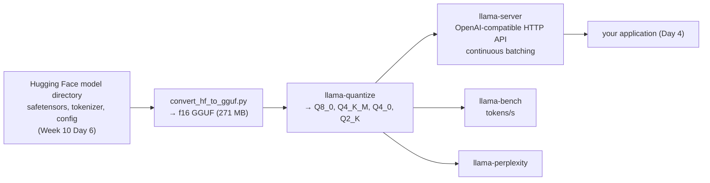

# Week 11, Day 1: Local Inference and Quantisation (llama.cpp, GGUF, Ollama)

**Time:** ~5h · **Needs:** `brew install llama.cpp` (a prebuilt bottle: no compiler), the Week 10 model directory · **Run it:** `uv run python weeks/week11_inference-serving-deployment/solutions/day1_solution.py` (about 4 minutes)

Weeks 9 and 10 ran models in PyTorch. That is the right tool for training and a poor one for serving: it carries a framework, a Python process and 32-bit weights. This week is about the other half of an AI engineer's job: **getting a model to answer requests, fast, cheaply and reliably.** It starts where Week 10 stopped. You have a fine-tuned model that scores 74% on the hand-written emails in PyTorch; today you convert **exactly that model** to GGUF, run it on **llama.cpp**, quantise it four ways, and find out how much accuracy each byte saved costs.

## Learning objectives
- Explain what **llama.cpp**, **GGUF** and **Ollama** are, and when each is the right tool.
- **Convert** a Hugging Face model to GGUF, **quantise** it, and **inspect** the file (what is actually inside a "Q4_K_M").
- Measure **speed** (prompt processing against token generation, GPU against CPU) and **quality** (task accuracy and perplexity) for each format, and read the trade-off honestly.
- Know why a quantisation that is harmless on a 7B model can destroy a 135M one.

---

## 1. The local inference stack

| piece | what it is | use it for |
|---|---|---|
| **llama.cpp** | a C/C++ inference engine (the `ggml` tensor library): runs on CPU, Metal (Apple), CUDA, Vulkan; reads **GGUF** files; ships tools: `llama-cli`, `llama-server`, `llama-bench`, `llama-quantize`, `llama-perplexity`, `llama-speculative` | the workhorse for local and edge inference; this week's serving backend |
| **GGUF** | llama.cpp's single-file model format: a header, key-value **metadata** (architecture, context length, the **tokenizer**, the **chat template**), then the tensors, each in its own quantisation type | one portable file with everything needed to run the model |
| **Ollama** | a model manager and server built on llama.cpp: `ollama pull`, `ollama run`, a registry, a **Modelfile** (the file you wrote on Week 10 Day 6) | the easiest path for a developer laptop. *Not installed here, so not run; everything it does is done below with the underlying tools* |
| **vLLM / TGI / SGLang** | GPU serving engines: continuous batching, PagedAttention, tensor parallelism (Day 2) | multi-user GPU serving; *not run: they need an NVIDIA GPU* |
| **AWQ / GPTQ / bitsandbytes** | GPU-oriented quantisation formats | 4-bit models for the engines above; described in Week 10 Day 6, not run |

## 2. Converting the Week 10 model

`brew install llama.cpp` gives the tools but **not the converter**; it is a Python script in the source tree. I downloaded the source for the same release (b9690) and ran it on the exported model directory (the converter's own Python dependencies are `torch`, `transformers`, `gguf` and `sentencepiece` for some tokenizers).

One snag worth recording, because it is the kind of thing that eats an afternoon. The converter's `set_vocab` for Llama- and Qwen2-architecture models **first tries a SentencePiece tokenizer** and only falls back to the GPT-2 style byte-level BPE path (which SmolLM2 and Qwen2.5 actually use; Week 9 Day 2) when the model has no `tokenizer.model` file. But the SentencePiece helper imports the `sentencepiece` package *before* it looks for that file, so on a machine without the package the conversion dies with `ModuleNotFoundError: No module named 'sentencepiece'` instead of falling back. For the Week 10 model I got past it with a one-line local edit that forces the BPE path (`self._set_vocab_gpt2()` in `conversion/llama.py`, marked "local edit" in my copy); for the Qwen model used on Day 5 I did the cleaner thing, **`pip install sentencepiece`**, and the stock converter then worked. Install the package; do not edit the converter. The converted file embeds the tokenizer and the **chat template** (a check: `tokenizer.chat_template` is in the metadata, so `llama-server` formats the conversation exactly as the Week 10 training did).

`solutions/llamacpp.py` wraps the tools (`quantize`, `bench`, `perplexity`, `LlamaServer`) with parsers that are tested on pasted output. A live test starts a real server and checks that it answers an extraction request with valid JSON (`{"is_order": true, ..., "order_id": "A-5", "urgency": "high"}`).

## 3. What is inside a GGUF file

`gguf_summary` reads the header and tensor table with the `gguf` package. The five files from the same model:

| file | size | tensor types inside (count, MB) |
|---|---|---|
| f16 | 271 MB | F16 (211, 269 MB); F32 (61: the norm weights) |
| **Q8_0** | **145 MB** | Q8_0 (211, 143 MB); F32 (61) |
| **Q4_K_M** | 105 MB | **Q5_0 (166, 54 MB)**; Q8_0 (15, 32 MB); Q6_K (14, 10 MB); Q4_K (16, 8 MB); F32 (61) |
| **Q4_0** | 92 MB | Q4_0 (210, 60 MB); **Q8_0 (1, 30 MB: the embedding table)**; F32 (61) |
| **Q2_K** | 88 MB | **Q4_0 (180, 45 MB)**; Q8_0 (1, 30 MB); Q3_K (30, 11 MB); F32 (61) |

A "Q4_K_M" file is **not** four-bit, and "Q2_K" is not two-bit. Three things happen:

1. **The quantiser picks a type per tensor.** The "M" (medium) mix keeps some tensors at higher precision (token embeddings and attention value/output weights), because they are more sensitive.
2. **The k-quants need blocks of 256 values.** Q4_K, Q5_K, Q6_K, Q3_K and Q2_K store their scales per 256 weights. This model's width is **576**, which is not a multiple of 256, so most of its matrices **cannot** use a k-quant and the tool falls back to a legacy 32-block type (Q5_0 for 166 tensors in the "Q4_K_M" file, Q4_0 for 180 tensors in "Q2_K"). Only the 1,536-wide MLP matrices (6 × 256) get a true k-quant. That is why the effective size is **6.3 bits per weight** for "Q4_K_M" and **5.2** for "Q2_K".
3. **The embedding table stays at 8 bits** in Q4_0 and Q2_K (30 MB of 92 MB): in a 135M-parameter model with a 49,152-token vocabulary the table is **a fifth of all the weights**, and quantising it hard hurts.

The lesson: **read the file before you trust its name**, and expect small models to behave differently from the 7B examples the format names were designed around.

## 4. The experiment

`day1_solution.py` benchmarks each file with `llama-bench` (128 prompt tokens, 64 generated, 3 repetitions) on the GPU (Metal) and on the CPU only, and measures **quality** two ways: exact match on the 38 hand-written emails served through `llama-server` at temperature 0, and **perplexity** on 40,000 characters of ordinary prose (the Week 1 and 2 lessons, `llama-perplexity`, context 512).

| format | MB | bits/w | prompt tok/s GPU | gen tok/s GPU | prompt tok/s CPU | gen tok/s CPU | **exact (hand-written)** | field acc | valid order | prose perplexity |
|---|---|---|---|---|---|---|---|---|---|---|
| f16 | 271 | 16.1 | 7,051 | 154 | 790 | 161 | **74%** [58%, 85%] | 89% | 92% | 29.5 ± 1.3 |
| **Q8_0** | **145** | 8.6 | 6,624 | 166 | 1,505 | **302** | **74%** [58%, 85%] | 89% | 92% | 29.6 ± 1.3 |
| Q4_K_M | 105 | 6.3 | 5,533 | 178 | 889 | 286 | 63% [47%, 77%] | 87% | 92% | 30.8 ± 1.4 |
| Q4_0 | 92 | 5.5 | 7,099 | 311 | 1,546 | 375 | **16%** [7%, 30%] | 29% | 32% | 32.9 ± 1.5 |
| Q2_K | 88 | 5.2 | 6,532 | 181 | 1,309 | 342 | **0%** [0%, 9%] | 18% | 24% | 36.2 ± 1.6 |

(An Apple M2, 4 threads; `llama-bench` repetitions are reported without their spread here, and a different run moves single numbers by roughly 5 to 10%. The speed columns are for the fine-tuned order extractor; the prompt is 128 tokens and the generation 64.)

### Quality
- **llama.cpp reproduces PyTorch.** The f16 GGUF scores **74% exact, 89% field accuracy and 92% valid orders on the 38 emails: the numbers PyTorch's float32 gave in Week 10.** Two independent implementations (the from-scratch decoder under the PyTorch library, and llama.cpp's C++ engine on a converted file) agree on the model's task behaviour: a cross-check that the conversion, the tokenizer and the chat template are right. (It is a statement about these 38 emails, not about every logit.)
- **Q8_0 is free.** Identical task scores at **54% of the f16 size** and a perplexity that moved by 0.1.
- **Four-bit is where it breaks, on this model.** "Q4_K_M" (really 6.3 bits) costs **11 points** of exact match (63%, whose interval overlaps 74%: with n = 38 I cannot call it a real drop; the paired count would show it); **Q4_0 collapses to 16%**, and "Q2_K" to **0%**. The Week 10 simulation (round-to-nearest in PyTorch) predicted the same ordering: Q4_0 24%, NF4 50%, uniform int4 0%. Different implementations, same story: **a 135M-parameter model has little redundancy to spare.**
- **Perplexity understates the damage.** Q4_0 raises prose perplexity from 29.5 to **32.9 (+11%)** and Q2_K to 36.2 (+23%), while task accuracy goes from 74% to 16% and 0%. A generic quality number moves a little; the **structured-output task**, where one wrong character fails the whole object, moves a lot. Always evaluate the thing you ship.
- **The prose perplexity itself** (29.5) is high because the model was fine-tuned on order emails; it is useful only for comparing formats.

### Speed
- **Prompt processing is fast, generation is the cost.** The GPU prefilled 6,600 to 7,100 prompt tokens per second against 154 to 311 tokens per second of generation: generating a token is ~40× the cost of reading one (Week 9: decoding is memory-bound, prefill is compute-bound).
- **For a model this small the CPU is faster at generation than the GPU** (Q8_0: **302 against 166 tokens/s**). The Metal backend pays a fixed cost per kernel launch and the model has 30 tiny layers, so the GPU is idle waiting on launches; the CPU's caches hold the whole 145 MB model. On a bigger model the order reverses. (The CPU is far slower at prompt processing: 1,505 against 6,624 tokens/s.) **Benchmark on the target hardware; do not assume the accelerator wins.**
- **Smaller files generate faster** (Q4_0: 375 tokens/s on the CPU against 161 for f16): fewer bytes to read per token, the bandwidth argument of Week 9 Day 6. The exception: the f16 and Q4_K_M rows are not monotonic (the k-quant fallback types and the f16 CPU path have their own kernels), and I did not investigate.
- **Memory:** the Q8_0 file is 145 MB; with an 8,192-token context the KV cache adds 23 KB per token × 8,192 = **189 MB**, more than the weights. Context length, not model size, can dominate a small model's memory.

## 5. Ollama, in one paragraph (not run)
Ollama packages exactly this: a registry of GGUF files plus a Modelfile (the one from Week 10 Day 6: `FROM ./order-extractor.gguf`, the ChatML `TEMPLATE`, `PARAMETER stop "<|im_end|>"`) and a local server on port 11434. `ollama create order-extractor -f Modelfile` then `ollama run order-extractor` would serve the same Q8_0 file. It is not installed here, so none of that was run; `llama-server`, which Ollama wraps, was.

## 6. Pitfalls
- **Trusting a format's name.** Read the tensor types (section 3).
- **Judging quantisation by perplexity.** It is the least sensitive detector.
- **Benchmarking the wrong thing:** prompt processing and token generation are different regimes with different bottlenecks; report both, and the context length.
- **Assuming the GPU is faster for a small model.**
- **Forgetting that the chat template travels in the file.** A GGUF converted without it makes every server guess a format.
- **Measuring on a warm laptop with other work running.** The numbers above carry that noise.
- **Running a downloaded GGUF you did not make.** It is a binary format parsed by C++ code: treat third-party files like third-party executables.

---

## Daily challenge: the same model at Q4, Q8 and FP16, with a quality-versus-speed table

**Build** (reference: [`solutions/llamacpp.py`](solutions/llamacpp.py), [`solutions/day1_solution.py`](solutions/day1_solution.py)):
1. Convert a model you fine-tuned (or any small instruct model) to GGUF and quantise it to at least three formats.
2. For each: size on disk, **prompt and generation tokens/second** (GPU and CPU if you have both), and **task accuracy** on an evaluation set you wrote, served through `llama-server`.
3. Add perplexity on a text file and show how it compares with task accuracy as a detector.
4. Open each file with the `gguf` package and report the tensor types.
5. A paragraph that recommends a format and says what it would take to change your mind.

**Acceptance criteria**
- The f16 GGUF reproduces the task score of your framework implementation to within the noise of your evaluation set (or you explain the gap).
- The table has intervals on the accuracy column, and says which differences are within noise.
- You report what each file actually contains, and explain any format whose name does not match its contents.
- Speed numbers say which hardware and which backend produced them.

**Stretch**
- Generate an **importance matrix** (`llama-imatrix`) on a calibration text and re-quantise to Q4_K_M or Q4_0 with it; measure the accuracy recovered.
- Pad the model's width (or pick a model whose width is a multiple of 256) and check that Q4_K_M then uses true k-quants and behaves better.
- Run `llama-perplexity` with a longer context and see how perplexity depends on it.
- Install Ollama (`brew install ollama`), run the Week 10 Modelfile, and compare its answers with `llama-server`'s.

## Further reading
- The llama.cpp repository: `docs/` and the `gguf-py` README; the quantisation blog posts by Georgi Gerganov and the k-quants pull request (#1684).
- Dettmers and Zettlemoyer, *The case for 4-bit precision* (what scales and what does not).
- The Ollama Modelfile reference.
