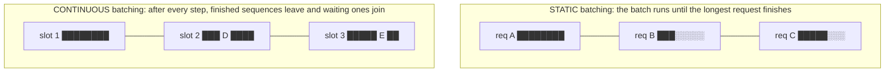
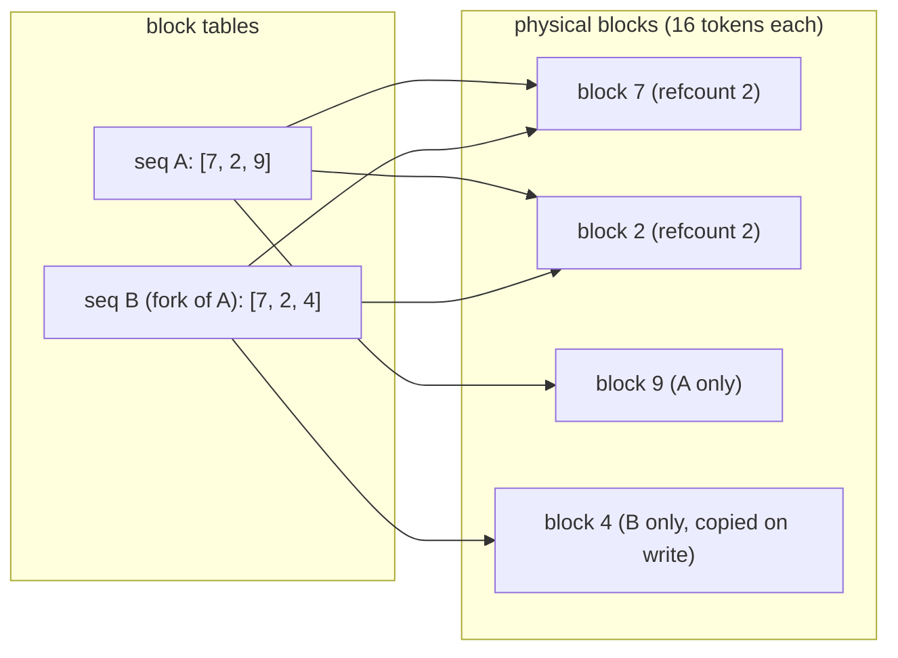

# Week 11, Day 2: Continuous Batching, PagedAttention and Throughput Under Load

**Time:** ~5h · **Needs:** Day 1 files · **Run it:** `uv run python weeks/week11_inference-serving-deployment/solutions/day2_solution.py` (about 5 minutes; `--fit 0.00453,0.003035` skips the server and reuses the fitted constants below)

> **What was and was not run.** The plan for this day names **vLLM**. vLLM needs an NVIDIA GPU, and this machine is an Apple laptop, so **vLLM was not run**. What was run is the engine that does the same job here: **llama.cpp's `llama-server`**, which has continuous batching built in (`-np N` parallel slots). The ideas below (continuous batching, paged KV memory, OpenAI-compatible serving) are the ones vLLM popularised; the numbers are llama.cpp's on Metal, for a 135M-parameter model. Treat them as a measured illustration of the mechanism, not as vLLM benchmarks.

## Learning objectives
- Explain **why a single request wastes the hardware** and how batching fixes it.
- Contrast **static** and **continuous** (iteration-level) batching, and say why continuous wins on mixed-length traffic.
- Explain **PagedAttention**: what is wrong with contiguous KV buffers and what block tables fix.
- Write a **load generator** (closed loop and open loop) and report throughput, **time to first token (TTFT)** and p50/p95 latency without fooling yourself.
- Fit a small **cost model** to measurements and say how far to trust it.

---

## 1. Why one request wastes the hardware

Generating a token means reading **every weight once** (Week 9 Day 6: decoding is memory-bound). If two sequences are decoded in the same step, the weights are read once for both: the second sequence is nearly free. So the aggregate **throughput rises with batch size** while each sequence gets only slightly slower, until the compute or the KV-cache reads start to dominate.

Model the cost of one decoding step as

`step time = base + per_seq × (sequences in the batch)`

`base` is the fixed cost (read the weights, launch the kernels); `per_seq` is the marginal cost of one more sequence (its attention over its cache, its share of the matrix products).

## 2. Static versus continuous batching

In **static** batching (the way a naive `model.generate(batch)` works) a finished sequence keeps its slot as padding until the longest one is done, and nobody new can start. With output lengths that vary (from 5 to 500 tokens is normal) most slots are idle most of the time. In **continuous** batching (Orca, 2022; "iteration-level scheduling") the scheduler runs **after every step**: a finished sequence leaves immediately and a waiting request joins, its prompt processed in that step. No slot idles while someone waits.

## 3. Measured: a real server under load

`day2_solution.py` starts `llama-server` with `-np` slots and drives it with a **closed-loop** load generator (`solutions/loadgen.py`): *U* users, each sending its next request when the previous one finishes (48 extraction requests built from the Week 10 test emails, greedy, at most 200 new tokens; Q8_0 file; the first request is a warm-up).

| slots | users | tokens/s | req/s | TTFT p50 | TTFT p95 | latency p50 | latency p95 | per-user tok/s | errors |
|---|---|---|---|---|---|---|---|---|---|
| 1 | 1 | 127 | 1.6 | 31 ms | 39 ms | 0.66 s | 0.96 s | 138 | 0 |
| 1 | 4 | 128 | 1.6 | **1,880 ms** | 2,410 ms | 2.49 s | 3.07 s | 136 | 0 |
| 2 | 2 | 189 | 2.4 | 31 ms | 50 ms | 0.82 s | 1.16 s | 100 | 0 |
| 4 | 4 | 249 | 3.1 | 46 ms | 65 ms | 1.24 s | 1.65 s | 66 | 0 |
| 4 | 8 | 255 | 3.2 | 1,178 ms | 1,581 ms | 2.41 s | 3.00 s | 66 | 0 |
| 8 | 8 | **275** | 3.4 | 68 ms | 154 ms | 2.20 s | 3.02 s | 38 | 0 |
| 8 | 16 | 274 | 3.4 | 2,173 ms | 2,841 ms | 4.15 s | 5.53 s | 37 | 0 |

(Apple M2, one run per cell, no repetitions, so single numbers move by roughly 5 to 10% between runs.)

What the table shows:

- **Throughput rises with slots, then saturates.** 127 → 189 → 249 → **275 tokens/s** from 1 to 8 slots: **2.2× the aggregate throughput**, not 8×. Per-user speed falls from 138 to 38 tokens/s. This is the central trade-off of serving: **throughput against per-user latency.**
- **Users beyond the slots only wait.** One slot with four users: the same 128 tokens/s as one user, but the median **time to first token is 1.9 s** (a request queues behind three others). Eight slots with sixteen users: no extra throughput (274), TTFT 2.2 s. Past saturation, more load buys queueing, not work. TTFT is the number users feel first.
- **No errors anywhere:** a queue absorbs the overload (Day 4 shows what a gateway should do instead).

### A fitted step-cost model
Fitting the closed-loop cells where users equal slots to `step = base + per_seq × batch` (`scheduler.fit_step_model`, least squares) gives:

**one decoding step costs 4.53 ms + 3.04 ms per sequence in the batch.**

| batch | measured tokens/s | model tokens/s |
|---|---|---|
| 1 | 127 | 132 |
| 2 | 189 | 189 |
| 4 | 249 | 240 |
| 8 | 275 | 278 |

The model reproduces the four fitted points within about 4%, which is unsurprising for two constants and four points: **it is a fit, not a validation.** For this tiny model the per-sequence part is the larger one (3.0 against 4.5 ms), which is why saturation arrives at about 8 slots; on a big GPU model `base` (reading 16 GB of weights) dwarfs `per_seq` and batching pays far more. I did not measure that.

## 4. Static against continuous batching (simulated)

I did not implement a static-batching server, so this comparison is a **simulation** with the fitted constants, not a measurement. `scheduler.py` is a discrete-event simulator: Poisson arrivals at 2.5 requests per second, 300 requests, prompts of 60 to 120 tokens, outputs of 40 to 110 tokens, 10% of requests four times longer.

| max batch | policy | tokens/s | latency p50 | latency p95 | TTFT p95 | slot use |
|---|---|---|---|---|---|---|
| 1 | static = continuous | 132 | 52.8 s | 112.9 s | 112.1 s | 100% |
| 4 | static | 136 | 48.2 s | 106.3 s | 103.8 s | 57% |
| 4 | **continuous** | **235** | **8.6 s** | **15.0 s** | 12.7 s | 100% |
| 8 | static | 115 | 62.4 s | 149.3 s | 141.9 s | 42% |
| 8 | **continuous** | **257** | **3.4 s** | **10.0 s** | 3.0 s | 100% |

- With one slot the system is overloaded (it can serve about 1.6 requests/s, offered 2.5): latency grows without bound for the whole run. Batching is what restores a stable system.
- **Static batching barely helps** (136 tokens/s at batch 4) and gets *worse* at batch 8 (115): bigger batches mean more padding while waiting for the longest request. Slot use of 57% and 42% is the waste.
- **Continuous batching is 1.7× to 2.2× the throughput and 6× to 18× lower median latency** at the same hardware cost, because nothing idles.

How far to trust this: the simulator assumes a linear step cost, no memory limit, no chunked prefill, and Poisson arrivals; the real server was only compared on closed-loop throughput. The direction (continuous ≫ static on mixed lengths) is well established in the literature (Orca, vLLM); the exact ratios are this model's.

## 5. PagedAttention: why the KV cache needs a memory manager

The cache costs per token: `2 × layers × kv_heads × head_dim × bytes`.

| model | KV bytes per token (fp16) | per 1,024 tokens |
|---|---|---|
| SmolLM2-135M (this model) | 23,040 | 23.6 MB |
| Qwen2.5-0.5B | 12,288 | 12.6 MB |
| Llama-3-8B | 131,072 | 134.2 MB |

If every request gets one **contiguous buffer** sized for the maximum length, you must reserve the worst case up front, and you cannot tell how long a reply will be. In this workload requests are about 160 tokens long (median; maximum 188), but a 2,048-token reservation holds **92% empty slots**. On a 24 GB GPU with Llama-3-8B in bf16 (about 8 GB left for the cache) that is the difference between **29 concurrent requests** (contiguous, 2,048 each) and about **362** (paged, using what is actually needed). With 8,192-token reservations it is 7 requests.

**PagedAttention** (vLLM, 2023) borrows from operating systems: split the cache into fixed-size **blocks** (16 tokens), give each sequence a **block table** mapping its logical positions to physical blocks, and allocate blocks only as the sequence grows. Waste falls to the last partly-filled block: **4.2%** here with 16-token blocks. Two bonuses:

- **Sharing:** sequences that share a prefix (the same system prompt, or beams of one prompt) point at the **same physical blocks**, with a reference count, and **copy on write** when one of them diverges.
- **Preemption:** when memory runs out the scheduler can free a sequence's blocks and recompute or swap it later, instead of crashing.

`solutions/paged_kv.py` implements the block pool (allocate, append, fork with refcounts, copy-on-write, free, out-of-blocks), plus a **paged attention decode** that gathers a sequence's keys and values through its block table. The tests check that attention over the paged layout is **numerically identical** to attention over a contiguous cache, that forks share blocks until written, and that blocks are never leaked or double-freed (mutation-tested: breaking the refcount makes tests fail).

## 6. What an OpenAI-compatible server is
vLLM, llama.cpp's server, TGI, SGLang and Ollama all expose the same HTTP shape: `POST /v1/chat/completions` with `messages`, `max_tokens`, `temperature`, `stream`, answering `choices[0].message.content` and `usage`. Day 4 builds a gateway against exactly that, so the backend can be swapped (llama.cpp today, vLLM on a GPU box tomorrow) without touching clients. *(I ran `llama-server`; the same client code would target a vLLM server, which I did not run.)*

## 7. Pitfalls
- **Reporting average latency.** Report p50 and p95, and TTFT separately from total latency.
- **Closed-loop numbers read as capacity.** In a closed loop, users slow down when the server slows down, so it never overloads. Real traffic arrives regardless: use an **open-loop** generator (arrivals at a fixed rate) to find where latency explodes. `loadgen.py` has both.
- **Benchmarking with identical prompts.** Caches and identical lengths flatter the engine; use a realistic mix.
- **Throughput without a latency budget.** 275 tokens/s at 8 slots is also 38 tokens/s per user; whether that is acceptable is a product decision.
- **Ignoring the warm-up.** The first request pays for graph and cache set-up.
- **Sizing by model weights only.** Concurrency is limited by KV memory (section 5).
- **Counting tokens by eye.** Take them from the server's `usage`, not from characters.

---

## Daily challenge: a throughput benchmark at increasing concurrency

**Build** (reference: [`solutions/loadgen.py`](solutions/loadgen.py), [`solutions/day2_solution.py`](solutions/day2_solution.py)):
1. Start a local OpenAI-compatible server with N parallel slots (llama.cpp here; vLLM if you have a GPU).
2. Write a load generator that runs **at least five concurrency levels** and reports, per level: aggregate tokens/s, requests/s, **TTFT p50/p95**, **latency p50/p95**, per-user tokens/s and error count.
3. Find the **saturation point** (where more users stop adding throughput) and the **knee** (where latency starts to climb).
4. Fit `step = base + per_seq × batch` to your runs and say how well it predicts a level you held out.
5. Add an **open-loop** run at a fixed arrival rate above and below capacity.

**Acceptance criteria**
- The table includes p95, not only averages, and zero silent failures (errors are counted).
- You state the hardware, the model file, the slot count and the number of requests per cell.
- You separate what you measured from what you simulated.
- The held-out prediction error is reported, with its direction.

**Stretch**
- Implement **static batching** as a real server (collect, run to the longest, return) and compare it with the simulation's prediction.
- Add **chunked prefill** to the simulator (long prompts split across steps) and show it lowers other users' TTFT.
- Add **prefix sharing** to `paged_kv` and measure the blocks saved for 100 requests with the same 200-token system prompt.
- On a machine with an NVIDIA GPU: run vLLM with the same load and compare.

## Further reading
- Yu et al., *Orca: A Distributed Serving System for Transformer-Based Generative Models* (continuous batching).
- Kwon et al., *Efficient Memory Management for LLM Serving with PagedAttention* (vLLM).
- The vLLM docs: the OpenAI-compatible server and the engine arguments.
- The llama.cpp server README (`-np`, `--cont-batching`, `/metrics`).
