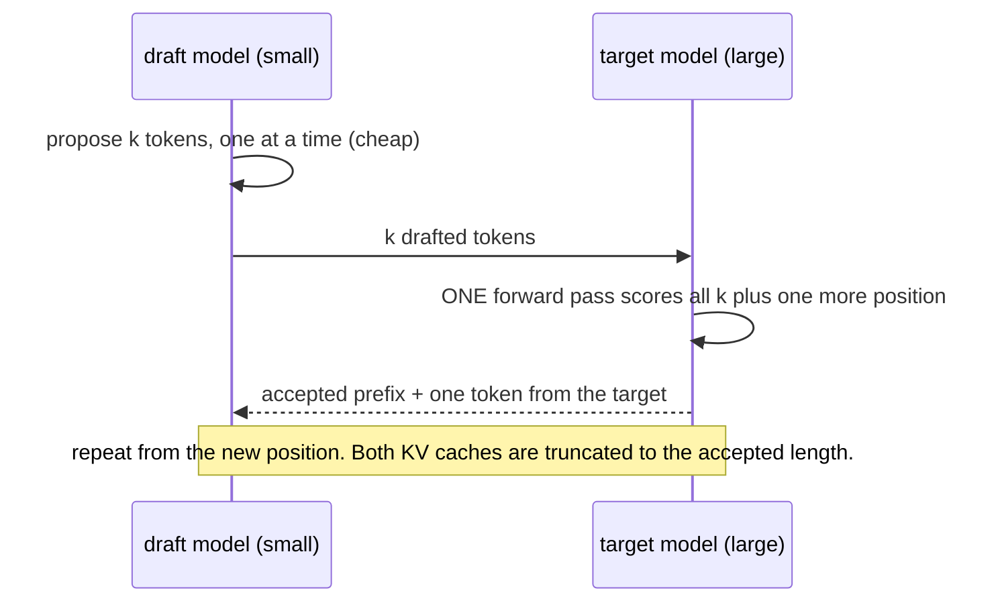

# Week 11, Day 3: GPU Memory and Cost Math, Speculative Decoding, and Self-Host vs API

**Time:** ~5h · **Run it:** `uv run python weeks/week11_inference-serving-deployment/solutions/day3_solution.py` (about 20 minutes: the speculative section runs 54 CPU generations; `--only memory,money` takes a second) · **Tests:** `test_day3.py`

> **What is real here.** The memory and cost sections are **arithmetic**: every price, GPU size, bandwidth and efficiency is an **assumed input** that I typed in, not something I looked up or measured on a GPU. The speculative-decoding section is **measured** on real models (SmolLM2-360M target, SmolLM2-135M draft) on a laptop CPU in the Week 9 decoder, and the result is an honest negative. No GPU was used.

## Learning objectives
- Answer "**will this model fit, and for how many users?**" with arithmetic.
- Estimate the **memory-bound ceiling** on decoding speed from bandwidth.
- Explain **speculative decoding**, why its output is *exactly* the target's, and when it speeds things up and when it does not.
- Build a **break-even calculator** for API versus self-hosting, and read its **sensitivity** instead of its headline.

---

## 1. Will it fit?

GPU memory holds three things: **weights** (`params × bytes per parameter`), the **KV cache** (`sequences × context × bytes per token`, Day 2), and overhead (activations, runtime, fragmentation: assumed 1.5 GB here). What is left after the weights and overhead is the cache budget; dividing by one sequence's cache gives how many requests can run at once. `economics.fit_on_gpu` does this arithmetic (tested against hand-computed values).

Context 4,096 tokens, from the published model configs (entered by hand):

| model | weights | GPU | KV per sequence | sequences that fit |
|---|---|---|---|---|
| Llama-3-8B bf16 | 16.1 GB | 24 GB | 537 MB | **11** |
| Llama-3-8B bf16 | 16.1 GB | 80 GB | 537 MB | 116 |
| Llama-3-8B int8 | 8.0 GB | 24 GB | 537 MB | 26 |
| Llama-3-8B 4-bit | 4.0 GB | 24 GB | 537 MB | 34 |
| Qwen2.5-7B bf16 | 15.2 GB | 24 GB | **235 MB** | **30** |
| Llama-3-70B bf16 | 141.1 GB | 80 GB | 1,342 MB | does not fit |
| Llama-3-70B int8 | 70.6 GB | 80 GB | 1,342 MB | 5 |
| Llama-3-70B 4-bit | 35.3 GB | 24 GB | 1,342 MB | does not fit |
| Llama-3-70B 4-bit | 35.3 GB | 80 GB | 1,342 MB | 32 |

What the table teaches:
- **Quantising the weights buys concurrency, not only fit.** Llama-3-8B on 24 GB: 11 users in bf16, 26 in int8, 34 in 4-bit, because the weights stop crowding the cache. (Day 1: on a *small* model 4-bit costs accuracy; whether it does on an 8B model for your task is a measurement, not an assumption.)
- **Architecture changes the answer as much as precision.** Qwen2.5-7B has 4 KV heads where Llama-3-8B has 8 (grouped-query attention, Week 9 Day 6), so its cache per sequence is less than half (235 against 537 MB), and the same card holds **30 sequences instead of 11**, with similar weights.
- **A 70B model is a multi-GPU or a 4-bit model.** "Does not fit" is one subtraction away from a design decision (tensor parallelism across GPUs, or int8/4-bit on 80 GB).
- **Context is the lever you control:** halving the context doubles the sequences; `fit_on_gpu(..., kv_bytes=1)` models an 8-bit cache.

### The speed ceiling
Decoding reads all the weights once per step, shared by the batch, plus each sequence's cache: `tokens/s ≤ batch × bandwidth / (weight bytes + batch × cache bytes)`. With an **assumed** 900 GB/s and Llama-3-8B in bf16 at 1,024 tokens of context:

| batch | ceiling, total tokens/s | per user |
|---|---|---|
| 1 | 56 | 56 |
| 8 | 420 | 53 |
| 32 | 1,415 | 44 |
| 64 | 2,337 | 37 |

The ceiling at batch 1 is **bandwidth over model size**: 900 GB/s ÷ 16 GB ≈ 56 tokens/s, however many TFLOPs the GPU has. That is why batching (Day 2) raises throughput almost linearly while per-user speed barely moves, and why quantisation speeds decoding (fewer bytes to read). It is an **upper bound**, not a prediction: real engines reach a fraction of it (I assumed 50% below; that is a guess to be replaced by a measurement on your hardware).

## 2. Speculative decoding

Decoding is limited by reading the weights, so **checking several tokens in one pass costs about the same as generating one** (on a memory-bound device). Speculative decoding exploits that:

1. A small, fast **draft** model proposes `k` tokens.
2. The large **target** scores all `k` in **one** forward pass.
3. Accept the longest prefix the target agrees with; at the first disagreement, take the target's own token; if all were accepted, take one **bonus** token.

For sampling (not just greedy), each drafted token `x` is accepted with probability `min(1, p(x)/q(x))` (target over draft probability); on rejection the replacement is sampled from the normalised residual `max(0, p − q)`. This **rejection sampling** makes the output distribution **exactly the target's** (Leviathan et al., Chen et al., 2023): speculation changes the speed, never the quality.

With acceptance probability `α` per token and `k` drafted, the expected tokens per target pass is `(1 − α^(k+1)) / (1 − α)`, and with a draft step costing `c` target steps, the speed-up over plain decoding is that divided by `(k·c + 1)`: the tests check these formulas, and **exactness** (greedy output identical to the target's for several `k`; the sampling version verified against the target's distribution with a chi-square-style test; a perfect draft is always accepted).

### Measured: it made things slower
`speculative.py` implements it on the Week 9 decoder with preallocated KV caches that are truncated on rejection. Target **SmolLM2-360M-Instruct**, draft **SmolLM2-135M-Instruct** (same tokenizer), CPU float32, greedy, 64 new tokens on six chat prompts:

- one decoding step costs **42.9 ms** (target) and **18.5 ms** (draft): cost ratio **c = 0.43** (a poor ratio; useful drafts are 10× or more cheaper)
- plain cached decoding of the target: **24.9 tokens/s**

| k | acceptance | tokens per target pass | measured tokens/s | **measured speedup** | formula speedup | output identical |
|---|---|---|---|---|---|---|
| 2 | 65% | 2.23 | 11.1 | **0.45×** | 1.11× | yes |
| 4 | 51% | 2.84 | 12.8 | **0.51×** | 0.72× | yes |
| 6 | 42% | 3.23 | 12.7 | **0.51×** | 0.48× | yes |
| 8 | 36% | 3.49 | 12.0 | **0.48×** | 0.35× | yes |

**Every setting is about twice as slow as not speculating**, while the output is identical to the target's in every case (that part works). Why:

1. **The draft is not cheap enough.** At c = 0.43 each drafted token costs almost half a target step. A draft model needs to be roughly an order of magnitude cheaper (a 1B draft for a 70B target, c ≈ 0.02) to pay for itself.
2. **Verification is not free here.** The formula assumes scoring `k+1` tokens costs one target step: true when a step is **memory-bound**. On this CPU in float32, a 360M model is closer to compute-bound: a forward pass over several new tokens took **3.3× to 4.2× the time of one token** (34 ms for one token; 143, 122 and 113 ms for 3, 5 and 9; the non-monotonic numbers are a reminder this is a noisy, unoptimised CPU kernel, best of five). So the "one pass for k tokens" saving never materialises. (A real GPU serving an 8B-plus model *is* memory-bound at small token counts, which is where the published 2–3× speed-ups come from. I did not measure that.)
3. **Acceptance falls with `k`** (65% → 36%) because later guesses depend on earlier ones being right, so a larger `k` is not free.

A diagnostic worth keeping: the **formula with the real acceptance and cost ratio** said 1.11× at k = 2 and the measurement said 0.45×. When a model and a measurement disagree this much, one of the model's assumptions is false, here assumption 2. **Measure before shipping an optimisation**, and count tokens per *second*, not per pass.

When speculative decoding does pay: a big, memory-bound target; a much smaller draft that agrees often (same family, ideally fine-tuned on the same data; or **n-gram / prompt-lookup** drafting with no model at all, great for extraction and code edits that copy from the prompt); low-to-moderate batch sizes (at large batches the GPU is already busy and there is little spare compute to spend on drafts). llama.cpp ships `llama-speculative`, and vLLM supports draft models, n-gram lookup and Medusa/EAGLE-style heads (none run here: no GPU).

## 3. Self-host or pay per token?

`economics.py`: `ApiPrice` ($ per million input and output tokens), `SelfHost` (GPU $/hour, sustained output tokens/s, prefill speed, utilisation, minimum GPUs, monthly operations cost), `compare` (cost of each at a volume, who is cheaper), `break_even_tokens_per_month` (bisection over the stepwise GPU count), `sensitivity` (one assumption at a time). **Every number is an input. None is built in.**

Assumed for the illustration: API card **$0.50 / $1.50 per million input / output tokens**; a rented 24 GB GPU at **$1.00 per hour**; Llama-3-8B bf16, batch 32, so the ceiling above (1,415 tokens/s) times an assumed 50% efficiency is **707 output tokens/s** per GPU; prefill 8× faster; **50% utilisation** (real traffic is bursty); 3 input tokens per output token.

| output tokens / month | API | self-hosted | GPUs | cheaper |
|---|---|---|---|---|
| 1M | $3 | $730 | 1 | API |
| 100M | $300 | $730 | 1 | **API** |
| 1,000M | $3,000 | $1,460 | 2 | self-hosted |
| 10,000M | $30,000 | $10,950 | 15 | self-hosted |

- **Self-hosting has a floor:** one GPU running all month costs $730 whether or not anyone calls (730 hours × $1).
- **The break-even is 243M output tokens a month, with no operations cost.** Add **$2,000 per month** of engineering, monitoring and on-call, and it moves to **1,153M**, nearly five times further out. *The hidden cost of self-hosting is the people, and it is usually the largest term.*
- **Sensitivity** (break-even, millions of output tokens per month, one assumption changed at a time, with the $2,000 operations cost in place):

| assumption | ×0.5 | ×1 | ×2 |
|---|---|---|---|
| GPU price per hour | 910 | 1,153 | 3,100 |
| tokens per second | 2,127 | 1,153 | 910 |
| utilisation | 2,857 | 1,153 | 910 |
| operations cost (columns are ×0, ×1, ×2 of $2,000 a month) | 243 | 1,153 | 2,307 |

Which assumption is least certain, and moves the answer most? **Utilisation and tokens per second** (both uncertain by 2×, and both set to a guess here): halving utilisation moves the break-even by 2.5×. That is the case for **measuring your real traffic** (Day 4's `/metrics`, Day 7's load test) before deciding anything.

### The small fine-tuned model
The Week 10 extractor (60 prompt + 70 new tokens per request) is a different regime: tiny, CPU-friendly, **275 output tokens/s measured on this laptop at 8 slots** (Day 2). Priced as if a **$0.20/hour CPU VM** matched that speed (an assumption: a cloud vCPU slice may be several times slower than an M2) and against the same assumed API card:

| requests / month | API | self-hosted | cheaper |
|---|---|---|---|
| 0.1M | $14 | $146 (1 machine) | API |
| 1M | $135 | $146 (1 machine) | API (close) |
| 10M | $1,350 | $438 (3 machines) | **self-hosted** |
| 100M | $13,500 | $3,066 (21 machines) | self-hosted |

A cheap small model crosses over at about **a million requests a month** at these assumptions, long before the 8B-on-a-GPU case (hundreds of millions of tokens), because a small specialised model needs little hardware. **But** the API card here is a hosted *general* model's, and "fits this task" (Week 10: 74% exact on the hand-written set) is a different quality level from what a frontier API gives; the comparison above prices cost, not quality. Decide on cost at equal quality.

## 4. Pitfalls
- **Quoting a break-even without its assumptions.** The number is a function of five guesses; show the sensitivity.
- **Forgetting the idle GPU** (the $730 floor) and operations time.
- **Planning with peak tokens/s** at utilisation 100%.
- **Sizing concurrency from weights only** (section 1).
- **Assuming an optimisation wins because the paper says so.** Speculation lost here; check your target, hardware and draft.
- **Comparing prices at different quality.** A cheaper model that fails more often is not cheaper.
- **Treating a price card as constant.** API prices change often; keep them as inputs, dated.

---

## Daily challenge: a break-even calculator for API versus self-hosted

**Build** (reference: [`solutions/economics.py`](solutions/economics.py), [`solutions/day3_solution.py`](solutions/day3_solution.py)):
1. A function that says whether a model fits a GPU and how many concurrent sequences it can hold.
2. A cost model for an API and for a self-hosted GPU with utilisation, a minimum fleet and operations cost.
3. The **break-even volume**, and a **sensitivity table** for at least four assumptions.
4. Feed it **a measured throughput from your own benchmark** (Day 2) and a **token mix from your own traffic** (a real or synthetic log).
5. A one-page recommendation: which option, at what volume, and which assumption would flip it.

**Acceptance criteria**
- Every price and hardware figure is an input; none is hard-coded, and the report lists them.
- Tests check the arithmetic against hand-computed cases and the monotonic properties (cheaper GPU → earlier break-even; more operations cost → later).
- The sensitivity table identifies the assumption with the largest effect.
- The recommendation separates what you measured from what you assumed.

**Stretch**
- Add **spot or reserved pricing** and a traffic profile with daily peaks (utilisation from the peak-to-average ratio).
- Add the cost of **quality**: price the extra human review needed if the cheaper model errs more.
- Run `llama-speculative` with a GGUF draft and measure it on your hardware.
- Implement **prompt-lookup (n-gram) drafting** in `speculative.py` for the extraction task and measure acceptance on the Week 10 emails (the output copies the prompt heavily).

## Further reading
- Leviathan, Kalman and Matias, *Fast Inference from Transformers via Speculative Decoding*; Chen et al., *Accelerating LLM Decoding with Speculative Sampling*.
- The vLLM docs on speculative decoding; the llama.cpp `llama-speculative` example.
- Kipply, *Transformer Inference Arithmetic*: the memory-bound ceiling worked through.
