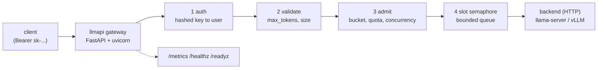

# Week 11, Day 4: A FastAPI LLM Backend: Streaming, Auth, Rate Limits and Backpressure

**Time:** ~6h · **Needs:** `fastapi`, `uvicorn`, `httpx`, the Day 1 GGUF files · **Run it:** `uv run python weeks/week11_inference-serving-deployment/solutions/day4_solution.py` (about 2 minutes; starts a real `llama-server` and the API) · **Tests:** `uv run pytest weeks/week11_inference-serving-deployment/solutions/test_day4.py`

Day 2 gave you an engine that answers fast. You cannot hand its port to the internet: it has no identity, no limits, no health story and no accounting, and one noisy client can starve the rest. Today you build the **gateway**: a FastAPI service in front of the model server that makes it safe to share.

## Learning objectives
- Design an **OpenAI-compatible contract** with proper errors, request ids and usage accounting.
- Implement **SSE streaming** and handle a client that hangs up mid-answer.
- Implement **API-key auth** (hashed keys), a **token bucket**, a **daily token quota** and a **concurrency cap**, all testable without sleeping.
- Apply **backpressure**: a bounded queue and a fast `503`, instead of unbounded latency.
- Expose **health vs readiness** and **Prometheus metrics**, and measure the **overhead** the gateway adds.

---

## 1. Architecture

The code is in `solutions/llmapi/`: `auth.py` (keys), `ratelimit.py` (limits), `backends.py` (the model client), `metrics.py` (Prometheus text), `app.py` (routes), `rag.py` (Day 5). The gateway talks to the model server over HTTP, so the same gateway fronts llama.cpp today and vLLM tomorrow, and several models at once (the request's `model` field picks the backend).

## 2. The contract

A good API tells clients what went wrong in a form a program can act on. The errors are shaped like OpenAI's (`{"error": {"message", "type", "code"}}`) so existing client libraries parse them.

| situation | status | `code` |
|---|---|---|
| no key / wrong key | 401 | `invalid_api_key` |
| empty `messages`, bad field types | 400 | `invalid_request` |
| `max_tokens` above this user's cap | 400 | `max_tokens_too_large` |
| prompt too long | 400 | `prompt_too_long` |
| over the request rate | 429 + `Retry-After` | `rate_limited` |
| daily token quota used | 429 | `quota_exceeded` |
| too many in flight | 429 | `too_many_concurrent` |
| queue full | 503 + `Retry-After` | `overloaded` |
| unknown model | 404 | `model_not_found` |
| waited too long for a model slot | 503 + `Retry-After` | `queue_timeout` |
| the model server failed | 502 | `backend_error` |

Every response carries `x-request-id` (the client's, if sent, else generated), logged as one JSON line per request (`event`, `rid`, `user`, `outcome`, `tokens`, `stream`). **Never log prompts or keys**: the log line holds identifiers and counts only (Week 8 Day 5).

**Keys.** Generate a key once, show it once, store only its **SHA-256 hash**, and compare with `hmac.compare_digest` (constant time). A key identifies a *user*; the user object carries the limits (`rpm`, `burst`, `daily_tokens`, `max_concurrent`, `max_tokens_cap`). Hashing a high-entropy random key with plain SHA-256 is fine (the passwords-need-slow-hashes advice is for low-entropy human secrets). *The demo keys in the solution (`sk-demo-alice`) are obviously fake and exist only for the local stack.*

## 3. Rate limiting, three different limits

They answer three different questions, and you need all of them:

| limit | protects against | mechanism |
|---|---|---|
| **request rate** | a burst or a stuck retry loop | **token bucket**: capacity `burst`, refilled at `rpm / 60` per second; each request takes one token, else `429` with `Retry-After` = the time until a token exists |
| **daily token quota** | cost | counter of prompt + completion tokens per UTC day; checked at admission, charged **after** the answer from the server's real `usage` |
| **concurrency** | one user holding every model slot | counter of requests in flight per user; a slot is held until the request finishes **on every path** (success, error, client hang-up) |

`ratelimit.Limiter` takes an injected clock, so every one of these is tested without `sleep`: advance the fake clock by 0.5 s and check one token has returned. The subtle bug class is **leaking the concurrency slot**: every exit path must release it (`finish(...)` is idempotent and is called from `finally`), and a test hangs up mid-stream to check that the count returns to zero.

Measured on the real stack (`day4_solution.py`): **bob** (burst 3, 30 requests per minute) sends six requests back to back: `[200, 200, 200, 429, 429, 429]`, with `Retry-After: 2` on the first refusal. His usage shows `requests: 3, rejected: 3, in_flight: 0`.

## 4. Backpressure: say "no" quickly

An unbounded queue turns overload into **latency**: every request waits, every client times out, retries add load, and the service collapses. The gateway has `max_inflight` model slots (match the model server's `-np`) and a **bounded queue** (`max_queue`). A request arriving when both are full gets `503` + `Retry-After` immediately.

Measured: 12 concurrent users against 2 slots and a queue of 2, 36 requests: **4 served, 32 refused (503)**. The served requests had latency p50 1.07 s and p95 1.38 s, the same as an unloaded system; the **refused requests were answered in a median of 5 ms** instead of waiting. (Read the 32 with care: a refusal costs almost nothing, so this closed-loop generator burns through its 36 requests in a blink; a well-behaved client would honour `Retry-After` and back off. The point is the shape: served traffic stays fast, and the excess is turned away cheaply, rather than everyone slowing down together.)

## 5. Streaming (SSE)

For chat, time to first token is the user-visible latency. The gateway proxies the model server's stream as **Server-Sent Events**: `data: {chunk}\n\n` lines, ended by `data: [DONE]`, with a final chunk carrying `usage` so streaming requests are accounted too.

Measured: one streamed request showed its **first token after 51 ms, then 97 chunks in 0.49 s**; a non-streaming client sees nothing until the whole reply is ready: **9× later** for the first visible output.

**Hang-ups.** A user closes the tab. If the gateway keeps pulling tokens from the model, a slot is burned on an answer nobody reads. Starlette cancels the response generator when the client disconnects; the gateway cancels the upstream call in a `finally`, releases the user's slot, and counts the outcome `client_disconnected`. Measured: a client that hangs up after 5 chunks leaves the API with `in_flight 0` and the model server with **0 slots still processing** (checked through the server's own `/metrics`, not assumed).

## 6. Health, readiness, metrics
- **`/healthz` (liveness):** the process is up. Restart me if this fails. It must not depend on the model.
- **`/readyz` (readiness):** the model server answers. Send me traffic only if this passes. A gateway that is alive but whose model is down is *not ready*, and killing it would not help (Day 6 demonstrates this with a real container).
- **`/metrics`:** Prometheus text format: `llmapi_requests_total{outcome,stream}`, `llmapi_tokens_total{kind}`, `llmapi_in_flight`, `llmapi_queue_depth`, `llmapi_request_seconds` and `llmapi_ttft_seconds` histograms, `llmapi_rejected_total{reason}`. Protect it with an admin token if it is exposed. Metric labels must be **low cardinality** (outcome, not user id or request id: one time series per label value will melt your monitoring).

## 7. What the gateway costs
The same 40 requests, straight to `llama-server` and through the gateway:

| path | users | tokens/s | latency p50 | latency p95 | TTFT p50 |
|---|---|---|---|---|---|
| direct | 1 | 125 | 0.64 s | 0.90 s | 31 ms |
| via the API | 1 | 132 | 0.61 s | 0.83 s | 20 ms |
| direct | 4 | 247 | 1.22 s | 1.60 s | 35 ms |
| via the API | 4 | 244 | 1.26 s | 1.59 s | 35 ms |

**The gateway's overhead is within the run-to-run noise** (at one user the API path even looks *faster*; that is noise, not a speed-up: one run per cell). Auth, limits, accounting and metrics are not where the time goes: **generation is.**

## 8. Testing it
`test_day4.py` (37 tests) drives the app with `httpx`'s ASGI transport and a **fake backend** (scripted replies, controllable delays and failures), so no model is needed: contract and error shapes, the key store, every limiter path with a fake clock, queue overflow, a hang-up releasing the slot, streaming framing, usage accounting for both modes, multi-model routing, metrics output. A mutation check (flip the bucket's comparison, drop the slot release, skip the quota charge) must make a test fail. Separate tests in `test_day1.py` start the real server and skip themselves if llama.cpp is not installed.

## 9. Pitfalls
- **Releasing the concurrency slot on the happy path only.**
- **Charging tokens from your own estimate** instead of the server's `usage`.
- **Streaming without accounting** (an easy hole around every quota).
- **An unbounded queue.**
- **One health endpoint** that conflates "alive" with "ready".
- **Metrics labelled by user or request id.**
- **Secrets in the repo or the logs.** Keys come from the environment or a secret store; the repo holds only fake demo values.
- **Trusting `X-Forwarded-For` or a client-sent user id** for identity. Identity comes from the key.
- **Forgetting that rate limits kept in process memory** reset on restart and do not add up across replicas (use Redis, or a gateway like Envoy, when you scale out; not run here).

---

## Daily challenge: a streaming API with per-user rate limits, and tests

**Build** (reference: [`solutions/llmapi/`](solutions/llmapi), [`solutions/test_day4.py`](solutions/test_day4.py), [`solutions/day4_solution.py`](solutions/day4_solution.py)):
1. `POST /v1/chat/completions` in front of a model server, JSON and SSE modes, with usage.
2. API-key auth with hashed keys and two users with different limits.
3. A token bucket, a daily token quota and a concurrency cap, with `Retry-After`.
4. A bounded queue with a `503`.
5. `/healthz`, `/readyz`, `/metrics`.
6. Tests with a fake backend and a fake clock, including a hang-up test.

**Acceptance criteria**
- No test sleeps; every limiter path is covered.
- A client that disconnects mid-stream leaves `in_flight` at 0 (asserted).
- Overload produces `503` fast while served requests keep their latency (measured, with numbers).
- No secret or prompt appears in the logs (asserted by a test that captures log output).
- Mutating the limiter (comparison, release, charge) makes at least one test fail.

**Stretch**
- Move the limiter's state to Redis and run two gateway replicas.
- Add per-user model allow-lists and a spend report from `/v1/usage`.
- Add request timeouts that cancel the upstream call, and a circuit breaker after N consecutive backend errors.
- Add an OpenTelemetry trace per request (Week 7 Day 4).

## Further reading
- The FastAPI docs: `StreamingResponse`, dependencies, lifespan events.
- The OpenAI API reference for chat completions and streaming (the shape you are mirroring).
- The Prometheus docs: metric types and the label-cardinality warning.
- Google SRE book, "Handling Overload" and "Addressing Cascading Failures".
