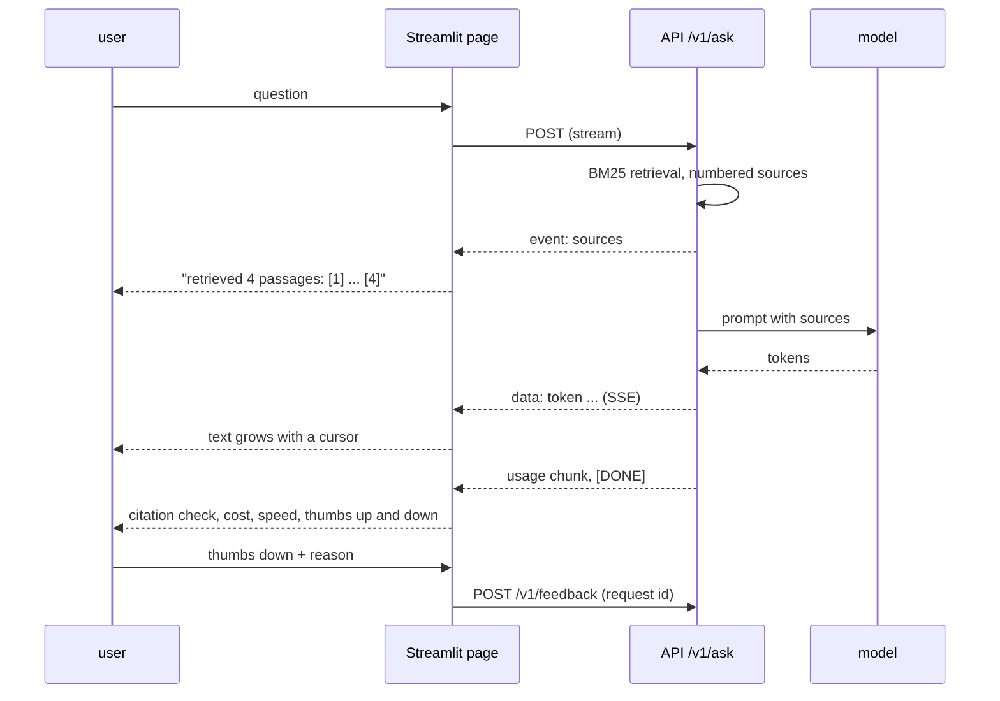

# Week 11, Day 5: A Streaming Chat UI with Citations, Feedback and a Cost Readout

**Time:** ~5h · **Needs:** Day 4's gateway, `streamlit`, `rank-bm25` · **Run it:** `uv run python weeks/week11_inference-serving-deployment/solutions/day5_solution.py` (about 2 minutes; the first run converts a second model to GGUF) · **Tests:** `test_day5.py` (37 tests, including the page driven headlessly)

A model behind an API is a demo for engineers. A product is something a person can use, trust and complain about. Today you build the front end: a streaming chat page that shows **where an answer came from**, lets the user say **it was wrong**, and shows **what it cost**, and you test it without a browser.

> **Not run:** the page was started for real (health check and page served) but I cannot see it render from a terminal; everything about its behaviour is verified with Streamlit's headless `AppTest`. The **Vercel AI SDK / Next.js** route is described, not built.

## Learning objectives
- Choose a UI stack and know what each costs you.
- Stream tokens into a page, and show **retrieved sources before the first token**.
- Verify citations in the UI instead of trusting them, and make failures **visible**.
- Capture **feedback tied to a request id** without storing the conversation.
- Show **cost and speed** from the server's own usage numbers, and label estimates as estimates.
- Test a Streamlit page with `AppTest` and a fake client.

---

## 1. Choosing a UI stack

| option | good for | cost |
|---|---|---|
| **Streamlit** (used here) | internal tools and demos in pure Python; chat elements (`st.chat_message`, `st.chat_input`) and streaming via `st.empty()` | the script **reruns top to bottom on every interaction**; not a design system; poor fit for a polished consumer product |
| Gradio | model demos, Hugging Face Spaces | similar, more ML-demo flavoured |
| Chainlit | chat UIs for agent traces and steps | a framework to learn; less general |
| **Next.js + Vercel AI SDK** | a product front end: `useChat`, streaming, tool-call rendering, auth, deployment | JavaScript/TypeScript, a second codebase. *Not built here.* The same gateway serves it: it speaks SSE and OpenAI-shaped chunks, which is what the SDK consumes |

Whichever you pick, the gateway contract (Day 4) is the seam. The UI is a client like any other.

## 2. What the page shows

Design choices, each of which fixes a real failure:

- **Sources arrive first** (a named SSE event before any token), so the user sees what was retrieved while the model is still writing, and a retrieval failure is visible immediately.
- **Citations are checked, not trusted.** The page parses `[n]` from the answer: a valid number becomes bold, **a number that is not among the retrieved sources is struck through** (the model cited something that does not exist), an answer with claims and **no citation at all gets a warning**, and the exact abstention sentence ("I don't know based on the provided sources") is treated as a legitimate outcome, not an error.
- **Cost from the server's `usage`**, multiplied by a **price card the user types into the sidebar** (an assumption; the page never ships a price). If a stream carried no usage the page estimates (about 4 characters per token) and says "estimated".
- **A usage meter** (tokens used today against the quota, from `/v1/usage`) turns a surprise `429` into a visible budget.
- **Errors are human:** a `429` becomes a warning with "try again in N s" from `Retry-After`; other failures are errors; a partial answer is kept, not thrown away.
- **Feedback is tied to the request id**, with a reason (wrong, off-topic, unsafe, ...). The server stores `{user, request_id, rating, reason, comment, time}` and **never the answer or the question**: it does not keep prompts. The free-text comment is user text and personal data (Week 8): capped and handled accordingly. The buttons disable after one click.

All logic (SSE parsing, citation checks, cost arithmetic) lives in `ui/client.py` as plain, unit-tested functions; `ui/chat_app.py` only draws it.

## 3. The Streamlit execution model (the part that bites)
Streamlit re-executes the script on every widget interaction. That has three consequences the code deals with: keep conversation state in `st.session_state`; stream by writing into a placeholder (`out_box.markdown(text + "▌")`) and replace it with the final rendering afterwards; and finish with `st.rerun()` so the buttons under the new answer exist before the user can click them. A `Clear conversation` button resets the state. The API URL and key live in sidebar inputs defaulting to environment variables, never in the source.

## 4. Testing a page without a browser
`streamlit.testing.v1.AppTest` runs the script headlessly and lets you set inputs and read elements. The page takes its client from `st.session_state["_client"]` when present, so the tests inject a **fake client** that streams scripted events. They check: the page renders with examples and a usage meter and raises no exception; asking a question shows the answer, its citations, the cost and a **bad-citation warning**; a thumbs-down is sent with the request id and then disabled; an answer without citations is flagged while an abstention is not; a `429` is a warning with the retry hint; the extract mode sends the system instruction and shows the JSON. The client's SSE parser, error handling and arithmetic have their own unit tests, and a mutation check (break the invalid-citation test, drop the usage fallback) fails them.

## 5. Measured: the stack end to end

`day5_solution.py` starts two `llama-server`s behind one gateway: the Week 10 **order extractor** and a general chat model (**Qwen2.5-0.5B-Instruct**, converted to a Q8_0 GGUF). The gateway indexes the **Week 9, 10 and 11 lessons of this repository** with BM25 (heading-aware chunks: a heading path is kept with each chunk, and code fences are never split) and `/v1/ask` answers from the top four chunks. The questions go through the UI's own client. The price card is an **assumed $0.50 / $1.50 per million tokens**.

| question | retrieval (top source) | answer | cited? | first token | cost at the assumed card |
|---|---|---|---|---|---|
| why divide attention scores by √d (in the course) | right page: "3. Why divide by √d? (measured)" | **"I don't know based on the provided sources."** | abstained | 669 ms | $0.00057 |
| what does the rank r control in LoRA (in the course) | right page (Day 3, section 2 "LoRA" is third) | a plausible two-sentence answer, partly restated from the sources | **no citation** | 415 ms | $0.00059 |
| continuous vs static batching (in the course) | right page (Week 11 Day 2, sections 2 and 4) | quotes the simulated speed-up figures | **no citation** | 431 ms | $0.00064 |
| capital of France (**not in the course**) | four **unrelated** chunks (BM25 returns anything that shares a word) | "1. tokenize 2. prefill 3. decode loop 4. stop 5. detokenize" (it answered from the irrelevant passage instead of abstaining) | **no citation** | 482 ms | $0.00067 |

And the extractor through the same gateway, `model="order-extractor"`, for "Dana Okoye ... 3 x USB-C cable (order ref K-204) ... urgent": a valid JSON object with `customer_name`, `order_id: "K-204"`, `items: [{name: "usb-c", quantity: 3}]`, `urgency: "high"`; it also invented `delivery_date: "2023-08-20"` (the email gave none: a hallucinated field, one example, in the model's known weak spot).

Read this honestly:

- **The plumbing works.** Sources arrive first, tokens stream (first token 415 to 669 ms including retrieval and the prompt), usage and cost come from the server, feedback is accepted, the usage meter reads 4,812 tokens after five requests, the Streamlit app starts and serves (health endpoint and page, not a rendered screenshot).
- **The model does not follow the citation instruction. None of the four answers cites a source.** A 0.5B-parameter model cannot reliably do "answer only from the numbered sources and cite them", and one of its four answers was an abstention on a question whose answer *was* in the top source. This is a **quality result about the model, not a bug in the page**, and it is why the page checks citations rather than trusting them: all three non-abstaining answers would show the "no citation" warning.
- **Retrieval has no "nothing relevant" signal.** The out-of-scope question still produced four sources (BM25 returns whatever scores above zero), so the model had something to answer from and did. A **relevance threshold** (abstain without calling the model when the best score is low) is the first fix; Day 7 measures it.
- **This is four questions.** They show failure modes; they are not an accuracy estimate. Day 7 runs a labelled question set.
- A larger model (7B or hosted) would follow the citation format far better. I did not run one, so I cannot say by how much.

## 6. Pitfalls
- **Trusting the citation format.** Verify it in code, and show the user what failed.
- **Showing a citation without the source text.** Let the user open the passage.
- **Streaming into the page without a final re-render**, leaving a dangling cursor or missing buttons.
- **Putting the API key in the page source or the URL.**
- **Pricing from a hard-coded table** that goes stale: make it an input with a date.
- **Feedback that stores the whole conversation** (a privacy decision, not a default).
- **Treating retrieval as always successful.** Surface what was retrieved and let "no good match" end the request early.
- **Testing the UI only by clicking.**

---

## Daily challenge: a UI with citations, feedback buttons and a cost display

**Build** (reference: [`solutions/ui/`](solutions/ui), [`solutions/day5_solution.py`](solutions/day5_solution.py), [`solutions/test_day5.py`](solutions/test_day5.py)):
1. A streaming chat page over your API with a sources panel that fills before the first token.
2. Citation verification in the page (valid, invalid, missing, abstained).
3. Thumbs up/down with a reason, tied to a request id and sent to a feedback endpoint that stores no conversation text.
4. A cost and speed readout from the API's usage, with an editable price card and an "estimated" flag when usage is missing.
5. Headless tests with a fake client.

**Acceptance criteria**
- A fabricated citation number is visibly flagged in a test.
- A `429` shows the retry time rather than a stack trace.
- The feedback request contains the request id and no answer text (asserted).
- No price, key or URL is hard-coded.
- The page works in both modes (ask, extract) in the tests.

**Stretch**
- Add a **relevance threshold** to retrieval and measure the abstention rate on in-scope against out-of-scope questions.
- Let the user click a citation to open the passage and highlight the supporting sentence.
- Rebuild the front end in Next.js with the Vercel AI SDK against the same API.
- Add a conversation history sidebar stored in the browser only.

## Further reading
- Streamlit docs: chat elements, `session_state`, and `streamlit.testing.v1` (AppTest).
- MDN: Server-Sent Events. The Vercel AI SDK docs on `useChat` and stream protocols.
- Nielsen Norman Group on designing AI answers with citations and feedback.
