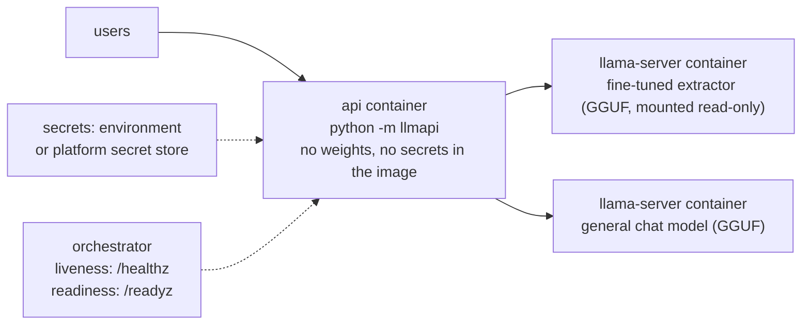

# Week 11, Day 6: Docker, Secrets, Health Checks and Where to Deploy

**Time:** ~5h · **Needs:** Docker (Docker Desktop or Engine) · **Run it:** `uv run python weeks/week11_inference-serving-deployment/solutions/day6_solution.py` (about 2 minutes after the first image pull) · **Tests:** `test_day6.py`

> **What was and was not run.** The image was **built and run on this machine's Docker**, the failure drills are real, and the llama.cpp server container (`ghcr.io/ggml-org/llama.cpp:server`) was pulled and used. **No cloud account was used:** the Fly.io, Render and Modal files are *sketches written from my knowledge of those platforms, never deployed*. Platform configuration changes often; check each file against the platform's current documentation before relying on it. A GPU was not used anywhere.

## Learning objectives
- Write a **small, safe Dockerfile** for the gateway: cached dependency layer, non-root user, a health check, no baked-in secrets.
- Pass **secrets through the environment** (and know their limits), and prove none leaked into the image or the logs.
- Distinguish **liveness from readiness** by breaking things on purpose.
- Rehearse **failures**: the model server dies, a request is in flight when the container stops.
- Compare **where the model should run** (laptop Metal, a CPU container, a serverless GPU) and what each costs you.

---

## 1. The deployment shape



Two rules shape everything: **the gateway image contains no model weights** (they are hundreds of MB to hundreds of GB, change on a different schedule than code, and are mounted as a volume read-only), and **model servers are separate containers**, so the CPU-light gateway scales and restarts independently of the memory-heavy model.

## 2. The Dockerfile (`solutions/deploy/Dockerfile`)

```dockerfile
FROM python:3.12-slim
RUN useradd --create-home --uid 10001 app          # not root
WORKDIR /app
COPY requirements-api.txt .
RUN pip install -r requirements-api.txt            # slow layer, rebuilt only when dependencies change
COPY llmapi ./llmapi                               # fast layer: your code
COPY docs ./docs                                   # the retrieval corpus (markdown), baked in
ENV LLMAPI_DOCS_DIR=/app/docs HOST=0.0.0.0 PORT=8000
USER app
HEALTHCHECK --interval=10s --timeout=3s --start-period=10s --retries=3 \
    CMD python -c "...urlopen('http://127.0.0.1:8000/healthz'...)"
CMD ["python", "-m", "llmapi"]
```

Why each line is there: the **dependency layer comes first** so editing code does not reinstall packages; the process runs as **an unprivileged user**, so a compromised API does not own the container; the health check uses Python (the slim image has no `curl`); `HOST=0.0.0.0` is needed because a container's loopback is not reachable from outside. A `.dockerignore` keeps `.env`, `.git`, logs and `*.gguf` files out of the build context. `deploy/build_context.py` assembles exactly what the image needs (the package, a copy of the lessons' Markdown, the requirements) in a temporary directory, so nothing else can leak in.

### Measured
| | |
|---|---|
| image size | **228 MB** (python:3.12-slim is 145 MB; FastAPI, uvicorn, httpx, pydantic and rank-bm25 make up the rest) |
| first build (base image already pulled) | **8 s**; rebuild after touching one source file: **0.2 s** (all dependency layers cached) |
| runs as | user `app` (uid 10001) |
| container healthy after | **5.7 s** (the `HEALTHCHECK` passing: the process answers `/healthz`) |
| baked-in secret-looking variables | **none** (the base image's public `GPG_KEY` fingerprint, used to verify Python's own signatures, is the one match for "key" and is not a secret) |
| the demo secret in the image's layer history | **absent** |
| prompts or secrets in the container's logs | **none** (checked by searching the logs for a marker prompt and the secret) |

The check that matters is the last two rows: **look for the secret instead of assuming it is not there.** `docker history` shows every `ENV` and `RUN` you wrote.

## 3. Secrets
- **Never in the image or the repository.** An `ARG` or `ENV` in a Dockerfile is readable by anyone who can pull the image. The keys (`LLMAPI_KEYS`, a JSON list of users with their limits and the **SHA-256 hash** of each key; a plaintext `key` field is accepted only for local demos) and `LLMAPI_ADMIN_TOKEN` arrive as **environment variables at run time**: `docker run -e`, an `--env-file` that is `.gitignore`d (`.env.example` shows the shape, with fake values), or the platform's secret store (`fly secrets set`, Render's dashboard, Modal secrets).
- **Know the limits of environment variables.** They are visible to `docker inspect`, to anyone who can exec into the container, and sometimes in crash dumps and `/proc`. They are the *baseline*; a cloud secret manager with short-lived credentials is better, and keys should be **rotatable** without a redeploy (the key store accepts a list, so adding a new key before removing the old one works).
- **Fail closed.** The API **refuses to start with no keys** (`sys.exit("set LLMAPI_KEYS ...")`) rather than starting open.
- **A secret that was committed is burned.** Rotate it; deleting the commit is not enough (the lesson from Week 8's regression corpus).

## 4. Liveness and readiness, broken on purpose

`/healthz` answers "is the process up?"; `/readyz` answers "can it do its job right now?" (it calls the model server). The orchestrator uses them differently: **liveness fails → restart the container; readiness fails → stop sending traffic, but do not restart.** I killed the model server under a running API container:

| step | observed |
|---|---|
| model server killed | `/readyz` → **503** "model server unavailable"; `/healthz` → **200**; container health stays `healthy`, state `running` |
| a request during the outage | **502 `backend_error` in 22 ms**: a clear failure, not a hang |
| model server restarted on the same port | `/readyz` healthy again, with no restart of the API |

Restarting the API would not have fixed anything here: the fault was elsewhere. A health check that included the model would make an orchestrator restart-loop a perfectly good gateway. (Conversely, if `/healthz` were wired to readiness on a platform with no separate readiness probe, you would get exactly that restart loop. Fly's and Render's health checks are one probe: the sketches point Render at `/healthz` and Fly's HTTP check at `/readyz` deliberately, and which one is right depends on what you want the platform to do on failure. Decide, and write it down.)

### Graceful stop
`docker stop` sends SIGTERM, waits (10 s by default), then SIGKILL. With a **streaming request in flight**, the container stopped in **2.0 to 2.8 s (two runs) with exit code 0**, and the client had received 300 chunks before the connection closed: uvicorn's graceful shutdown (`timeout_graceful_shutdown=20` in `__main__.py`) lets it cancel the stream cleanly instead of being killed mid-write. A process that ignores SIGTERM gets SIGKILLed after the timeout and its requests die with no accounting; run one process per container, as PID 1 that handles signals (uvicorn does).

## 5. Where should the model run?

The llama.cpp server container (CPU, inside Docker Desktop's Linux VM, 8 vCPUs) against the host's `llama-server` (Metal GPU, 4 threads), the same fine-tuned Q8_0 file, the same four-user, 24-request load:

| | tokens/s | latency p50 |
|---|---|---|
| container, CPU (two runs) | **511, 458** | 0.54 s, 0.57 s |
| host, Metal (two runs) | **257, 261** | 1.07 s, 1.04 s |

The CPU container was **about twice as fast as the Metal GPU** at this load. This is the Day 1 finding again (a 135M-parameter model does not occupy a GPU, and per-kernel overheads dominate), made starker because the container could use 8 CPU threads and the host process 4. It is **not a controlled comparison** (different thread counts, different builds of llama.cpp, a VM in between), so read it as "a small model does not need the accelerator", not as a ranking of runtimes. A 7B model reverses it.

### Platform sketches (none deployed)
| platform | fits | notes on the file in `deploy/` |
|---|---|---|
| **docker compose** (run on this machine for Day 7) | a single host, a demo, a small team | two model containers + the gateway; health checks and `depends_on: service_healthy` order the start-up |
| **Fly.io** (`fly.toml`, not run) | a small gateway close to users, private networking to model apps | the gateway as one app, the model server as another; secrets with `fly secrets set`; HTTP health check on `/readyz` |
| **Render** (`render.yaml`, not run) | the simplest "git push to deploy" for the gateway | secrets as `sync: false` entries filled in the dashboard; no GPU |
| **Modal** (`modal_app.py`, not run) | **serverless GPU**: the model server on a T4 that scales to zero | the cost of scale-to-zero is the **cold start**: container start plus model load before the first request (seconds for 135M, minutes for large models); you pay per second of use, so it wins when traffic is sparse and loses to an always-on GPU at steady load (Day 3's break-even, with utilisation as the lever) |

A GPU deployment of the model server is the same container image with CUDA (`ghcr.io/ggml-org/llama.cpp:server-cuda`) or vLLM and a GPU reservation; the gateway does not change, because the contract is OpenAI-shaped (Day 2).

## 6. Pitfalls
- **Running as root, or baking `.env` into the image.**
- **Putting model weights in the image.** Mount them.
- **One health endpoint for two jobs** (section 4).
- **`latest` tags.** Pin the base image (`python:3.12-slim`, better a digest) and the llama.cpp image tag; "works on my machine" often means "worked at the time of the last pull".
- **No resource limits.** A model server without a memory limit will take the host with it; set `mem_limit`/`--memory` and test the OOM case.
- **Ignoring SIGTERM** and losing in-flight requests on every deploy.
- **Logging the prompts** (Week 8 Day 5).
- **Treating a cloud sketch as tested.** The three platform files here have never run.

---

## Daily challenge: a containerised app with a health check, ready to deploy

**Build** (reference: [`solutions/deploy/`](solutions/deploy), [`solutions/dockerlab.py`](solutions/dockerlab.py), [`solutions/day6_solution.py`](solutions/day6_solution.py)):
1. A Dockerfile for your API: dependency layer, non-root, health check, no secrets, no weights.
2. Run it with secrets from the environment in front of a model server; show `/healthz` and `/readyz`.
3. Prove no secret is in the image environment, its history or the logs.
4. Kill the model server and show readiness failing while liveness holds; restart it and show recovery.
5. Stop the container during a streaming request and report the stop time and exit code.
6. Fill in a platform file (Fly, Render or Modal) with a note on every setting you could not verify.

**Acceptance criteria**
- The build cache works (a code-only change rebuilds in seconds, and you show it).
- The secret search checks the *value* in the environment, history and logs, and reports names only, never values.
- The failure drill reports status codes and timings.
- Anything not run is labelled "not run" in the file and in your write-up.

**Stretch**
- Deploy the gateway to a real platform and add the live URL and a deploy log to your write-up.
- Add memory limits and show what happens when the model server hits them.
- Run the gateway as a read-only root filesystem (`--read-only`) with a tmpfs for `/tmp`.
- Add a `/readyz` that distinguishes "model loading" from "model dead".

## Further reading
- Docker docs: best practices for writing Dockerfiles; `HEALTHCHECK`; BuildKit cache.
- The Twelve-Factor App: config in the environment, disposability.
- Fly.io, Render and Modal documentation (the sketches here must be checked against them).
- The llama.cpp `docs/docker.md` and server README.
