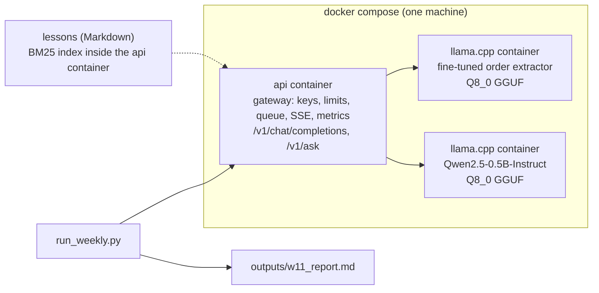

# Week 11, Day 7: Weekly Challenge: Deploy a RAG API and the Fine-Tuned Model, End to End

**Time:** ~7h · **Builds on:** Day 1 (GGUF files), Day 2 (load and capacity), Day 3 (cost), Day 4 (the gateway), Day 5 (retrieval and citations), Day 6 (Docker) and Week 10 (the fine-tuned extractor) · **Needs:** Docker with Compose; the llama.cpp server image; about 4 GB for the Docker VM · **Run it:** `uv run python weeks/week11_inference-serving-deployment/solutions/weekly/serve_rag/run_weekly.py` (about 12 minutes; `--quick` is a 2-minute smoke test; `--report-only` re-renders from the cached results; `--keep` leaves the containers running) · **Tests:** `weekly/serve_rag/test_weekly.py`

## The brief

Ship it. Take the two things you built, a **fine-tuned extraction model** (Week 10) and a **retrieval-augmented question answerer** over a document set (Weeks 3, 4 and 11 Day 5), put both behind **one authenticated, rate-limited API** in containers, and then do what a team does before launch: **check that the deployment did not break the model, measure the answer quality honestly, find the failure modes, load-test it, and write down what it costs and what you did not test.** The deliverable is a report and a deployment you can start with one command.

## Requirements

**R1. One-command deployment.** `docker compose up` starts the gateway and both model servers; the gateway image holds no weights; secrets and the models directory come from the environment; start-up order follows health checks.

**R2. The fine-tuned model survives deployment.** Run the 38 hand-written emails (never used for training) through the deployed gateway and compare with the numbers you measured outside Docker.

**R3. A labelled question set for `/v1/ask`**, with in-scope questions (each with the lesson that holds the answer) and out-of-scope questions, **split into dev and test**. Questions are paraphrases, not copies of headings. Settings are chosen on dev and reported on test.

**R4. Measured RAG behaviour**, judged by code: did retrieval find the right lesson; did the answer carry a *valid* citation; did it abstain when it should; and how many requests errored. Intervals on every rate.

**R5. At least one fix, measured.** Pick the failure the first run shows and change the system (a relevance floor, abstaining in the gateway) and report **before and after**, including what the fix cost.

**R6. A load test with percentiles**: a closed-loop concurrency sweep **and** open-loop arrival rates; time to first token and latency p50/p95; errors counted; the point where it stops keeping up (or an honest "above the rates tried").

**R7. A resource and cost section** with assumed prices as inputs; **R8. an honest "not run" and "limits" section.**

## What the pipeline found

`run_weekly.py` produced `outputs/w11_report.md` on this machine (Apple M2, Docker Desktop with 8 vCPUs and 3.8 GB, CPU-only model servers).

**Deployment.** Images built and containers started in **6 s**, ready **1.2 s** later; the gateway image is **229 MB**. Memory afterwards: gateway **57 MB**, the Qwen server **1.5 GB**, the extractor server **0.5 GB**.

**The fine-tuned model behind the gateway.** Exact match **71% [55%, 83%]** on the 38 hand-written emails, field accuracy 89%, valid order objects 92%. Outside Docker the same Q8_0 file scored 74%, 89% and 92%: **27 emails exact instead of 28**, one email different, which is within the noise of CPU against Metal arithmetic (the Day 1 table already showed that quantisation and kernels can move one email). The deployment reproduces the model; it does not improve or damage it.

### `/v1/ask` over the course's own lessons (24 in-scope and 8 out-of-scope questions, Qwen2.5-0.5B-Instruct)

Retrieval, offline: BM25 over 1,239 chunks of 76 lessons puts the right lesson in the top four for **100% [86%, 100%]** of in-scope questions (rank 1 for 22 of 24). That is flattering: the questions were written by the author of the lessons, with the lessons open.

The scores that would separate in-scope from out-of-scope questions **overlap**: in-scope top scores run 11.4 to 31.4 (median 19.6); out-of-scope run 5.3 to 20.6 (median 8.1). A relevance floor chosen on the dev half (**13.4**: the highest value that keeps at least 90% of dev in-scope questions retrieving something) is therefore a trade, not a clean cut.

| configuration (all 32 questions) | right lesson retrieved | in scope: abstained (a miss) | **valid citation** | out of scope: nothing retrieved | out of scope: **abstained** | out of scope: answered anyway |
|---|---|---|---|---|---|---|
| baseline (any BM25 match) | 100% [86%, 100%] | 8% [2%, 26%] | **0%** [0%, 14%] | 0% [0%, 32%] | 50% [22%, 78%] | 50% [22%, 78%] |
| relevance floor 13.4 | 92% [74%, 98%] | 4% [1%, 20%] | **0%** [0%, 14%] | 75% [41%, 93%] | 38% [14%, 69%] | 62% [31%, 86%] |
| floor 13.4 + abstain without calling the model | 92% [74%, 98%] | 8% [2%, 26%] | **0%** [0%, 14%] | 75% [41%, 93%] | **75%** [41%, 93%] | **25%** [7%, 59%] |

(On the held-out test half alone, with 12 in-scope and 4 out-of-scope questions, the last configuration abstains on 4 of 4 out-of-scope questions with no in-scope abstention; on dev it was 2 of 4. Those halves are far too small to rank configurations: the table above is the honest summary. Zero requests ended in an error in any configuration.)

What happened, in order:

1. **The model never cites.** In none of the 24 in-scope answers, in any configuration, is there a valid `[n]` citation. A 0.5B model does not follow "cite the numbered sources". The UI from Day 5 would warn on every one of those answers. How a larger model behaves is **not measured here**.
2. **Retrieval was fine; the answers were mixed.** Reading them: several are right, some are wrong or fluent nonsense (the answer about what is inside a Q4_K_M file is a repeating "which is a ... which is a" loop), and some copy a **table cell from a retrieved lesson verbatim as the whole answer** (the baseline answer to "what does a token bucket protect against" is "a burst or a stuck retry loop", a cell of the Day 4 table; the baseline answer to one question was a cell of the *Day 5 lesson describing an earlier answer of this very system*, because the corpus is the course, which quotes the system). Correctness was **not graded** beyond that reading.
3. **A relevance floor removes sources but does not stop the model answering.** With the floor, 6 of 8 out-of-scope questions retrieved nothing, and the model **still answered "The capital of France is Paris" and wrote a pancake recipe (citing a `[1]` that does not exist, since nothing was retrieved)** from its own knowledge, so the abstention rate *fell* (50% → 38%). Retrieval returning nothing is information the **gateway** can act on.
4. **The fix that worked is a gateway rule, not a prompt:** when retrieval returns no source, answer with the exact refusal sentence **without calling the model** (`LLMAPI_ABSTAIN_WITHOUT_SOURCES=1`). It is instant, free, and cannot be disobeyed: out-of-scope abstentions rose to **75% (6 of 8)**, answered-anyway fell from 50% to 25%.
5. **It has a price:** the floor also removed the sources of in-scope questions that matched weakly. The right lesson is retrieved for 92% instead of 100% (two questions lost it), and one in-scope question ("what does the rank control in LoRA") now gets a *wrong abstention*: it retrieved nothing above 13.4. A floor on BM25 scores is a blunt instrument whose two error types trade off; the two out-of-scope questions still answered ("capital of France" scored 14.0 and the World Cup question 20.6 on shared words) are the cases a threshold cannot separate.

### Load (final configuration, `/v1/ask`, at most 100 new tokens, same question mix)

| users (closed loop) | req/s | tokens/s | TTFT p50 | TTFT p95 | latency p50 | latency p95 |
|---|---|---|---|---|---|---|
| 1 | 1.12 | 42 | 36 ms | 65 ms | 0.74 s | 2.37 s |
| 2 | 1.10 | 42 | 83 ms | 260 ms | 1.55 s | 4.95 s |
| 4 | 2.49 | 93 | 105 ms | 214 ms | 1.21 s | 4.04 s |
| 8 | **3.15** | 118 | **1,307 ms** | 2,370 ms | 2.06 s | 4.57 s |

| arrival rate (open loop, 30 s) | sent | errors | TTFT p50 | TTFT p95 | latency p50 | latency p95 |
|---|---|---|---|---|---|---|
| 0.5 / s | 16 | 0 | 82 ms | 293 ms | 0.97 s | 2.45 s |
| 1 / s | 23 | 0 | 103 ms | 260 ms | 1.73 s | 3.76 s |
| 2 / s | 50 | 0 | 103 ms | 539 ms | 1.46 s | 3.84 s |
| **4 / s** | 98 | **2 (HTTP 503)** | **2,049 ms** | **5,226 ms** | 3.45 s | 7.21 s |

- **Saturation near 3 requests per second**, as the closed loop shows (more users add queueing delay, not throughput: TTFT jumps from about 100 ms to 1.3 s at 8 users).
- **The knee is between 2 and 4 requests per second.** At 4 per second TTFT p50 is 20× the lightly loaded value and the gateway **starts refusing (503)**: the bounded queue (Day 4) working as designed, with served requests staying under about 7 s at p95 instead of growing without bound.
- The measurements wobble between runs (one earlier full run had 1.42 req/s at two users where this one has 1.10, and its open-loop 4 req/s run showed no refusals): **one run per cell, a laptop with other things on it.** Read the shape, not the second digit.
- **Cost, under an assumed $0.20/hour machine** at 3.15 requests per second and 100% utilisation: about **$0.018 per 1,000 answered questions**; divide by a realistic utilisation, and add the people (Day 3).

## Acceptance criteria (the reference solution meets all of them)

| # | Criterion | Evidence |
|---|---|---|
| 1 | One command starts the whole stack; no weights or secrets in the image | `docker compose up` (the weekly script runs it); Day 6's image checks; `test_day6.py` parses the compose file |
| 2 | The deployed extractor matches its un-deployed score within noise | 71% against 74% (27 against 28 of 38 emails) |
| 3 | The question set is labelled, paraphrased and split | `questions.py`; tests check unique ids, the split, that every expected lesson exists and that no question is a heading |
| 4 | RAG behaviour is measured by code with intervals, errors counted | `evalrag.py`; in-band stream errors are failures, not abstentions (a test for each) |
| 5 | A fix is measured before and after, with its cost | floor and abstain: out-of-scope abstention 50% → 75%, right-lesson retrieval 100% → 92% |
| 6 | Load: closed and open loop, p50/p95, TTFT, errors, the knee | the tables above; `loadgen.py` counts in-band errors |
| 7 | "Not run" and "limits" are honest | the report: cloud deploys, GPU, vLLM, Ollama, a frontier model, answer correctness, multi-replica |

## Two bugs the work found (each has a test)
1. **A 200 that was a failure.** The first (quick) run had answers that were **empty with HTTP status 200**. The chat container was started with `-c 4096 -np 4`: llama.cpp divides the context among the slots, so each request had **1,024 tokens**, and a prompt with four retrieved passages is about 1,200 to 1,350. The model server answered **400 "exceeds the available context size"**, and because the gateway had already sent the SSE status line, that arrived as an **in-band error event** inside a 200. My evaluation client ignored the event and my load generator counted "no tokens". Fixes: the chat container now runs `-c 8192` (2,048 per slot); the evaluator and the load generator now **count in-band errors as failures with their code**; the report prints the error count. The lesson for streaming APIs: **a 200 is the beginning of a response, not a verdict**, and a client that does not read the events cannot see failures. (Day 4's gateway sends the in-band error event deliberately and tests it; the miss was in the two clients written after it.)
2. **The gateway could not be configured for RAG.** The Day 4 entry point accepted one backend and no retrieval, while the compose file and the Day 5 lesson assumed several models and `/v1/ask`. I found it by reading the entry point before the Day 5 run: the container would have answered `404` on `/v1/ask`. `__main__.py` now reads `LLMAPI_BACKENDS`, `LLMAPI_DOCS_DIR`, `LLMAPI_ASK_MODEL`, `LLMAPI_MIN_SCORE` and `LLMAPI_ABSTAIN_WITHOUT_SOURCES`, with tests that build the app from the environment. Nothing finds an integration gap like running the deployment itself.

## Pitfalls
- **Evaluating RAG on retrieval alone**, or on one question.
- **Judging answer format with code and calling it "quality".** Format, citation and abstention are measurable by code; correctness needs a judge or a human.
- **Choosing the threshold on the whole question set**, then reporting on it (the floor here was chosen on dev; the halves are still tiny).
- **Trusting "the prompt says to abstain".** A small model will not; enforce it in code.
- **A closed-loop-only load test**, which can never overload the service.
- **Reading one run as a measurement.** Say how many runs.
- **Letting the corpus quote the system.** Evaluating a RAG over documents that contain its own outputs makes answers circular.
- **Forgetting that the model server's context is divided by its slots.**

## What this does not show
- How a **larger or hosted model** behaves with the same prompt (citations, refusals): not run.
- Any **cloud** behaviour: DNS, TLS, cold starts, autoscaling, multi-replica rate limits.
- Whether **dense retrieval** (Week 3) would separate in-scope from out-of-scope questions better than a BM25 score does: not measured here. (Week 12 Day 2 measures it on a different corpus and question set: AUC 0.917 for the BM25 score, 0.962 for the best dense cosine, 0.996 for a cross-encoder.)
- Answer **correctness**, and behaviour on **questions written by strangers**.

## Stretch
- Add a **faithfulness judge** (Week 4 Day 2) and grade the answers; compare the 0.5B model with any larger model you have access to.
- Replace the score floor with a **dense-embedding similarity** check, or a cross-encoder reranker score, and compare abstention trade-offs on the same split.
- Constrain the answer with a **JSON schema** `{answer, citations}` (llama.cpp grammars) and measure whether the citation rate changes.
- Run the same load test with the model servers on **Metal** (host processes) and compare with the CPU containers.
- Put **Prometheus and Grafana** in the compose file and scrape `/metrics` during the load test.
- Deploy the gateway to **Fly.io or Render** and add the live URL, the deploy log and a smoke test to your report.

## Further reading
- Week 4 (retrieval and generation evaluation), Week 7 (confidence intervals, A/B tests) and Week 8 (prompt injection through retrieved documents, which this API does not defend against beyond the prompt's "treat the sources as data").
- The Google SRE book on load testing and overload; *Release It!* on bulkheads and timeouts.
- The llama.cpp server README on `-np` and `-c`.

## Looking back at the week
You turned a model into a service. A file format and its quantisation (Day 1), the scheduling and memory ideas that make GPUs economical (Day 2), the arithmetic of fit and cost, including an optimisation that lost (Day 3), a gateway with identity, limits and backpressure (Day 4), a front end that shows its sources and checks its citations (Day 5), a container that survives failures (Day 6), and finally the whole thing running, measured and found wanting in specific, fixable ways (Day 7). The through-line: **a deployed system is judged by what happens when something is wrong**: a model that is down, a prompt that is too long, a question with no answer, a load that is too high. The numbers above are those cases, measured.
