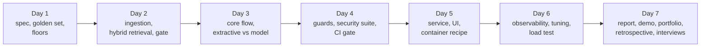

# Week 12: Capstone: A Production AI Product

**Phase 6: Capstone** · ~6-7 hours/day · Prerequisites: Weeks 1-11 (this week assembles them) · **CPU only**: no GPU, no hosted model and no cloud account is needed; Docker is needed only for the container step, which could **not** be run while writing this (see Day 5)

Eleven weeks produced parts. This week turns them into **one product** and takes it from a blank page to something you can demo, defend and hand over. You choose the product (three briefs, or your own, on Day 1); the week gives it a spine: every day ends with a milestone a reviewer can check without trusting you.

The reference solution is **Course Copilot**: a cited, guarded question-answering assistant over this course's own 77 lessons. It says where an answer came from, says "I don't know" when the lessons do not cover the question, survives hostile input, and runs on a laptop CPU with no model. It is also an honest case study: **it misses one of its own targets**, a 0.5B model made it worse, and its load test exposed a flaw in the Week 11 gateway. Those are the parts to read twice.

> **The rule of this week:** the evaluation exists before the product does, and a number you did not like is a result, not an obstacle.



## Learning goals
By Sunday you can:
- Write a **design document** whose requirements have measurements and numbers, and a **golden set** with a validator that fails when the set is wrong.
- Build **ingestion and hybrid retrieval** and compare configurations with **paired** statistics; choose and calibrate a **relevance gate**.
- Build a core flow with **replaceable, timed stages**, evaluate on **dev**, run each reported system **once on test**, and classify failures by cause.
- Write **guards for each channel**, measure them against an **obedient** model and attacks built to **evade** them, and gate releases on a **CI check** that you have shown to fail.
- Put a **pipeline** behind an authenticated gateway, verify **parity**, and write a container recipe whose weights and data are mounted, not baked.
- **Trace, price and load-test** it, and fix what the load test finds.
- Produce the documents of a finished project: **a report with targets against outcomes, a portfolio README, a retrospective, an interview checklist**.

## Schedule
| Day | Lesson | Milestone | Needs |
|---|---|---|---|
| 1 | [Product spec and evaluation plan](day1_product-spec-and-eval-plan.md) | design doc + golden set, both checked by code; floors and ceilings | CPU |
| 2 | [Data and retrieval layer](day2_data-and-retrieval-layer.md) | ingestion + hybrid retrieval meeting the recall target; a calibrated gate | embedder, re-ranker (~2 min) |
| 3 | [The core flow](day3_core-flow.md) | a pipeline whose pass rate you can state; extractive against model-backed | llama.cpp optional (~2 min) |
| 4 | [Guardrails and CI](day4_guardrails-and-ci.md) | a security suite and a gate that fails on bad changes | CPU (~3 min) |
| 5 | [Serving, the UI and deployment](day5_serving-ui-deploy.md) | the product over HTTP with parity, a UI, a container recipe | CPU; Docker for the container |
| 6 | [Observability, tuning, load](day6_observability-and-load.md) | per-stage latency, cost, three tunings, a load test and a dashboard | CPU (~10 min) |
| 7 | [Weekly: demo, portfolio, retrospective](day7_weekly-challenge.md) | the final report, README, retrospective, interview checklist | CPU (~15 min) |

New code lives in `weeks/week12_capstone/solutions/`: the package `copilot/` (`ingest`, `retrieve`, `answer`, `gate`, `guard`, `security`, `core`, `evaluate`, `evalgate`, `golden`, `design`, `dashboard`, `llm`, `service`), the golden set (`golden/golden.jsonl`) and its stored dev baseline, the reference design document (`design/DESIGN.md`), `deploy/` (Dockerfile, compose, build context), `ci/` (an unrun workflow sketch), one script per day, `run_capstone.py`, `ci_gate.py`, `demo.py`, and the templates in `templates/` (design doc, portfolio README, retrospective, interview checklist). Shared pieces come from `common/` (RAG index, reranker, guard, PII, tracing, cache) and the Week 11 gateway.

```bash
uv sync --extra serve         # torch, transformers, fastapi, streamlit, rank-bm25, gguf, ...
# the first run builds the index (1,219 chunks, about 48 s) under outputs/w12_index
```

## The week's headline numbers (Apple M2 CPU; every number from a run in `outputs/`)
| | |
|---|---|
| Day 1 | 67 golden questions (44 single-lesson, 8 two-lesson, 10 out-of-scope, 5 adversarial), **every fact pattern validated against its lesson**; floors on the test split: always abstain **21%**, dump the top BM25 chunk **55%**; ceiling: facts occur in the top-5 sources for **52 of 52** answerable questions |
| Day 2 | hit@5 **96%** for BM25 and for dense alone, **98%** hybrid; week scoping finds both lessons for **8 of 8** two-lesson questions (4 of 8 for either signal alone); relevance gate AUC **0.996** for a cross-encoder against 0.962 (cosine) and 0.917 (BM25), and it costs **427 ms** against 28 ms for the whole search |
| Day 3 | extractive **76%** on test [59%, 87%], **69%** on the answerable questions (**target 80%: not met**); a 0.5B model with verification **64%**, without **52%**; every extractive failure was "right lesson, wrong sentence" |
| Day 4 | input guard blocks **5 of 13** direct attacks and **0 of 58** legitimate questions; with an obedient model, **13 → 5 → 0** of 18 attacks as the controls are added; **4 of 10** poisoned documents still get through with every defence on; the CI gate fails on **4 of 4** bad changes and passes a refactor |
| Day 5 | the service answers **24 of 24** questions identically to the in-process pipeline; ready in about **7.5 s**; the container could **not** be built here (host disk full) |
| Day 6 | cold question **≈ 390 ms** (the gate is **95%** of it), **$0.023** per 1,000 questions of machine time; the cascade gate cuts the median to **17 ms** at the price of one test item; the load test found a **gateway flaw** (served requests waited **25 s** at 4 arrivals per second) that is now fixed |
| Day 7 | see `outputs/w12_report.md`: the targets table is generated from the measurements |

## What has been verified
| Item | How |
|---|---|
| Day 1: `golden.py`, `design.py` | 17 tests (`test_golden.py`, `test_design.py`): the real golden set validates and has its documented shape; **each planted defect** (missing fact, missing lesson, verbatim question, duplicate, wrong cardinality, leaked forbid pattern, invalid regex, unknown kind or split) is caught; scoring rules by hand for every kind; the design checker passes the reference and fails the blank template and each planted defect |
| Day 2: `ingest.py`, `retrieve.py` | 16 tests (13 in `test_retrieve.py`, 3 for ingestion in `test_core.py`): lessons-only corpus with metadata (no README, no Week 12); **incremental** re-ingestion; week naming; reciprocal rank fusion by hand; scoped search represents every named week; the memo; reranking; `k` bounds |
| Day 3: `answer.py`, `core.py`, `evaluate.py`, `llm.py` | 54 tests (30 in `test_answer.py`, 24 in `test_core.py`): quotable units; extractive selection by hand (IDF weights, neighbours, two-week quoting); `verify`, `support` and **citation repair**; the model-backed answerer with its fallback; every stage and span; the pipeline never raises on a model failure; the cache never stores blocked or errored answers; the evaluation report with intervals; the model client against every failure |
| Day 4: `guard.py`, `gate.py`, `security.py`, `evalgate.py` | 34 tests: gate calibration and AUC by hand; the cascade gate; each guard; a canary caught through obfuscation; the obedient model; quarantine and verification stop what they should; **each gate rule fails alone**; the stored baseline covers exactly the dev split |
| Day 5: `service.py` | 12 tests: the pipeline behind the gateway runs **once** per question; sources before tokens; refusals have no sources; the gateway's identity, limits and health unchanged; **a real SQLite cache used from the gateway's worker thread**; gate selection from the environment |
| Day 5-6: `deploy/`, `dashboard.py` | 8 tests (`test_deploy.py`): the Dockerfile and compose file parsed (non-root, health check, CPU torch, nothing secret or heavy baked in, data mounted read-only, secrets required); the build context is code only; **the service imports in the container's layout with the repository off the path**; the dashboard renders every section, escapes everything and loads nothing external |
| Day 7: `capstone_report.py` | 5 tests: **each target is computed from the results** (changing a result changes the verdict); the report has every section and the not-run list; the portfolio README is the template filled in without inventing a demo |

**Mutation checks** (`scripts/mutate.py`) ran on the new gateway code in Week 11 (`llmapi/app.py`: the worker-thread retrieval and its back-pressure) and on 15 Week 12 modules (about 80 mutants): `answer`, `retrieve`, `gate`, `evalgate`, `golden`, `guard`, `core`, `evaluate`, `design`, `service`, `security`, `dashboard`, `llm`, `capstone_report`. The first pass left **22 survivors**, mostly in `answer.py`: boundaries nobody tested (a unit of exactly 25 characters, support of exactly 0.6, exactly half of the sentences unsupported, a score exactly at the gate's threshold, a recall of exactly the floor), the near-duplicate filter (the first test used identical sentences, which a different check already removed), the rule that two named weeks force a sentence from each (it passed because the scoring already chose both), and an HTTP error with a valid-looking body. Each became a test. The survivors that remain are equivalent mutants (a tie-break that an epsilon in the same line already decides).

**Bugs found by the work itself** (each has a test):
- **A gateway flaw**, found by the load test: the Week 11 `/v1/ask` ran the retriever on the event loop before admission control, so a slow retriever defeated the bounded queue. Fixed in Week 11 (worker thread, bounded, fast 503) and now covered there.
- **The embedding and re-ranker SQLite caches** raised when used from the gateway's worker thread (`check_same_thread`): found by moving the pipeline off the event loop; fixed with a lock and a test that uses a real cache from a thread.
- **My first out-of-scope questions were in scope** (the lessons discuss them), and **two attack-oracle patterns occurred in the lessons**: the golden validator now rejects both.
- **`import` shadowing between weeks**: Week 11's `day4_solution.py` shadowed Week 12's of the same name once a helper inserted its path first; the shared path helper now *appends* instead of inserting.
- **A golden item that names one source where two lessons answer** (`w10-a`): reported as a miss with the reason, not edited after the fact.
- **A Week 11 docstring that promised a measurement** ("measured in Week 11 Day 7") that was never made: Week 12 Day 2 measures it and both places now say so.

**Not run by the author:** a hosted or larger chat model for the answerer (whether it beats the extractive one is unmeasured), the **container build and run** (the host disk filled during the first attempt and Docker did not recover), any cloud deployment and URL, the CI workflow on GitHub, real users, a GPU. Prices are **assumptions** supplied as inputs; one run and one machine for every measurement.

**What to remember:** write the ruler before the product; find the floor and the ceiling; a baseline that cannot invent a fact can beat a model; trust is a property of provenance; defences that do not recognise the attack are the ones that stop it; a gate is only credible once you have watched it fail; the load test finds what the unit tests could not; and a retrospective is the list of numbers that surprised you.
