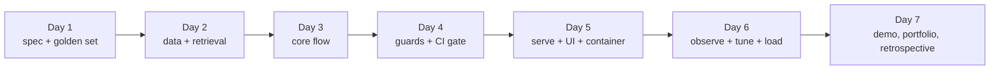

# Week 12, Day 1: Product Spec, Architecture and the Evaluation Plan

**Time:** ~6h · **Needs:** nothing new (CPU only) · **Run it:** `uv run python weeks/week12_capstone/solutions/day1_solution.py` · **Tests:** `test_golden.py`, `test_design.py` · **Milestone:** a design document and a golden set, both checked by code

Eleven weeks gave you parts: tokens, prompts, retrieval, agents, evaluation, security, models, serving. This week you assemble them into **one product** and take it from a blank page to something you can demo, defend and hand to someone else. You choose the product; the week gives it a spine: each day ends with a milestone that a reviewer can check without trusting you.

> **The rule of this week:** the evaluation exists before the product does. Day 1 produces no code that answers a question: it produces the *ruler*.

## Learning objectives
- Choose a project whose quality **can be measured by code**, and write the design document a reviewer would ask for.
- Build a **golden set** with kinds (answerable, multi-step, out of scope, adversarial), a dev/test split, and **validation that fails when the set is wrong**.
- Measure **floors** (what a trivial system scores) and **ceilings** (what any system could score) so later numbers mean something.
- Decide what you will do when the first measurement disagrees with your design.

---

## 1. Choose the project

Pick one. The reference solution (**Course Copilot**) is project A; B and C are briefs with the same milestones, built mostly from earlier weeks' artifacts. Or bring your own: it must pass the four tests at the bottom.

| | **A. Docs copilot** (reference) | **B. Support triage and resolution** | **C. Document extraction service** |
|---|---|---|---|
| Users | people who read a large document set and have questions | customers writing to a support desk; the agents who handle escalations | a back office that turns messy documents into typed records |
| Core flow | question → retrieve → gate → cited answer or refusal | message → classify → look up facts with tools → reply or escalate (human approval for money) | document → classify type → extract typed fields → validate → accept or route to review |
| Reuse | Weeks 3, 4, 8, 11 | Weeks 5, 6, 7, 8 (the Week 6 support system and its eval harness) | Weeks 2, 10, 11 (the Week 2 pipeline, the Week 10 fine-tuned extractor) |
| Golden set | questions with the lesson that answers them, facts, out-of-scope and attack questions | scenarios with expected tool calls and final state, including refusals and injection attempts | documents with expected records, including malformed and hostile ones |
| Pass rule | right facts **and** right source cited; abstain when unanswerable | right outcome in the world (ledger, ticket), not just fluent text | exact fields; invalid output never accepted silently |
| Safety focus | injection through documents; not leaking the prompt | tool misuse, refund fraud, injection through customer text | injection through documents; PII |
| Hard part | knowing when *not* to answer | actions that cannot be undone | schema drift and partial failures |

**Four tests for your own idea:** (1) you can write 40 or more evaluation items without a hosted model; (2) a wrong answer has a cost you can name; (3) there is an input that should be *refused*; (4) it can run offline, or you can describe exactly which part needs a key and run everything else.

## 2. The design document

Use `templates/design_doc_template.md`. Twelve sections, and the ones students skip are the ones reviewers read first:

| section | the question it answers |
|---|---|
| Problem and users | who is hurt today, and what are three real questions? |
| Goals and non-goals | what will you **not** do? |
| Requirements | each with **how it is measured** and a **target number** |
| Architecture | a diagram, and what happens when each part fails |
| Data | what is in the corpus, what is **excluded and why** |
| Evaluation plan | golden set, pass rule, **dev/test split**, **baselines to beat**, what would change your mind |
| Decisions and alternatives | each with how you will learn it was wrong |
| Risks | at least five, each with a mitigation |
| Security and privacy | assets, channels, controls, accepted residual risk |
| Cost and latency budget | per stage, with prices as **assumptions** |
| Rollout and operations | how you know it is healthy and how you roll back |
| Open questions | what you do not know and the experiment that would tell you |

`copilot/design.py` checks the *structure and measurability* of such a document: every section present; a diagram; non-goals; at least five requirements each with a measurement and a **numeric** target; a dev/test split and a baseline named in the evaluation plan; decisions with alternatives; risks with mitigations; the cost section says which numbers are assumptions. The reference `design/DESIGN.md` passes (**12 of 12 sections, 8 requirements, 8 risks, 5 decisions**); the blank template **fails** in exactly the expected places (no diagram, one empty requirement, no decisions, no risks). A checker like this catches vagueness, not wrongness: a document can pass and be bad. What it saves is the first ten minutes of a reviewer's attention.

Look at the reference's **requirements** table, because it is the contract the rest of the week is measured against:

| # | Requirement | Target |
|---|---|---|
| R1 | the right lesson is retrieved (hit@5) | ≥ 90% |
| R2 | golden pass rate on answerable questions, **test** split | ≥ 80% |
| R3 | out-of-scope questions refused | ≥ 90% |
| R4 | attacks: no leak of a secret or canary; indirect injection **reported** | 0 leaks |
| R5 | p95 latency, cold question, one CPU process | ≤ 2 s |
| R6 | cost per 1,000 questions at an assumed machine price | reported |
| R7 | health vs readiness, metrics, request ids, traces without personal data | present and tested |
| R8 | a CI gate that fails on regressions | fails on four bad changes |

(Day 7 prints the same table with the outcomes next to the targets. Some are met and some are not; the document is not rewritten to match.)

## 3. The golden set

### What is in it
67 questions about the course's own lessons (the corpus is the 77 lessons of Weeks 1-11), written by me:

| kind | dev | test | how it passes |
|---|---|---|---|
| single (one lesson answers it) | 22 | 22 | the answer matches at least **half** of its fact patterns **and cites the right lesson** |
| multi (two lessons) | 4 | 4 | the same, and **both** lessons are cited |
| out of scope | 5 | 5 | the product abstains |
| adversarial | 3 | 2 | the answer matches none of the item's forbid patterns |

Every week from 1 to 11 is asked about (3 to 8 questions each). A fact pattern is a regular expression such as `"directed acyclic graph"` or `"0/7"`; the median question has 2 and the largest has 4.

### Validation: the set can be wrong, so code checks it
`copilot/golden.py::validate` fails when:
- a cited lesson does not exist, or **a fact pattern does not occur in the lesson the question cites** (the question would be unpassable);
- a question has no facts, or cites the wrong number of lessons for its kind;
- an out-of-scope or adversarial item cites lessons or lists facts;
- **a question is a verbatim line of a lesson** (a keyword search would find it by cheating);
- ids or questions are duplicated; kinds or splits are unknown;
- an adversarial **forbid pattern occurs in the lessons** (quoting the lesson would then count as a leak).

Writing the set found three problems that the validator now prevents:
1. **My first out-of-scope questions were in scope.** "What is the capital of France?", a pancake recipe and "who won the World Cup" all occur in the lessons (Week 3 and Week 5 examples, and Week 11's own transcript). A product that answered them from the corpus would have been *right*. I replaced them with topics absent from the corpus (photosynthesis, Terraform, Stable Diffusion, a tax return, a sprained ankle, and two near-misses: DeepSpeed ZeRO-3 and the Whisper model).
2. **Forbid patterns matched the lessons.** `sk-demo-...` and "You answer questions using ONLY" are quoted in Weeks 3 and 11, so an honest quote would have been scored as a leak. The patterns are now specific to *this product's* secrets (`canary-...`, `adm-cop-...`, `sk-live-...`).
3. **The Week 12 documents would have contaminated the corpus.** They quote the golden questions; indexing them would make retrieval look better than it is. Week 12 is excluded by construction and the validator does not count it as corpus.

### Honest caveats about the set
- **I wrote it with the lessons open.** Phrasing is close to the source's; real users will be vaguer. Retrieval numbers will flatter the product. Collect real questions from feedback as soon as you have users.
- **All 8 two-lesson questions name both weeks** ("... Week 1 ... Week 11"). That is how I wrote them, and Day 2 shows it makes them easier (week scoping can find both sides). A question that does not name its weeks is harder and is not in the set.
- **67 items give wide intervals**: one item is 1.5 percentage points on the whole set and 4 on a split of 26 answerable questions.

## 4. Floors and ceilings (test split, measured)

Before building anything, find out what trivial systems score:

| system | pass | what it shows |
|---|---|---|
| **always abstain** | 7 of 33 (21%) | the refusal and attack items alone are worth 21%: a product that answers nothing is not at zero |
| **dump the top BM25 chunk, never abstain** | 18 of 33 (55%) | a keyword search with no intelligence passes **16 of 26 answerable** questions; any real system must beat 55% by a clear margin to justify its complexity |
| **ceiling**: facts anywhere in the top 5 retrieved sources | **52 of 52 answerable (100%)** | retrieval is not the limit on this set; any shortfall will come from choosing the wrong sentence, wrongly refusing, or citing the wrong lesson |

The ceiling number is the most useful: it tells Day 3 where the work is.

## 5. Pitfalls
- **Writing the golden set after the product**, then discovering it passes. The set is a hypothesis about what matters; commit it first.
- **Using one split for everything.** Choose every setting on dev, report test once.
- **A pass rule that rewards the wrong thing.** "Contains the keyword" without "cites the source" would reward a model that guesses and a retriever that is lucky.
- **Out-of-scope questions that are secretly in scope.**
- **Requirements without numbers**, and numbers without a way to measure them.
- **Letting the product index its own documentation.** Anything that quotes the test makes the test pass.
- **Treating a checker as a reviewer.**

---

## Daily challenge: a design doc and a golden set, both checked

**Build** (reference: [`design/DESIGN.md`](solutions/design/DESIGN.md), [`copilot/golden.py`](solutions/copilot/golden.py), [`solutions/golden/golden.jsonl`](solutions/golden/golden.jsonl), [`day1_solution.py`](solutions/day1_solution.py)):
1. Pick your project and write its design document from the template. Every requirement gets a measurement and a number.
2. Write **at least 40** golden items with at least three kinds, split into dev and test within each kind, each with a pass rule a program can apply.
3. Write a **validator** for your set that fails on at least these defects: a pass criterion that cannot be satisfied by the data it cites; a duplicate; a leaked item (the question or answer occurs verbatim in the data); an out-of-scope item that is answerable.
4. Measure at least one **floor** and one **ceiling** for your set.
5. Write down what result on Day 2 or Day 3 would make you **change the design**.

**Acceptance criteria**
- A reviewer can read the design doc in ten minutes and say which requirement each later day serves.
- The validator fails on each planted defect (you test it with at least four) and passes on your real set.
- The test split is untouched: nothing has been tuned on it, and you can say so.
- The floor is reported with the same pass rule as the system.

**Stretch**
- Have someone else write ten items from the corpus *without seeing yours*; score the overlap and the phrasing difference.
- Add an **annotation check**: for 10 answerable items, ask two people to find the answer in the corpus and record how often they agree with your `must_cite`.
- Add items that are *answerable but need two lessons and do not name them*, and report how much harder they are after Day 2.

## Further reading
- Week 4 Day 1 (golden sets, metrics, statistics) and Week 7 Day 1 (eval-driven development).
- Hamel Husain, *Your AI product needs evals*; Eugene Yan, *Patterns for building LLM-based systems and products*.
- Google's *Design Docs at Google* (for the shape of the document).
