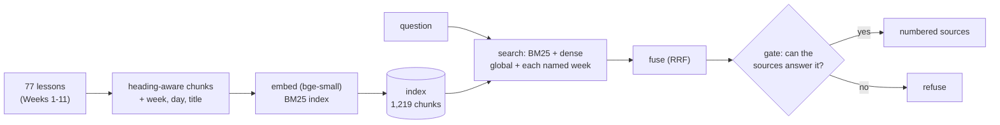

# Week 12, Day 2: The Data and Retrieval Layer

**Time:** ~6h · **Needs:** the bge-small embedder and the bge reranker (Weeks 3-4 downloaded them) · **Run it:** `uv run python weeks/week12_capstone/solutions/day2_solution.py` (about 2 minutes warm; the first run embeds 1,219 chunks, about 48 seconds on this machine) · **Tests:** `test_retrieve.py`, `test_core.py` (ingestion) · **Milestone:** ingestion plus hybrid retrieval that meets the recall target, with a relevance gate

Day 1 produced the ruler. Today you build the first half of the product and measure it with that ruler: what goes into the index, how a question finds it, and how the product decides **whether the question can be answered at all**.

## Learning objectives
- Build an **incremental, idempotent ingestion** step with metadata that later stages can filter on.
- Compare **BM25, dense, hybrid, week-scoped and re-ranked** retrieval on a golden set, with a paired comparison instead of a table of means.
- Choose and **calibrate a relevance gate**, measuring how well three signals separate answerable from out-of-scope questions.
- Measure what each stage **costs**, with questions no cache has seen.

---

## 1. Ingestion: decisions before code

`copilot/ingest.py` turns each lesson into a `SourceDoc` with metadata `{week, day, title}` and hands it to the Week 3-4 `RagIndex` (heading-aware chunks of about 1,200 characters with the heading path in each chunk; BM25 and dense vectors; a manifest keyed by content hash).

| decision | what and why |
|---|---|
| **Lessons only** | READMEs repeat the headline numbers, so a golden question would be answerable from two places and "the right lesson" would be ambiguous |
| **Nothing from Week 12** | its documents quote the golden questions: indexing them would make retrieval look better than it is (circular evidence) |
| **Metadata `week` and `day`** | so a question that names a week can be searched inside it (section 3) |
| **Incremental** | only changed documents are re-embedded |

The corpus is **77 documents → 1,219 chunks** (82 to 143 per week; Week 7 is the biggest). Measured: the first build embedded all 1,219 chunks in **47.9 s** on this CPU. Running ingestion again with nothing changed embeds **0 chunks in 0.01 s**; editing one document (a paragraph appended) re-embeds **15 chunks** and leaves the other **76 documents unchanged** (0.29 s: the other chunks of that document are served from the embedding cache, which is also why this number is small; do not read it as the cost of embedding 15 fresh chunks).

## 2. Retrieval: what to compare

On the **52 answerable** golden questions (44 single-lesson, 8 needing two lessons), a retrieval *hit* means a lesson the item cites is among the top *k* sources:

| configuration | hit@1 | hit@3 | hit@5 | MRR | both lessons found (8 two-lesson questions) |
|---|---|---|---|---|---|
| BM25 only | 0.85 | 0.94 | 96% [87%, 99%] | 0.89 | 4 / 8 |
| dense only (bge-small) | 0.85 | 0.90 | 96% [87%, 99%] | 0.89 | 4 / 8 |
| hybrid (BM25 + dense, α = 0.5) | 0.90 | 0.98 | 98% [90%, 100%] | 0.94 | 7 / 8 |
| **hybrid + week scoping** | **0.90** | **0.98** | **98% [90%, 100%]** | **0.94** | **8 / 8** |
| hybrid + scoping + cross-encoder re-rank | 0.88 | 0.98 | 98% [90%, 100%] | 0.93 | 7 / 8 |

Read it the way Week 4 taught you to:
- **R1 (hit@5 ≥ 90%) is met by every configuration.** The interval's lower edge is 87% for the weakest and 90% for hybrid. On 52 questions, 96% against 98% is **one question**.
- **Paired, not averaged.** Hybrid + scoping found a lesson in the top 5 on **2 questions BM25 missed and missed 1 that BM25 found**; against dense only: **1 and 0**; against the re-ranked variant: **0 and 0**. A margin of one or two questions is noise on this set. What the golden set *can* see is the two-lesson row.
- **Fusion mostly matters for the two-lesson questions:** both lessons are found for 4 of 8 with either signal alone, 7 of 8 with the hybrid, and **8 of 8 with week scoping**.
- **Week scoping is a metadata filter doing a retrieval job.** When a question names weeks ("Week 1 ... Week 11"), the retriever also searches *inside* each named week and guarantees the best chunk of each week a place in the sources (`retrieve.py`, reciprocal rank fusion of the global and the scoped rankings). **Caveat from Day 1:** all eight two-lesson questions name their weeks because I wrote them that way. On a question that does not, scoping does nothing and the 4/8 to 7/8 rows are what you would get.
- **The cross-encoder re-ranker did not help** (hit@1 0.88 against 0.90): a model that is better at scoring pairs is not automatically better as a re-orderer of a list that is already good. Keep it for the gate, where it earns its cost (section 3).
- **The one remaining miss is not a retrieval failure.** `w10-a` ("How much better is the fine-tuned order extractor than the best prompt?") cites the Week 10 weekly lesson; retrieval returns the Week 10 *evaluation* lesson, which contains the same numbers (74% against 3%). The golden item names one acceptable source where two exist. That is a flaw of the **golden set**, not the retriever: when several lessons answer a question, `must_cite` should allow any of them (a stretch task below). Reporting it as a miss, with the reason, is more useful than quietly editing the item after seeing the result.

## 3. The gate: can this question be answered from the corpus?

If retrieval always returns five sources, something must decide when they are not good enough. Three signals, each computed per question, scored by **AUC** (the probability that a random answerable question scores higher than a random out-of-scope one: 0.5 is a coin flip, 1.0 is perfect separation), over the 52 answerable and 10 out-of-scope questions:

| signal | AUC | answerable median | out-of-scope median |
|---|---|---|---|
| BM25 score of the best chunk | 0.917 | 25.7 | 13.0 |
| cosine of the best source (free: it came with the retrieval) | 0.962 | 0.76 | 0.61 |
| **cross-encoder score, best of the top 3** | **0.996** | 2.57 | -8.82 |

The cross-encoder separates the two groups far better, because it reads question and passage **together**: a question about DeepSpeed shares vocabulary with the fine-tuning lessons (so BM25 and cosine are high) but the *passage does not answer it* (so the cross-encoder is low).

**Calibration, honestly.** `gate.calibrate` picks the threshold that maximises balanced accuracy, **on the dev split only**: threshold **-1.94**, which on dev admits **96%** of answerable questions and refuses **100%** of out-of-scope ones. Applied **once** to the test split it admits **26 of 26** answerable questions and refuses **5 of 5** out-of-scope ones. Five out-of-scope test questions are a very small sample: the threshold *sits between* two real examples, so its generalisation is exactly as good as those examples are representative. A gate threshold is a model; treat it like one.

**What it costs:** the cross-encoder gate takes **427 ms per question** against **28 ms** for the whole hybrid search (measured on questions no cache has seen, CPU). The gate is **15 times** the cost of retrieval. Day 6 asks whether you can have the quality for less.

## 4. Pitfalls
- **Reporting retrieval means.** Report intervals and paired counts; a one-question difference is a rounding error on 52 questions.
- **Evaluating retrieval against a single acceptable source** when several exist.
- **Indexing the spec of the thing you are testing.**
- **A gate threshold chosen on the whole golden set**, or worse, on the test split.
- **Timing a warm cache.** Embedding and re-ranking results are cached on disk here; the honest latency of a stage uses questions the cache has never seen (the script appends a unique suffix).
- **Treating re-ranking as always good.**
- **Forgetting to scope.** If your documents have a natural partition (a week, a product, a tenant), a metadata filter is the cheapest accuracy there is, and for multi-tenant products a **security** control, not just a quality one.

---

## Daily challenge: ingestion and hybrid retrieval that pass the recall target

**Build** (reference: [`copilot/ingest.py`](solutions/copilot/ingest.py), [`copilot/retrieve.py`](solutions/copilot/retrieve.py), [`copilot/gate.py`](solutions/copilot/gate.py), [`day2_solution.py`](solutions/day2_solution.py)):
1. Ingest your corpus with metadata you will later filter on; make re-ingestion incremental and prove it (nothing changed → nothing embedded; one change → only that document).
2. Retrieval with at least BM25, dense and hybrid, scored on your golden set with **hit@1/3/5 and MRR**, intervals, and **paired** comparisons.
3. A relevance **gate** with at least two signals; report each signal's AUC; choose the threshold on dev only and apply it once to test.
4. A per-stage latency table on questions no cache has seen.
5. For every miss, say whether it is a retrieval failure, a gate failure, or a golden-set flaw.

**Acceptance criteria**
- Recall at 5 meets the target in your design doc, with its interval.
- The incremental-ingestion claim is demonstrated, not asserted.
- The gate's threshold was not chosen on the test split, and you can show that.
- Every number in your table can be regenerated by one command.

**Stretch**
- Let `must_cite` hold **alternative** sources and re-score: how many "misses" disappear?
- Add a **query rewriter** for follow-up questions (Week 3 Day 6) and measure it on a conversation set.
- Replace the cross-encoder gate with a small **trained classifier** on (cosine, BM25, rerank) and compare AUC on held-out items.
- Add **document-level** retrieval (retrieve lessons, then chunks) and compare on the two-lesson questions.

## Further reading
- Week 3 (hybrid search, fusion, re-ranking) and Week 4 (retrieval metrics, statistics, advanced indexing).
- Cormack, Clarke and Büttcher, *Reciprocal Rank Fusion outperforms Condorcet and individual rank learning methods*.
- Nogueira and Cho, *Passage Re-ranking with BERT* (why a cross-encoder reads the pair jointly).
