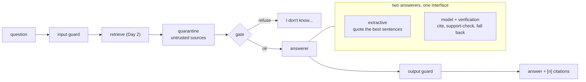

# Week 12, Day 3: The Core Flow, Measured Against the Golden Set

**Time:** ~7h · **Needs:** Day 2's index; `llama.cpp` and the Qwen2.5-0.5B GGUF from Week 11 for the model-backed systems · **Run it:** `uv run python weeks/week12_capstone/solutions/day3_solution.py` (about 2 minutes) · **Tests:** `test_answer.py`, `test_core.py` · **Milestone:** a core flow whose pass rate on the golden set you can state, with intervals, and whose failures you can classify

Today the product answers questions. The temptation is to reach for a language model first. The discipline is to build the **simplest system that could pass**, measure it, and let the model *earn* its place with a number.

## Learning objectives
- Build a pipeline whose **stages are replaceable and individually timed**, and whose failures become **refusals, not crashes**.
- Write an answerer that **cannot invent a fact** (extractive), and one that uses a model but is **verified in code** before anyone sees its output.
- Evaluate on **dev**, choose a design, then run each reported system **once on test**.
- Classify failures by cause, so the next change is aimed.

---

## 1. The pipeline (`copilot/core.py`)

`Copilot.ask(question)` runs: input guard → (response cache) → retrieve → quarantine of untrusted sources → gate → answerer → output guard, and returns a `Result` with the answer, the sources (empty when the gate refused), which sources the answer cites, a mode, flags for every guard and verification event, per-stage timings and token counts. Each stage opens a span (`common.tracing`; a no-op unless a tracer is configured). Two rules shape it:

- **A model failure is an honest refusal.** A `ChatError` becomes `answer = "I don't know based on the provided sources."` with `error` set and a flag; the pipeline never raises on a bad day.
- **Citations must be real.** A cited number outside the sources is dropped from `cited` (and the Day 3 scoring treats an unattributed answer as a failure).

## 2. The answerers

**Extractive** (`ExtractiveAnswerer`): split each retrieved source into quotable units (sentences, bullet lines, table rows; code fences, headings and the chunker's breadcrumb line skipped), score each unit by IDF-weighted overlap with the question, prefer better-ranked sources, add the unit that **follows** each chosen one (a fact is often in the next line), avoid near-duplicates, and for a question that names two weeks quote the best unit of **each** week. Output: the sentences with `[n]` markers. It is deterministic, free, instant and cannot say anything the lessons did not.

**Model-backed with verification** (`LlmAnswerer`): ask a chat model (any OpenAI-compatible server; here Qwen2.5-0.5B-Instruct on llama.cpp from Week 11) to answer in at most three sentences, each ending in a source number. Then, **in code**:
1. `verify`: the answer is not empty, cites only sources that exist, and cites at least one (an honest refusal is allowed);
2. `repair_citations`: for each sentence, the share of its content words found in the **cited** source must clear a threshold (0.6); a sentence whose cited source does not support it is **re-pointed** to the source that does; a sentence no source supports is counted as *unsupported*;
3. if more than half the sentences are unsupported, or step 1 fails, **fall back** to the extractive answer and record why.

The model's text is never reworded. This is Week 4's lesson (verify citations mechanically) made into a control: *a citation is a claim, and claims get checked.*

## 3. The experiments

### 3a. Choosing the extractive design on **dev** (26 answerable + 5 out-of-scope + 3 attack questions)

| design (rerank gate, guards on) | dev pass | single | multi |
|---|---|---|---|
| 3 sentences, no following unit | 71% [54%, 83%] | 59% | 75% |
| 3 sentences + the following unit (first design) | 79% [63%, 90%] | 68% | 100% |
| **4 sentences + the following unit (chosen)** | **82%** [66%, 92%] | 73% | 100% |
| 4 sentences + a cross-encoder choosing the sentences | 85% [70%, 94%] | 77% | 100% |

The cross-encoder sentence picker is **3 points better on dev, which is one question**, and costs a model call per question. I did not adopt it. (A first dense-embedding scoring of sentences gave no gain either and was removed.) Honest note on procedure: while prototyping I ran the first design on the **test** split once (76%); I then changed `max_units` from 3 to 4 on dev evidence and did **not** look at test failures to guide any change. The test numbers below were produced after the design was fixed.

### 3b. Three complete systems, each run **once** on test (26 answerable + 5 out-of-scope + 2 attack questions)

| system | overall | single (22) | two-lesson (4) | out of scope (5) | attacks (2) | model tokens |
|---|---|---|---|---|---|---|
| **extractive** | **76%** [59%, 87%] | 68% | 75% | 100% | 100% | 0 |
| model + verification + fallback | 64% [47%, 78%] | 59% | 25% | 100% | 100% | 31,836 prompt + 908 completion |
| model only, no fallback | 52% [35%, 67%] | 45% | 0% | 100% | 100% | the same calls |

For reference (Day 1 floors on the same split): always abstain **21%**, dump the top BM25 chunk **55%**.

**The result that matters: the 0.5B model made the product worse, and cost 22 seconds and 32,000 tokens to do it.**
- **Model only: 52%.** It rarely cites at all. During development I tried three prompts on dev: a system-prompt instruction produced **0 of 26** answers with a citation; a one-shot example **2 of 26**; putting the instruction at the end of the user message got **23 of 26** answers to cite *something*, but the cited number was often **wrong** (the model cites `[2]` for a fact in source 1) and only **7 of 26** passed. *Format compliance is not correctness.*
- **With verification and fallback: 64%.** `repair_citations` fixes wrong numbers, and it **catches inventions**: one answer said the agent "passed all seven tasks with zero errors" while the lesson says **0/7**; no source supported the sentence, so the product fell back to the quote. In the verified system the model's own answer survived verification for **18 of 26** answerable questions and the fallback was used for **8**. But where the model's answer survives it is often a fluent paraphrase that **omits the key facts** the pass rule looks for, and on two-lesson questions it cites one lesson (**25%** against 75%).
- **Out-of-scope and attacks are 100% for all three,** because the gate and the input guard decide before any answerer runs. Model choice does not move them. (This is also why the attack numbers say little about the model-backed path: Day 4 measures that with a scripted obedient model.)

**Design decision (recorded in the design doc's table):** the extractive answerer ships as the default. The model-backed answerer stays as a **measured option behind the same interface**: a stronger model (7B-class or hosted) may beat the extractive one, and the verification harness is exactly what you would need to find out. *That comparison was not run: no GPU and no API key.* Do not infer from a 0.5B model's result what a 70B one would do; do infer that **you should measure before replacing something that works.**

## 4. Where the extractive system fails (test split)

| count | cause |
|---|---|
| 8 | the right lesson is quoted but **the answer misses the facts** (the pass rule needs at least half of the item's fact patterns) |
| 0 | the right lesson was not retrieved |
| 0 | the gate refused an answerable question |
| 0 | an out-of-scope question was answered |

All eight are the same cause, and Day 1's ceiling predicted it: facts are in the top-5 sources for every item, so the work is **choosing the right sentences**. Examples: for "For which kind of problem does self-consistency work?" the product quotes a sentence about why it works and not the one that says *one checkable final answer*; for "What is HNSW?" it quotes two measurement bullets instead of the definition; for "Why did speculative decoding slow down the CPU experiment?" it quotes the lesson's *learning objectives* line (which mentions speculative decoding) instead of the explanation.

**Against the targets:** R2 (golden pass rate ≥ 80% on test) is **not met**: **76% overall, 69% [50%, 83%] on the 26 answerable questions** (the design doc's wording counts the answerable ones), against **82% on dev**. The gap between dev (where the design was chosen) and test is what you should expect when 31 items choose among four designs; the intervals overlap heavily, so it is also consistent with no real gap. R3 (refuse ≥ 90% of out-of-scope questions) is met: **5 of 5** on test and 5 of 5 on dev. I am **not** adjusting the target or retuning on test to make R2 pass. Day 7's retrospective reports the gap as it is.

## 5. Pitfalls
- **Comparing systems on different splits, or tuning on the one you report.**
- **Counting "contains a citation" as "is correct".** Verify the cited source supports the sentence.
- **Letting the model's failure crash the request.**
- **Adding the model before measuring the baseline.** Here the baseline was better.
- **Fixing the pass rule to fit the system.** The rule is the contract.
- **Reading a 3-point dev gain as a result.** It was one question.
- **Hiding the fallback rate.** If the fallback is used 8 times in 26, the model is not the product.

---

## Daily challenge: a core flow that passes the golden set

**Build** (reference: [`copilot/answer.py`](solutions/copilot/answer.py), [`copilot/core.py`](solutions/copilot/core.py), [`copilot/evaluate.py`](solutions/copilot/evaluate.py), [`day3_solution.py`](solutions/day3_solution.py)):
1. A pipeline with replaceable stages, per-stage timings, and no unhandled exception on a model or retriever failure.
2. A **no-model baseline** answerer and (if you have a model) a verified model-backed one; the same interface.
3. Evaluate on **dev**, choose one design, then run each system you report **once on test**, with Wilson intervals by kind.
4. A failure table by **cause** (not retrieved, wrongly refused, wrong passage, wrong citation, answered out of scope).
5. A written decision: which system ships, and what result would change that.

**Acceptance criteria**
- Your pass rule is the one in your design doc, applied by code.
- You report dev and test separately and say which was used to choose.
- The failure table accounts for every failed item.
- If the target is not met, you say so and propose the next experiment instead of editing the target.

**Stretch**
- **Improve the sentence picker on dev** (for instance, prefer definitional sentences for "What is X?"), then run test *once* and report the dev-to-test gap.
- Add a **self-consistency check** for the model-backed answerer (Week 2): ask twice, require agreement.
- Run the same harness against a **larger or hosted model** if you have access, and report the verified-answer rate and the pass rate.
- Add a **claim-level faithfulness judge** (Week 4 Day 2) as a second opinion on the extractive answers.

## Further reading
- Week 4 Day 2 (faithfulness, judges), Week 3 Day 4 (citations and abstention).
- Gao et al., *Enabling Large Language Models to Generate Text with Citations* (citation quality as a metric).
- Min et al., *FActScore* (atomic-claim support).
