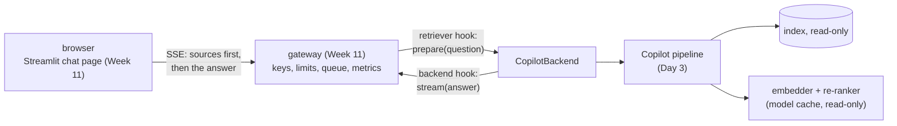

# Week 12, Day 5: Serving, the UI and Deployment

**Time:** ~6h · **Needs:** Day 2-4 artifacts; Docker for the container steps (see the honest note in section 4) · **Run it:** `uv run python weeks/week12_capstone/solutions/day5_solution.py [--no-docker]` (about 1 minute without Docker) · **Tests:** `test_service.py`, `test_deploy.py` · **Milestone:** the product reachable over HTTP by a client that is not the test harness, with a UI, a container recipe, and a deploy checklist

The plan for this day says "**live URL**". There is none: no cloud account was used while writing this, and the container image could not be built on this machine (section 4). What this day delivers instead is everything *up to* the URL, verified, and an exact list of what remains.

## Learning objectives
- Put a **pipeline** (not a model) behind an OpenAI-shaped, authenticated, rate-limited API **without rewriting the gateway**.
- Verify the **seam**: the service must give the *same* answers as the in-process pipeline.
- Reuse a UI by speaking its protocol (sources first, then tokens, feedback tied to a request id).
- Write a container recipe whose **weights and index are mounted, not baked**, and test it structurally when you cannot run it.
- State plainly what is and is not deployed.

---

## 1. The seam: two hooks the gateway already has

Week 11's `/v1/ask` route takes a **retriever** (`question → messages, sources`) and a **backend** (`messages → a stream of text deltas`). The Copilot is not a model; it is a pipeline that produces an answer *and* its sources. `copilot/service.py` fits it into those two hooks:

- `CopilotBackend.prepare` is the *retriever*: it runs the **whole pipeline once**, remembers the result, and returns the sources the UI shows first;
- `CopilotBackend.stream` is the *backend*: it streams the remembered answer in small chunks, with token usage (an **estimate**: about four characters per token, since the extractive pipeline has no tokenizer or model; it is labelled so).

Authentication, per-user limits, the bounded queue, SSE framing, readiness (`/readyz` is true once the index is loaded), Prometheus metrics, request ids, feedback: all unchanged. Nothing in the gateway knows what a lesson is. **A good seam is one where the old code does not change.** (Day 6's load test found a place where it did have to change; that is its story.)

Configuration is environment variables only (`COPILOT_INDEX_DIR`, `COPILOT_KEYS`, `COPILOT_ADMIN_TOKEN`, `COPILOT_GATE`, `COPILOT_GATE_TAU`, `COPILOT_LLM_URL`, `COPILOT_FEEDBACK`), and the service **refuses to start** without keys or an index (fail closed), exactly as a container will run it.

## 2. Measured: the service as a process

`day5_solution.py` starts `python -m copilot.service` on a free port, then drives it with the **same client the chat UI uses**:

- **Ready after about 7.5 s** (it loads the index, the embedder and the re-ranker).
- An unauthenticated request is `401`; `/healthz` and `/readyz` are `200`.
- Six questions went through: a definition, a comparison, an out-of-scope question, a two-lesson question, and an attack. Each returned `200` with its sources first (the out-of-scope question was about photosynthesis, not the capital of France: the lessons mention that one, see Day 1); the out-of-scope question and the attack came back as refusals (the gate's "I don't know", and the input guard's fixed reply with **0 sources**). Feedback is accepted, usage is reported, `/metrics` has 61 lines and counts the requests by outcome.
- **A caveat on "streaming".** The first token of an answer arrives *after the whole pipeline has run* (about 0.4 s cold here), because the answer is computed before the first byte of it is sent. (In the smoke test the six questions had been asked before, so their embeddings and re-ranker scores came from the disk caches and the first token took 1 to 55 ms; Day 6 measures the cold figure.) SSE is the right wire format for the UI and for the sources-first event, but for this product it does **not** reduce the time to the first word. It would if the answerer were a model that streams its tokens as it generates them.

### Parity: the seam must not change the answer
24 golden questions (answerable and out-of-scope) were asked both **in process** and **through the service**: **24 of 24 identical** in answer text and in the list of source documents. This is the cheapest test there is for an integration layer, and it is the one that catches a hook passing the wrong argument, a truncated answer, or a source list that is off by one.

### The UI
The Week 11 Streamlit page was started against the service: its health endpoint answers. Its behaviour (sources before the first word, citation checking, feedback with a reason tied to the request id, an editable price card, a usage meter) is covered by the Week 11 `AppTest` tests; **a browser is needed to see it render, and I did not look at it in one.** Because the page *checks* citations, an extractive answer (which cites by construction) displays with all its citations valid, and a model-backed answer that cited a nonexistent source would be struck through on screen.

## 3. The container recipe (`deploy/`)

| file | what it does and why |
|---|---|
| `Dockerfile` | `python:3.12-slim`; a **non-root** user; the **CPU-only** torch wheel first, then the other requirements (so code changes do not reinstall packages); `common/`, `llmapi/`, `copilot/` copied in; `HEALTHCHECK` on `/healthz`; `HF_HOME=/models/hf` with `HF_HUB_OFFLINE=1` (the container **never downloads** a model); secrets are **not** in the file |
| `docker-compose.yml` | the **index** and the **Hugging Face cache** mounted **read-only**; `COPILOT_KEYS` and `COPILOT_ADMIN_TOKEN` required (`${VAR:?...}`: compose refuses to start without them); the port bound to `127.0.0.1`; a memory limit |
| `build_context.py` | assembles exactly what the image needs (**0.47 MB**: 56 files of code) in a temporary directory, so nothing else can leak in |
| `.env.example` | the shape of the secrets with placeholders; the real file is never committed |

Two things worth copying: **weights and index mounted, not baked** (they change on a different schedule than code and are large), and a package that imports in the container's layout. The repository's layout (`weeks/.../solutions/copilot`, `common/` at the root) differs from the image's (`/app/copilot`, `/app/common`); a small `copilot/_paths.py` finds the nearest ancestor containing `common/`, and a test builds the context in a temporary directory and imports the service **there**, with the repository off the path.

## 4. What was not run, and why
- **The image was not built or run.** My first build attempt (with the default PyPI torch wheel) died with an input/output error when the machine's disk filled up; Docker did not recover afterwards, and with less than two gigabytes free I did not retry. The Dockerfile now installs torch from the **CPU-only index**, which should avoid several gigabytes of libraries this service never uses; **that change is untested**. The recipe is checked structurally (the Dockerfile and compose file are parsed: non-root, health check, dependency layer first, weights and index mounted read-only, secrets required, nothing secret-shaped in any file) and by the layout-import test above. **Run `docker build` and the container smoke test (`day5_solution.py` without `--no-docker` does both) on a machine with free disk before believing any of it.** I would not claim an image size, a start-up time or a container's memory use: I have none.
- **No cloud deployment, no live URL.** Week 11 Day 6 has unrun sketches for Fly.io, Render and Modal; they apply here with three changes: mount or bake the index, give the container at least 2 GB (the re-ranker alone is about 1 GB in float32), and set the health probe to `/readyz` only if you want the platform to stop traffic while the index loads.

## 5. Deploy checklist (what to do for a real URL)
1. Build the image; run the smoke test against the container; compare its answers with the in-process ones (parity).
2. Push the index and the model cache to storage the platform can mount (or bake the index and mount only the model cache).
3. Secrets in the platform's secret store; **hash** the API keys; set `COPILOT_ADMIN_TOKEN`.
4. Set `COPILOT_GATE_TAU` from your own dev calibration.
5. Health: liveness `/healthz`, readiness `/readyz`; at least 2 GB of memory; a single worker (the pipeline is one-at-a-time, Day 6).
6. Put the Streamlit page on the same platform or a static host, pointing at the API URL; do **not** put the API key in the page's source.
7. Run the Day 6 load test against the URL; set the rate limits from it.
8. Turn on the CI gate before the first user does.

## 6. Pitfalls
- **A seam that changes the answer.** Test parity.
- **Calling a streamed response "faster"** when the work happens before the first byte.
- **Baking weights into the image**, or downloading them at start-up in a container that should be offline.
- **Putting the pipeline's blocking work on the event loop** (Day 6).
- **Claiming a deployment you did not do.** "Not run" is a legitimate, useful line in a README; an invented URL is not.

---

## Daily challenge: your product behind an API, with a UI, and a container recipe

**Build** (reference: [`copilot/service.py`](solutions/copilot/service.py), [`deploy/`](solutions/deploy), [`day5_solution.py`](solutions/day5_solution.py)):
1. Expose your pipeline through an authenticated, rate-limited, health-checked HTTP API (reuse the Week 11 gateway if its hooks fit).
2. A **parity test**: the service and the in-process pipeline agree on at least 20 questions.
3. A UI (reuse the Week 11 page, or your own) that shows sources before the answer and lets the user send feedback tied to a request id.
4. A Dockerfile with a non-root user, a health check, no secrets and no weights; a compose file that mounts data read-only and requires secrets.
5. A deploy checklist, and an explicit list of what you did not run.

**Acceptance criteria**
- The service refuses to start without keys or data.
- A fresh clone can start it with the commands in your README (and you ran them).
- The container recipe is tested at least structurally, and you say which parts were also *run*.
- No secret-shaped literal appears in any file you commit.

**Stretch**
- Build and run the image, and report its size, start-up time and memory.
- Deploy to a platform and add the URL, the deploy log and a smoke test to your portfolio.
- Make the answerer a **streaming model** and measure the time to first token against the extractive one.
- Add an **admin page** that lists thumbs-down feedback with the question and the sources shown (privacy: decide what you store).

## Further reading
- Week 11 Day 4 (the gateway), Day 5 (the chat UI) and Day 6 (Docker, secrets, health checks, failure drills).
- The Twelve-Factor App (config in the environment).
