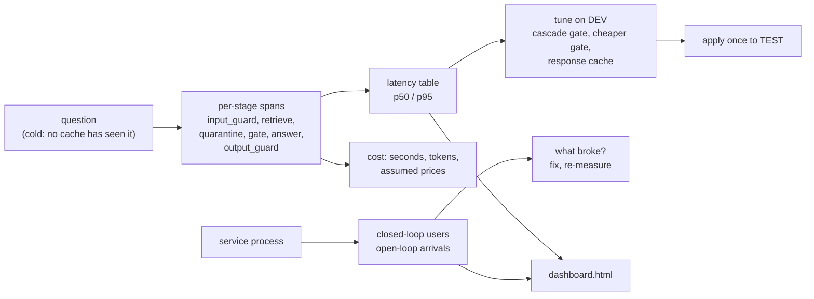

# Week 12, Day 6: Observability, Cost Tuning and a Load Test

**Time:** ~7h · **Needs:** Day 2-5 artifacts · **Run it:** `uv run python weeks/week12_capstone/solutions/day6_solution.py [--quick]` (about 12 minutes; it starts the service process several times) · **Tests:** `test_deploy.py` (the dashboard), `test_gate_guard.py` (the cascade), `test_service.py` · **Milestone:** a per-stage latency and cost report, three tuning experiments judged on dev, a load test, a dashboard, and whatever the load test breaks, fixed

Until now the product has been judged by *whether it answers correctly*. Today it is judged by **what it costs and what happens when many people use it**, which is where the surprises are.



## Learning objectives
- Read a **trace** and a **per-stage latency table**, and measure on **cold** questions so a cache cannot flatter you.
- Price a request in **machine time and tokens**, with prices as assumptions.
- Judge three optimisations the way you judged designs: choose on dev, report test once, count the items.
- Run a **closed-loop and an open-loop** load test, and find the capacity and the failure mode.
- Fix what the load test finds and **re-measure**.

---

## 1. Where the time goes

Every stage opens a span (`common.tracing`; names `copilot.input_guard`, `copilot.retrieve`, `copilot.quarantine`, `copilot.gate`, `copilot.answer`, `copilot.output_guard` under one `copilot.ask` root) and is timed into the result. Spans carry **lengths, counts and scores, never the question text** (Day 4 tests that no raw personal data reaches an attribute).

One trace, rendered by `tracing.render_tree`:

```
copilot.ask  [394ms]
├─ copilot.input_guard  [0ms]
├─ copilot.retrieve  [15ms]
├─ copilot.quarantine  [0ms]
├─ copilot.gate  [378ms]
├─ copilot.answer  [1ms]
└─ copilot.output_guard  [0ms]
```

Across 40 **cold** questions (one run; a second run of the same code gave 388 ms / 478 ms, and the final report run 393 ms / 484 ms) (each made unique with a suffix, so no embedding, re-ranker or response cache has seen it), one CPU process:

| stage | p50 | p95 |
|---|---|---|
| input guard | 0.3 ms | 0.3 ms |
| retrieve (embed the question, dense + BM25, fuse) | 16.1 ms | 20.4 ms |
| quarantine | 0.0 ms | 0.0 ms |
| **gate (cross-encoder over the top 3 sources)** | **355.0 ms** | **457.0 ms** |
| answer (extractive) | 0.7 ms | 0.8 ms |
| output guard | 0.1 ms | 0.1 ms |
| **total** | **372 ms** | **473 ms** |

**R5 (p95 ≤ 2 s) is met with a wide margin**, and the table says where to look: **the gate is 95% of the latency** (355 of 372 ms). Everything the product does *about* the answer costs more than producing it. (In Day 2 the gate cost 427 ms against 28 ms for retrieval; these are the same measurement, taken twice.) Remember what a profile like this tells you about the Week 11 serving story: the work is in a **second model**, not in the generation.

## 2. Cost

Prices are **assumptions supplied as inputs**: a small CPU machine at **$0.20/hour**, and a hosted-style card of **$0.50 / $1.50 per million input / output tokens**. Nothing was looked up.

| configuration | seconds per question | model tokens per question | per 1,000 questions |
|---|---|---|---|
| **extractive** (shipped) | 0.420 | 0 | **$0.023** of machine time |
| 0.5B model + verification (self-hosted) | 1.048 | 1,099 prompt + 24 completion | $0.058 of machine time |
| the same tokens at the assumed hosted card | | | $0.586 |

**R6 (≤ $0.05 per 1,000 for the extractive configuration) is met.** The model-backed path is 2.5× the machine time and, per Day 3, *less accurate*. If you were buying those tokens, the prompt side dominates (1,099 against 24): the retrieval prompt is the cost, which is why Week 7's prompt-trimming levers matter more than the model choice here. Machine time at 100% utilisation is a floor: divide by your real utilisation, and add the people (Week 11 Day 3: operations time is usually the largest term).

## 3. Three optimisations, judged properly

Choose on **dev**; run **test once**.

### 3a. A cascade gate: ask the cheap signal first
The cosine of the best source is free (it came with retrieval) and separates the two groups well (Day 2: AUC 0.962). Where it is *certain*, skip the cross-encoder. `CascadeGate` admits at cosine ≥ **0.716**, refuses at ≤ **0.677**, and calls the cross-encoder only in between; the band was chosen on **dev** as "just above the best out-of-scope cosine and just below the worst answerable one".

| gate | dev pass | cold latency p50 | p95 | cross-encoder calls |
|---|---|---|---|---|
| full cross-encoder gate | 82% [66%, 92%] | 359 ms | 457 ms | every question |
| **cascade** | 82% [66%, 92%] | **16 ms** | 377 ms | **7 of 31 (23%)** on dev |
| cross-encoder over 1 source instead of 3 | 76% [60%, 88%] | 131 ms | 153 ms | every question |

On dev the cascade made **the same admit or refuse decision as the full gate on 31 of 31 questions**, and the median question got **22× faster**. The p95 is still 377 ms because the uncertain quarter still pays the full price. Looking at **fewer sources** is faster but **loses 6 points on dev** (two questions): a cheaper gate that is wrong more often is not a saving.

**Applied once to test:** full gate **76%** [59%, 87%], cascade **73%** [56%, 85%]: **one item** (25 against 24 of 33). I would ship the cascade for the latency *and* write down that it cost one test item that I cannot tell from noise; the CI gate's "net regression ≤ 2" allowance is exactly this situation. Judging a speed-up by *whether it is free* is the right question; "is it free?" is answered with a count of items, not a feeling.

### 3b. A response cache
`common.cache.ResponseCache` (Week 7: exact match on normalised text, scoped to the pipeline version, with guards against wrong hits) in front of the pipeline; **blocked inputs, errors and blocked outputs are never stored** (tested). On 300 requests whose repeats follow a Zipf-like distribution over the 62 non-adversarial golden questions: **hit rate 84%**. A hit skips retrieval, the gate and the answer. That number is a property of the *traffic you assume*: measure the repeat rate of your real questions before believing it; the cache is also what makes your latency numbers lie, which is why every latency in this lesson uses cold questions.

### 3c. What I did not do
Quantise the cross-encoder, batch the gate across concurrent requests, or move retrieval to an ANN index (the corpus is 1,219 chunks: numpy is exact and fast enough; Week 3 Day 2 says when that changes).

## 4. Load test

The service process (`python -m copilot.service`, one worker), driven by the Week 11 load generator with **every question made unique** so the caches do not flatter it. **Closed loop** (a fixed number of users, each sending the next question when the last answer arrived), after the fix described next:

| users | req/s | latency p50 | latency p95 | errors |
|---|---|---|---|---|
| 1 | 2.65 | 0.37 s | 0.47 s | 0 |
| 2 | 2.73 | 0.71 s | 0.87 s | 0 |
| 4 | 2.71 | 1.43 s | 1.65 s | 0 |
| 8 | 2.72 | 2.83 s | 3.06 s | 0 |

**Capacity is about 2.7 requests per second, whatever the number of users**: one process answers one question at a time (0.37 s each), so more users add **queueing, not throughput**: latency grows linearly with users. Note also that for this product the **time to the first token equals the latency** (Day 5): the answer is complete before the first byte is sent.

**Open loop** (Poisson arrivals at a fixed rate for 20 seconds, whether or not earlier requests finished: what the public does):

| arrivals per second | sent | latency p50 | latency p95 | errors |
|---|---|---|---|---|
| 1 | 17 | 0.40 s | 0.58 s | 0 |
| 2 | 31 | 0.47 s | 0.81 s | 0 |
| **4** (above capacity) | 73 | **2.26 s** | **4.53 s** | **9 × HTTP 503** |

At 4 arrivals per second (1.5 times capacity) the service **sheds** load: 9 of 73 requests were refused at once with `503`, and the rest were served in a median of 2.3 s.

### What the load test found, and the fix
The first run of this test gave a very different row at 4 arrivals per second: **served requests took a median of 25 s (p95 26.7 s) and 57 of 73 were refused**; at 8 users the p95 was 4.8 s instead of 3.1 s. The Week 11 gateway has a bounded queue and a fast 503 (Day 4 measured it: refusals in 5 ms), so why did requests wait 25 seconds?

**Because admission control never got to run.** The gateway's `/v1/ask` called the retriever **synchronously on the event loop, before** the request reached its admission check. With a 5 ms BM25 retriever that did not matter. With a 0.4 s pipeline it meant the whole server was single-threaded: requests queued in the operating system's socket buffers *in front of* the bounded queue, so the queue could not refuse them; everything, including health checks, waited its turn.

The fix (in Week 11's `llmapi/app.py`, with tests there): run the retriever in a **worker thread**, bounded to `max_inflight` at a time, and refuse a request beyond `max_inflight + max_queue` that is *already preparing* immediately. Three tests pin it: the event loop stays free while a slow retriever runs (a health check answers in under 150 ms), overload is a fast 503, and the "preparing" counter returns to zero after a burst. A fourth consequence: the pipeline is **not thread-safe** (torch, the SQLite caches, the memo), so the service wraps it in a lock, and the embedder's and re-ranker's SQLite caches needed `check_same_thread=False`. The effect is the second table above: the same offered load, served requests **11 times faster at the median** (25 s → 2.3 s), refused **fast** instead of late.

*This is the argument for load-testing a thing you already unit-tested: every unit test passed before and after.*

### The cascade under load
The cascade is only a number on a dev table until it is under load. The service reads `COPILOT_GATE=cascade` (and `COPILOT_CASCADE_BAND`), and the same closed-loop test gives:

| users | req/s | latency p50 | latency p95 | errors |
|---|---|---|---|---|
| 1 | **11.4** | 0.02 s | 0.35 s | 0 |
| 4 | **12.1** | 0.38 s | 0.71 s | 0 |
| 8 | **12.1** | 0.76 s | 1.09 s | 0 |

**Capacity rose from 2.7 to about 12 requests per second (4.5×)** and the p95 at 8 users fell from 3.1 s to 1.1 s. Two honest caveats. First, the load mix here is **all answerable questions with clear matches**: for those the cosine settles the gate for most of them; a stream with many ambiguous or off-topic questions would send more of them to the cross-encoder and gain less (on dev, 23% needed it). Second, the throughput is the same arithmetic as before: the mean cost per question fell from about 0.37 s to about 0.08 s, and a single process answers one at a time.


## 5. The dashboard
`copilot/dashboard.py` renders `outputs/w12_dashboard.html`: one static file (no JavaScript, no external request, everything escaped) with the golden-set pass rates by kind (with intervals), the stage latencies as bars (p50 above, p95 below), the load tables and the cost table. It contains aggregates only: no question text, no user ids. (A real deployment also scrapes `/metrics` into a time series and alerts on error rate, queue depth and p95; this is the report you attach to a pull request, not a monitoring system.)

## 6. Pitfalls
- **Measuring latency on questions the caches have seen.** Make them unique.
- **Believing a closed-loop test about capacity.** Users who wait for answers never overload you. Use an open loop to find where it breaks.
- **Optimising what is cheap.** The answerer was 0.6 ms; the gate was 370.
- **Judging a speed-up by the dev set it was tuned on.** Run test once and count items.
- **A cache whose hit rate comes from an assumed traffic distribution.**
- **Running blocking work on the event loop** and thinking the queue protects you.
- **Reporting "tokens per second" for a pipeline that has no tokens.** Report seconds per question and requests per second.

---

## Daily challenge: a dashboard and a cost and latency report

**Build** (reference: [`day6_solution.py`](solutions/day6_solution.py), [`copilot/dashboard.py`](solutions/copilot/dashboard.py), [`copilot/gate.py`](solutions/copilot/gate.py)):
1. Per-stage spans (no question text) and a per-stage latency table on **cold** inputs.
2. Cost per 1,000 requests for each configuration you have, with assumed prices listed as inputs.
3. Three optimisations: choose on dev, apply once to test, **report the item count**, and say whether each is free.
4. A closed-loop and an open-loop load test of your service process; find the capacity and what happens above it.
5. Fix the first thing the load test breaks and **re-measure**; keep both tables.
6. A static dashboard with the aggregates.

**Acceptance criteria**
- Every latency is on inputs no cache has seen, and you say how you ensured that.
- The load test goes above capacity, and you report the error and latency behaviour there.
- A tuning's quality cost is a count of items on the test split.
- The dashboard contains no user text.

**Stretch**
- Put the gate in a **batch** across concurrent requests (the cross-encoder is a batch model) and measure throughput.
- Run **two worker processes** and measure capacity and memory; explain why the answer is not 2×.
- Add **alert rules** over `/metrics` (error rate, queue depth, p95) and test them against the load test's overload.
- Make the answerer **stream** (a model) and measure the time to first token separately from the total.

## Further reading
- Week 7 Day 4 (tracing), Day 5 (cost and latency), and Week 11 Day 2 (closed- and open-loop load).
- Google SRE book: *Handling Overload* and *Addressing Cascading Failures*.
- Gil Tene, *How NOT to measure latency* (coordinated omission: why closed-loop tests flatter you).
